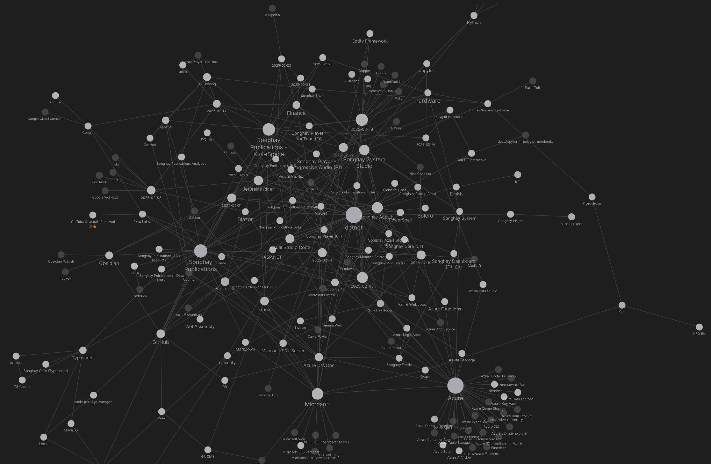
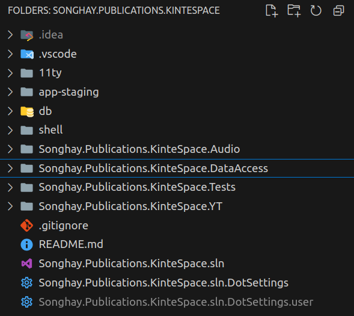

---json
{
  "documentId": 0,
  "title": "studio status report: 2025-02",
  "documentShortName": "2025-02-26-studio-status-report-2025-02",
  "fileName": "index.html",
  "path": "./entry/2025-02-26-studio-status-report-2025-02",
  "date": "2025-02-26T20:09:28.977Z",
  "modificationDate": "2025-02-26T20:09:28.977Z",
  "templateId": 0,
  "segmentId": 0,
  "isRoot": false,
  "isActive": true,
  "sortOrdinal": 0,
  "clientId": "2025-02-26-studio-status-report-2025-02",
  "tag": "{\n  \u0022extract\u0022: \u0022month 02 of 2025 was about upgrading Songhay.Publications to .NET 8.0 and working directly on kintespace.com I continue to fiddle and struggle with my Obsidian graph view of the month: Obsidian graph for this month I notice that most of nodes labeled with\\u2026\u0022\n}"
}
---

# studio status report: 2025-02

## month 02 of 2025 was about upgrading `Songhay.Publications` to .NET 8.0 and working directly on kintespace.com

I continue to fiddle and struggle with my Obsidian graph view of the month:

<div style="text-align:center">



</div>

I notice that most of nodes labeled with dates hover around the Songhay Publications topics of this Studio which indicates what should be obvious but is actually novel: this Studio works on Publications. It has taken easily over a decade to achieve the obvious. The release of `Songhay.Publications` release 8.0.0📦 [[GitHub](https://github.com/users/BryanWilhite/projects/32)] (which includes the completion of [issue #54](https://github.com/BryanWilhite/Songhay.Publications/issues/54), struck off below in “sketching out development projects”) represents the last major barrier between me and the obvious.

Below, in “sketching out development projects,” I have added and struck off the following line:

>change `Songhay.Player.YouTube` [[GitHub](https://github.com/BryanWilhite/Songhay.Player.YouTube)] to support deep linking into thumb sets 🔨🐎✨

This change to `Songhay.Player.YouTube` occurred last month, represented by the release of the [version 8.0.1 NuGet package](https://www.nuget.org/packages/Songhay.Player.YouTube/8.0.1). A rough prototype of this deep linking can be found at <https://staging.kintespace.com/b-roll/yt/set>. Importantly, this deep-linking feature makes it possible to replace the index page of kintespace.com with a more static, primal design—finally free of an ancient JavaScript framework called Angular JS.

The bottom line is that the way forward is obvious. Selected notes from this month are below:

## [[Songhay Publications (C♯)]]: issue #54 (upgrade to [[dotnet|.NET 8.0]])

I will add the following to [issue #54](https://github.com/BryanWilhite/Songhay.Publications/issues/54):

It is not recommended to completely remove the `Songhay.Publications.DataAccess` project from the [[Songhay Publications - KinteSpace|kintespace.com]] repo because this repo should _apply_ `PublicationsDbContext` for the specific [[SQLite]] needs of this publication. All of the <acronym title="Entity Framework">EF</acronym> migration files and direct references to a [[SQLite]] file should be kept in the kintespace.com repo.

By moving `PublicationsDbContext` out of the kintespace.com repo, the `dotnet ef migrations add` command can no longer use the `--project` option \[📖 [docs](https://learn.microsoft.com/en-us/ef/core/cli/dotnet#common-options) \] when run from this repo. The `--context` option would be the replacement:

>The `DbContext` class to use. Class name only or fully qualified with namespaces. If this option is omitted, EF Core will find the context class. If there are multiple context classes, this option is required.
>
>—“[Common options](https://learn.microsoft.com/en-us/ef/core/cli/dotnet#common-options)”
>

## [[Songhay Publications - KinteSpace|Songhay Publications: kinté space]]

### the results of the upgrade to [[dotnet|.NET 8.0]]

<div style="text-align:center">



</div>

It is now clear to me that ‘everything’ I have been working on _consistently_ in this Studio for _at least_ the last 15 years comes together in the [[Songhay Publications - KinteSpace|kintespace.com]] repo, namely all of the ‘cores’:

- `SonghayCore` [[GitHub](https://github.com/BryanWilhite/SonghayCore)]
- `Songhay.Modules` [[GitHub](https://github.com/BryanWilhite/Songhay.Modules)]
- `Songhay.Modules.Bolero` [[GitHub](https://github.com/BryanWilhite/Songhay.Modules.Bolero)]
- `Songhay.Publications` [[GitHub](https://github.com/BryanWilhite/Songhay.Modules.Bolero)]

## [[Songhay Publications - KinteSpace|kinté space]]: “What really happens inside a dating app”

>I think that if you are a marketing person and have a bit of a shady personality, you can create a dating app that has significant revenue easily. What you have to do is to create fake girls' profiles; you don't really have to make them talk or match, just be visible on the feed. Then you make guys pay for similar things that Tinder is doing (you can just copy their plans). The best would be to communicate around being an app for sex. When a guy pays, you would just not do anything different than non-paying users. You will probably end up with 90% real guys and 10% real girls, but I would be surprised if you don't make a lot of money with that. Probably a lot of not really popular dating apps you find on the Play Store/Apple Store are just that, and that have no girls.
>
>—“[What really happens inside a dating app](https://blog.luap.info/what-really-happens-inside-a-dating-app.html)”

## [[Songhay Publications|Publications]]: “Minimal viable service worker”

From 2018:

>The thing is, every website is different. So the service worker strategy for every website needs to be different too.
>
>Still, I was wondering if it would be possible to create a service worker script that would work for _most_ websites. [Here’s the script I came up with](https://gist.github.com/adactio/3717b7da007a9363ddf21f584aae34af).
>
>—“[Minimal viable service worker](https://adactio.com/journal/13540)”
>

Is this the kind of investigation that led to [[Google Workbox]] (noted [[2024-12-06#Google Google Workbox promises to make browser-based caching easy and useful ❓ to-do day-job|previously]])? In spite of what [[Google]] is doing, here is another article from 2024 yearning for “minimum interesting service worker”:

>Basic idea:
>
>You have a service worker (and “offline” HTML page) on your personal site, installed from any page on your site, that all it does is cache the offline page, and on future requests to your site checks to see if the requested page is available, and if so serves it, otherwise it displays your offline page with a “site appears to be unreachable” message that a lot of service workers provide, AND provides an algorithmically constructed link to the page on an archive (e.g. Internet Archive) or static mirror of your site (typically at another domain).
>
>—<https://tantek.com/2024/151/t1/minimum-interesting-service-worker>
>

## [[Songhay Publications|Publications]]: “A Gentle Introduction to CRDTs”

>CRDTs are needed in situations where you want multiple processes to modify the same state without coordinating their writes to that state.
>
>—“[A Gentle Introduction to CRDTs](https://vlcn.io/blog/intro-to-crdts)”
>

<div style="text-align:center">

<figure>
    <a href="https://www.youtube.com/watch?v=FG5Varj1Ows">
        
    </a>
    <p><small>CRDTs - Stop Worrying About Write Conflicts | Systems Design 0 to 1 with Ex-Google SWE</small></p>
</figure>

<figure>
    <a href="https://www.youtube.com/watch?v=PMVBuMK_pJY">
        
    </a>
    <p><small>Martin Kleppmann — CRDTs: The hard parts</small></p>
</figure>

</div>

## [[dotnet|.NET]] `System.Threading.Channels`

>The [System.Threading.Channels](https://learn.microsoft.com/en-us/dotnet/api/system.threading.channels) namespace provides a set of synchronization data structures for passing data between producers and consumers asynchronously. The library targets .NET Standard and works on all .NET implementations.
>
>…
>
>Channels are an implementation of the producer/consumer conceptual programming model. In this programming model, producers asynchronously produce data, and consumers asynchronously consume that data.
>
>—“[System.Threading.Channels library](https://learn.microsoft.com/en-us/dotnet/core/extensions/channels)”
>

[[Nick Chapsas]] insists that we should have been using Channels instead of [[MediatR]] and the like:

<div style="text-align:center">

<figure>
    <a href="https://www.youtube.com/watch?v=lHC38t1w9Nc">
        
    </a>
    <p><small>The Most Underrated .NET Feature You Must Use</small></p>
</figure>

</div>

Also, see “[An Introduction to System.Threading.Channels](https://devblogs.microsoft.com/dotnet/an-introduction-to-system-threading-channels/)” #to-do

## [[dotnet|.NET]]: “4 C# features that you (probably) shouldn't be using”

<div style="text-align:center">

<figure>
    <a href="https://www.youtube.com/watch?v=yzg5-T67FCc">
        
    </a>
    <p><small>4 C# features that you (probably) shouldn't be using</small></p>
</figure>

</div>

1. `goto` and labels (probably there for translating Bill’s BASIC code) ✅
2. lambda-based getter \[📹 [watch](https://youtu.be/yzg5-T67FCc?t=284) \]  (effectively hides methods that are invoked with every access to the getter)
3. default implementation of interface members \[📹 [watch](https://youtu.be/yzg5-T67FCc?t=651) \] (slippery slope toward entangling interfaces with inheritance; use extension methods on the interface instead)
4. regions \[📹 [watch](https://youtu.be/yzg5-T67FCc?t=993) \] 😐 (re-factor instead)

## [[Songhay Player - YouTube (F♯)]]: caching with service workers will help _after_ initial loading ⏱👀

My [[2024-12-06#Google Google Workbox promises to make browser-based caching easy and useful ❓ to-do day-job|previous]] note about the [[Google]] approach to service workers \[📖 [docs](https://developer.mozilla.org/en-US/docs/Web/API/Service_Worker_API/Using_Service_Workers) \] can servcei to remind me that a fundamental use case of service workers is caching—and caching is what [[Songhay Player - YouTube (F♯)|the b-roll player for YouTube 🎥 content]] seriously needs.

In order to address the problem of initial loading, I prioritized finding a service-based way toward caching. But in the particular design of [[Songhay Publications - KinteSpace|kintespace.com]] there _should_ be a static-<acronym title="HyperText Markup Language">HTML</acronym> based ‘splash’ page that should be loaded _before_ the player. This convention suggests that most visitors will discover the player from this ‘splash’ page—this means the ‘splash’ page can call a service worker to cache the data for the player.

>[!important]
>The ‘splash’ page can call a service worker to cache the data for the player.

This convention implies that this Studio should not encourage “deep linking” directly to the player(s).

## [[WebAssembly]]: “Rust is Eating JavaScript”

>[WebAssembly](https://webassembly.org/docs/use-cases/) (WASM) is a portable low-level language that Rust can compile to. It runs in the browser, is interoperable with JavaScript, and is supported in all major modern browsers.
>
>> WASM is definitely a lot faster than JS, but not quite native speed. In our tests, Parcel runs 10-20x slower when compiled to WASM than with native binaries. – [Devon Govett](https://twitter.com/devongovett)
>
>While WASM isn't the perfect solution yet, it _can_ help developers create extremely fast web experiences. The Rust team is [committed](https://www.rust-lang.org/what/wasm) to a high-quality and cutting-edge WASM implementation. For developers, this means you could have the performance advantages of Rust (vs. Go) while still compiling for the web (using WASM).
>
>—“[Rust is Eating JavaScript](https://leerob.com/n/rust)”
>

## [[Songhay Publications - KinteSpace|the kinté space]] repos are now working together

The ‘legacy’ repo, `kinte-space`, is positioned to maintain the current kintespace.com under <acronym title="Hypertext Transfer Protocol Secure">HTTPS</acronym> and the new repo, `Songhay.Publications.KinteSpace`, recognizes the existence of `staging.kintespace.com`, representing the next version of kintespace.com. It is [[2025-02-03#next steps|now ready]] to move forward:

- generating Publication indices from SQLite for the kintespace.com static index experience
  - ~~build~~ describe  an [[Songhay Activity|Activity]] that generates existing `data/index*.json` files 🚜✨ ✅
  - attempt to load `data/index*.json` files with `eleventyConfig.addGlobalData` 🔨✨ \[📖 [docs](https://www.11ty.dev/docs/data-global-custom/) \]
  - change the Activity that generates existing `data/index*.json` files to generate ‘defaults’ for `Document.ResponsiveImages` 🔨🖼✨
  - use [[eleventy]] to generate `app-staging/index.html` with `data/index*.json` 🔨🍱✨
  - copy all images from the legacy repo (`app/images`) 🚜
  - change eleventy template for `app-staging/index.html` to add:
    - [[Songhay Player - YouTube (F♯)]] deep link to thumb set 🔨🐎✨
    - `lunr` search  🔨🍱✨  (==not needed for initial re-release==)
    - [[Songhay Publications Index (F♯)]] link🔨🐎✨
- generating a new repo for [[Songhay Publications Index (F♯)]] with proposed name, `Songhay.Modules.Bolero.Index` ✨🚧 and add a GitHub Project (==not needed for initial re-release==)
- building the eleventy template for `kp_*.html` files 🔨🍱✨
- building the eleventy template for `p_*.html` files 🔨🍱✨
- building the eleventy template for `rasx*.html` files 🔨🍱✨
- migrating [[Songhay Publications - KinteSpace|rasx() context]] content from its legacy repo to `app-staging/rasxlog/` 🚜

This is pretty much >90% of kintespace.com content.

## [[dotnet|.NET 6.0]]:  “7 awesome improvements for LINQ in .NET 6”

[[Nick Chapsas]] reports from the .NET 6 era:

<div style="text-align:center">

<figure>
    <a href="https://www.youtube.com/watch?v=sIXKpyhxHR8">
        
    </a>
    <p><small>7 awesome improvements for LINQ in .NET 6</small></p>
</figure>

</div>

1. `Enumerable.Chunk<TSource>` \[📖 [docs](https://learn.microsoft.com/en-us/dotnet/api/system.linq.enumerable.chunk?view=net-9.0) \]
2. `Enumerable.TryGetNonEnumeratedCount<TSource>` \[📖 [docs](https://learn.microsoft.com/en-us/dotnet/api/system.linq.enumerable.trygetnonenumeratedcount?view=net-9.0) \] \[📹 [watch](https://youtu.be/sIXKpyhxHR8?t=200) \]
3. `IEnumerable.Zip<TFirst,TSecond,TThird>` \[📖 [docs](https://learn.microsoft.com/en-us/dotnet/api/system.linq.enumerable.zip?view=net-9.0#system-linq-enumerable-zip-3) \] (new support for three-tuple zips)
4. `MaxBy` \[📖 [docs](https://learn.microsoft.com/en-us/dotnet/api/system.linq.enumerable.maxby?view=net-9.0) \], `MinBy`, `*By` \[📹 [watch](https://youtu.be/sIXKpyhxHR8?t=571) \]
5. `ElementAt<TSource>(IEnumerable<TSource>, Index)` \[📖 [docs](https://learn.microsoft.com/en-us/dotnet/api/system.linq.enumerable.elementat?view=net-9.0#system-linq-enumerable-elementat-1) \]  \[📹 [watch](https://youtu.be/sIXKpyhxHR8?t=680) \] (supports the `Index` struct \[📖 [docs](https://learn.microsoft.com/en-us/dotnet/api/system.index?view=net-9.0) \], including its [Index from end operator ^](https://learn.microsoft.com/en-us/dotnet/csharp/language-reference/operators/member-access-operators#index-from-end-operator-))
6. `Take<TSource>(IEnumerable<TSource>, Range)` \[📖 [docs](https://learn.microsoft.com/en-us/dotnet/api/system.linq.enumerable.take?view=net-9.0#system-linq-enumerable-take-1) \] \[📹 [watch](https://youtu.be/sIXKpyhxHR8?t=763) \] (supports the `Range` struct \[📖 [docs](https://learn.microsoft.com/en-us/dotnet/api/system.range?view=net-9.0) \] and [its operators](https://learn.microsoft.com/en-us/dotnet/csharp/language-reference/proposals/csharp-8.0/ranges#systemrange))

## [[NuGet]]: “20 Nuget packages that every .NET developer should be familiar with”

<div style="text-align:center">

<figure>
    <a href="https://www.youtube.com/watch?v=qapJwFY9y2Y">
        
    </a>
    <p><small>20 Nuget packages that every .NET developer should be familiar with</small></p>
</figure>

</div>

1. [[xUnit.net]]
2. NUnit
3. [[moq]]
4. NSubstitute \[📹 [watch](https://youtu.be/qapJwFY9y2Y?t=136) \]
5. [[Polly]]
6. [Fluent Assertions](https://fluentassertions.com/)
7. [[BenchmarkDotNet]]
8. [Serilog](https://serilog.net/)
9. [Autofixture](https://autofixture.github.io/) 
10. [[Bogus]]
11. [Scrutor](https://github.com/khellang/Scrutor)
12. Automapper \[📖 [docs](https://docs.automapper.org/en/stable/) \]
13. [[Dapper]]
14. [[Entity Framework|Entity Framework Core]]
15. MediatR (see [[2025-02-11#dotnet .NET “You Probably Don't Need to Worry About MediatR”]])
16. [Brighter](https://github.com/BrighterCommand/Brighter) \[📹 [watch](https://youtu.be/qapJwFY9y2Y?t=692) \] #to-do
17. [[FluentValidation]]
18. [Refit](https://github.com/reactiveui/refit) #to-do
19. RestSharp \[📹 [watch](https://youtu.be/qapJwFY9y2Y?t=797) \]
20. Json.NET 😐

## [[Songhay Publications - KinteSpace|kintespace.com]]: my cousin, Gozié Ojini, is showing at The Hammer 🎊

“[Alice Coltrane, Monument Eternal](https://hammer.ucla.edu/exhibitions/2025/alice-coltrane-monument-eternal)”:

<div style="text-align:center">


</div>

…also see “[Alice Coltrane’s ashram — and her ‘Black radical imagination’ — lives on at the Hammer Museum](https://www.latimes.com/entertainment-arts/story/2025-02-14/alice-coltrane-hammer-museum-ashram-monument-eternal)” 📰

## [[hardware]]: “Toyota reveals new fuel-cell stack, isn't giving up on hydrogen cars”

>In a press release, the automaker promised improved durability and efficiency, as well as lower production costs for the new stack, which Toyota plans to debut in passenger vehicles and heavy-duty commercial trucks in North America, Europe, China, and Japan by 2026.
>
>Toyota claims the third-generation fuel-cell stack is 1.2 times more fuel-efficient than the previous generation, allowing for a **20% improvement in range** between fueling stops. And it claims **durability comparable to diesel engines**—the powertrain tech that Toyota sees fuel cells replacing in commercial semi trucks.
>
>—“[Toyota reveals new fuel-cell stack, isn't giving up on hydrogen cars](https://www.greencarreports.com/news/1145782_toyota-fuel-cell-stack-v3-hydrogen-cars)”
>

## [[dotnet|.NET]]: AutoFixture ✨ #to-do

From <https://autofixture.github.io/>:

>AutoFixture is a tool designed to make Test-Driven Development more productive and unit tests more refactoring-safe. It does so by removing the need for hand-coding anonymous variables as part of a test’s Arrange phase:

```csharp
[Fact]
public void IntroductoryTest()
{
    // Arrange
    Fixture fixture = new Fixture();

    int expectedNumber = fixture.Create<int>();
    MyClass sut = fixture.Create<MyClass>();
    // Act
    int result = sut.Echo(expectedNumber);
    // Assert
    Assert.Equal(expectedNumber, result);
}
```

The `AutoData` feature for the `Theory` attribute is interesting:

```csharp
[Theory, AutoData]
public void IntroductoryTest(int expectedNumber, MyClass sut)
{
    int result = sut.Echo(expectedNumber);
    Assert.Equal(expectedNumber, result);
}
```

## [[Obsidian]]: “Obsidian is now free for work”

>People in over [10,000 organizations](https://obsidian.md/enterprise) use Obsidian. Many work in high-security environments, like government, cybersecurity, healthcare, and finance. Some of the largest organizations in the world, including Amazon and Google, have thousands of employees using Obsidian every day. These teams rely on Obsidian to think more effectively and keep total ownership over private data.
>
>Previously, people at companies with two or more employees were required to purchase a Commercial license to use Obsidian for work. Going forward, the Commercial license is no longer required, but remains an optional way for organizations to support Obsidian, similar to the [Catalyst license](https://help.obsidian.md/Licenses+and+payment/Catalyst+license) for individuals.
>
>—“[Obsidian is now free for work](https://obsidian.md/blog/free-for-work/)”
>

## [[Songhay Publications|Publications]]: “Ńdébé: A Modern Writing System for Ìgbò ”

>**Invented by Lotanna Igwe-Odunze in 2009 and refined over more than a decade, the Ńdébé script is the first truly usable, writeable, and readable indigenous writing system for the Ìgbò language. It masterfully blends ancient Ìgbò designs with modern practicality, creating a script that celebrates cultural heritage while addressing the challenges of contemporary communication.**
>
>—“[Ńdébé: A Modern Writing System for Ìgbò](https://www.africandigitalart.com/ndebe-a-modern-writing-system-for-igbo/)”
>

<div style="text-align:center">

<figure>
    <a href="https://www.youtube.com/watch?v=vsV9gI_U184">
        
    </a>
    <p><small>Basic Ndebe Script Tutorial</small></p>
</figure>

</div>

## [[Songhay System Studio]]: “Nigerians are building affordable alternatives to AWS and Google Cloud”

>Nigerian entrepreneur Fara Ashiru built her fintech platform, Okra, on Amazon Web Services in 2020. She would pay AWS in dollars even as Okra earned in naira because American cloud providers did not accept payments in local currency at the time.
>
>…
>
>Ashiru took things into her own hands, and Okra set up cloud infrastructure with servers in data centers in Nigeria and South Africa in 2024. Later that year, the cloud operations were spun off into ==a new company called Nebula,== which allows anyone in Nigeria to run their website, app, or workflow on its cloud and pay in naira.
>
>…
>
>Global leaders appear to have noticed the threat. In January, AWS started accepting payments in naira. “Local currencies are important in localizing the payment experience for customers,” [AWS said](https://aws.amazon.com/about-aws/whats-new/2025/01/aws-payments-new-local-currencies/) at the time.
>
>—“[Nigerians are building affordable alternatives to AWS and Google Cloud](https://restofworld.org/2025/aws-google-cloud-nigeria-alternatives/?utm_source=rss&utm_medium=rss&utm_campaign=feeds)”
>

## open pull requests on GitHub 🐙🐈

- <https://github.com/BryanWilhite/Songhay.HelloWorlds.Activities/pull/14>
- <https://github.com/BryanWilhite/dotnet-core/pull/67>

## sketching out development projects

The current, unfinished public projects on GitHub:

- replacing the Angular app in `http://kintespace.com/player.html` with a Bolero app 🚜🔥 depends on:

  - ~~completing [issue #54](https://github.com/BryanWilhite/Songhay.Publications/issues/54): move `Songhay.Publications.DataAccess` out of the kinté space repo~~ 🚜
  - ~~generating Publication indices from SQLite for `Songhay.Publications.KinteSpace`~~
  - ~~change `Songhay.Player.YouTube` [[GitHub](https://github.com/BryanWilhite/Songhay.Player.YouTube)] to support deep linking into thumb sets~~ 🔨🐎✨
  - generate a new `index.html` page with eleventy

The proposed project items:

- switch Studio from Material Design to Bulma 💄 ➡️ 💄✨
- generating a new repo with proposed name, `Songhay.Modules.Bolero.Index` ✨🚧 and add a GitHub Project

🐙🐈<https://github.com/BryanWilhite/>
