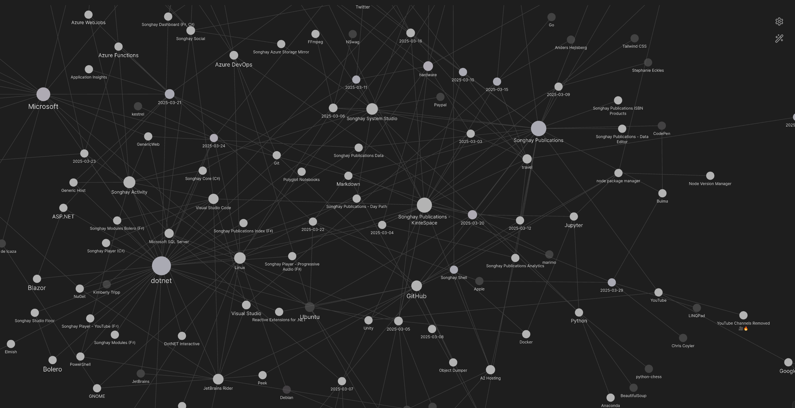

---json
{
  "documentId": 0,
  "title": "studio status report: 2025-03",
  "documentShortName": "2025-03-30-studio-status-report-2025-03",
  "fileName": "index.html",
  "path": "./entry/2025-03-30-studio-status-report-2025-03",
  "date": "2025-03-30T16:28:58.039Z",
  "modificationDate": "2025-03-30T16:28:58.039Z",
  "templateId": 0,
  "segmentId": 0,
  "isRoot": false,
  "isActive": true,
  "sortOrdinal": 0,
  "clientId": "2025-03-30-studio-status-report-2025-03",
  "tag": "{\n  \u0022extract\u0022: \u0022month 03 of 2025 was about another #day-job takeover, serious progress with Azure Functions and AzDO Selected notes for this month should show signs of major #day-job breakthroughs in the study of Azure Functions and the YAML pipelines of Azure DevOps (Az\\u2026\u0022\n}"
}
---

# studio status report: 2025-03

## month 03 of 2025 was about another #day-job takeover, serious progress with Azure Functions and AzDO

Selected notes for this month should show signs of major #day-job breakthroughs in the study of Azure Functions and the YAML pipelines of Azure DevOps (AzDO). Otherwise, we see in the Obsidian graph view most of the days of this month hover around .NET and Publications, representing ‘normal’ Studio operations:

<div style="text-align:center">



</div>

## [[SQL Azure]]: “10 Free Azure SQL Databases: Powering AI, Advanced Analytics & Enterprise Innovation | Data Exposed”

This video cautions us to pay attention to the “auto-pause” feature of the databases:

<div style="text-align:center">

<figure>
    <a href="https://www.youtube.com/watch?v=oHH9onH8Lao">
        
    </a>
    <p><small>10 Free Azure SQL Databases: Powering AI, Advanced Analytics & Enterprise Innovation | Data Exposed</small></p>
</figure>

</div>

## [[dotnet|.NET]]: SampleProject #to-do

>🚀 SampleProject is a comprehensive template designed to kickstart your .NET 8 application development with best practices in architecture, DevOps, and API management.
>
>…
>
> - **Clean Architecture** & **Design Patterns** like CQRS
> - **Database Support**: SQLServer, PostgreSQL
> - **Caching**: Redis
> - **Messaging**: RabbitMQ, Hangfire for background jobs
> - **Authentication**: JWT Tokens & OAuth
> - **Containerization**: Docker, pgAdmin, ELK Stack for logging and monitoring
> - **API Management**: Minimal APIs, Swagger, Rate Limiting, Idempotency, and Versioning
>
>—<https://github.com/BehzadDara/SampleProject>
>

## “.NET Previews Unboxed - .NET 10 Preview 1, C# 14, HybridCache, & More”

<div style="text-align:center">

<figure>
    <a href="https://www.youtube.com/watch?v=VncMk8ryxV8">
        
    </a>
    <p><small>.NET Previews Unboxed - .NET 10 Preview 1, C# 14, HybridCache, & More</small></p>
</figure>

</div>

Links from the video above:

- “[Error CS8103 Combined length of user strings used by the program exceeds allowed limit. Try to decrease use of string literals.](https://github.com/dotnet/roslyn/issues/39676)”
- “[OpenAPI 3.1 support](https://github.com/dotnet/core/blob/main/release-notes/10.0/preview/preview1/aspnetcore.md)”

## [[Katarzyna Dusza]] explains quite well how a [[b-roll player]] of streaming video would work

<div style="text-align:center">

<figure>
    <a href="https://www.youtube.com/watch?v=a7SFcDM00vo">
        
    </a>
    <p><small>Modern & secure adaptive streaming on the Web - Katarzyna Dusza - CPH DevFest 2024</small></p>
</figure>

</div>

In the first 20 minutes of the video, she explains and demonstrates how <acronym title="Moving Picture Experts Group">MPEG</acronym>-<acronym title="Dynamic Adaptive Streaming over HTTP">DASH</acronym> streaming works _without_ encryption and licensing.

- “[A Quick Dive Into MP4](https://github.com/alfg/quick-dive-into-mp4)”
- <https://www.bento4.com/documentation/mp4fragment/>
- <https://www.bento4.com/documentation/mp4dash/>

## [[eleventy]]: updating the `md-11ty` sample

In order to get started with [[Songhay Publications - KinteSpace|the kinté space]], I need to update my Studio guidance in the form of the `md-11ty` sample \[🔗 [GitHub](https://github.com/BryanWilhite/nodejs/tree/master/md-11ty) \]. The [official eleventy starter site](https://github.com/11ty/eleventy-base-blog) provides guidance as to what is now going on in the `3.x` world of eleventy:

### the conventional config file name changed

The file name has changed from `md-11ty/11ty/.eleventy.js` to `md-11ty/11ty/eleventy.config.js`.

### changing to <acronym title="European Computer Manufacturers Association">ECMA</acronym> Script Modules (ESM)

We have ESM for the `md-11ty/11ty/eleventy.config.js` file \[📖 [docs](https://www.11ty.dev/docs/cjs-esm/#esm-configuration) \]:

```javascript
export default function (config) {
    //…
};
```

…which is a move away from the CommonJS pattern:

```javascript
module.exports = function (config) {
    //…
};
```

>[!important]
>The new ESM pattern allows for loading static <acronym title="JavaScript Object Notation">JSON</acronym> files, using the `import` statement:
> 

```javascript
import staticJson from '../app-staging/data/static.json' with { type: 'json' };

export default function (config) {
    config.addGlobalData('staticJson', staticJson);
    //…
};
```

Use of the `addGlobalData` method \[📖 [docs](https://www.11ty.dev/docs/data-global-custom/) \] is essential here. Also, note that “import attributes” \[📖 [docs](https://developer.mozilla.org/en-US/docs/Web/JavaScript/Reference/Statements/import/with) \] are being used in the `import` statement, characterized by the `with` keyword.

### the new conventional directory structure

The `tree` command from the `md-11ty/` directory:

```shell
$ tree -d -I "*node_modules*"
.
├── 11ty
│   ├── _data
│   ├── entry
│   ├── other-entry
│   └── templates
│       └── layouts
└── app-staging
    ├── data
    ├── entry
    │   └── one
    └── not_in_a_collection
```

## [[Entity Framework|Entity Framework Core]]: `IDbSet<TEntity>` should be thought of as a repository-pattern abstraction 🧠💡

The architecture of your data abstraction layer, using <acronym title="Entity Framework">EF</acronym>, will ultimately (in the context of sanity) take two approaches:

1. defend against <acronym title="Entity Framework">EF</acronym> and design to optionally remove <acronym title="Entity Framework">EF</acronym>
2. embrace <acronym title="Entity Framework">EF</acronym>

Option _1_ can mean exploring the _Generic Repository Pattern_ (see “[Gentle introduction to Generic Repository Pattern with C#](https://dev.to/karenpayneoregon/gentle-introduction-to-generic-repository-pattern-with-c-1jn0)”) which will eventually replace or hide `DbContext`. Option _2_ can mean exposing `DbContext` in the data abstraction layer and eventually regarding `IDbSet<TEntity>` \[📖 [docs](https://learn.microsoft.com/en-us/dotnet/api/system.data.entity.idbset-1?view=entity-framework-6.2.0) \] as a _bona fide_ repository-pattern abstraction.

>[!important]
>The presence of [[Dapper]] alongside <acronym title="Entity Framework">EF</acronym> in the design should ultimately mean you have to ‘hide’ or ‘compose’ Dapper and <acronym title="Entity Framework">EF</acronym> which means you are in the realm of option _1_. 

The following video is a quick pitch for option _2_:

<div style="text-align:center">

<figure>
    <a href="https://www.youtube.com/watch?v=IT4Pk3P4O5Q">
        
    </a>
    <p><small>DON’T Use Repositories with Entity Framework Until You Watch This</small></p>
</figure>

</div>

This slightly longer video explains why option _1_ can be problematic:

<div style="text-align:center">

<figure>
    <a href="https://www.youtube.com/watch?v=Bz5JCbWnaHo">
        
    </a>
    <p><small>Generic Repository Pattern With EF Core - Why It Sucks</small></p>
</figure>

</div>

Towards the last two minutes of the video, the critiques start to emerge. One annoyance is when multiple generic repos are injected into a class and consumers may not know that the `SaveChanges` method is duplicated across these abstractions when <acronym title="Entity Framework">EF</acronym> is behind the scenes.

In the following videos, [[Milan Jovanović]] goes into ‘nuance’ about this matter #to-do:

<div style="text-align:center">

<figure>
    <a href="https://www.youtube.com/watch?v=h4KIngWVpfU">
        
    </a>
    <p><small>Repository Pattern With Entity Framework Core | Clean Architecture, .NET 6</small></p>
</figure>

<figure>
    <a href="https://www.youtube.com/watch?v=kwehxBDX_o8">
        
    </a>
    <p><small>How I Use The Generic Repository Pattern In Clean Architecture</small></p>
</figure>

<figure>
    <a href="https://www.youtube.com/watch?v=vN_j1Bs0ALU">
        
    </a>
    <p><small>Why I Use The Unit of Work Pattern With EF Core | Clean Architecture</small></p>
</figure>

</div>

Additional reading: “[Implementing the Repository and Unit of Work Patterns in an ASP.NET MVC Application (9 of 10)](https://learn.microsoft.com/en-us/aspnet/mvc/overview/older-versions/getting-started-with-ef-5-using-mvc-4/implementing-the-repository-and-unit-of-work-patterns-in-an-asp-net-mvc-application)” 📖

## [[Typescript]] news from [[Anders Hejlsberg]] 😲

Surprising! The Typescript compiler is being ported to [[Go]]:

<div style="text-align:center">

<figure>
    <a href="https://www.youtube.com/watch?v=pNlq-EVld70">
        
    </a>
    <p><small>A 10x faster TypeScript</small></p>
</figure>

</div>

F♯ folks are excited about what’s on Anders’ bookshelf in this video:

<div style="text-align:center">

<figure>
    <a href="https://www.youtube.com/watch?v=10qowKUW82U">
        
    </a>
    <p><small>TypeScript is being ported to Go | interview with Anders Hejlsberg</small></p>
</figure>

</div>

## [[Azure DevOps|AzDO]]: pipelines breakthrough at the #day-job

- the `zipAfterPublish` setting in `DotNetCoreCLI@2` prepares an archive for `AzureRmWebAppDeployment@4`
- the `$(Build.ArtifactStagingDirectory)` predefined variable [📖 docs ] flows through the task; it is the output of `DotNetCoreCLI@2` task and the input of the `AzureRmWebAppDeployment@4` task
- when we declare `DeploymentType: 'zipDeploy'`, `enableCustomDeployment` must be set to `true`

**Warning:** `webDeploy` means `MSDeploy`; there is [an ancient document for IIS](https://www.iis.net/downloads/microsoft/web-deploy) that opens with this equivalence. For more detail, see “[MSDeploy VS. ZipDeploy](https://github.com/projectkudu/kudu/wiki/MSDeploy-VS.-ZipDeploy).”

## questions [[Microsoft]] will _not_ help you to ask about [[Azure Functions]] 😐 #make-blog-post

_Note:_ the following note is abridged with ellipses (…) in anticipation of a Blog post in future.

### why does Microsoft generate a `static` class and method in a new project?

**Short answer:** because it is the highest-performance and most primal way to build Azure Functions.

…

### how does <acronym title="Dependency Injection">DI</acronym> work with a bunch of `static` classes?

**Short answer:** it should _not_. When building Azure Functions with <acronym title="Dependency Injection">DI</acronym>, stop using `static` classes and take the slight performance hit, including cold-start time.

…

### why does Microsoft generate the `HttpTrigger` example with `HttpRequest` instead of `HttpRequestMessage`?

The `HttpRequest` definition \[📖 [docs](https://learn.microsoft.com/en-us/dotnet/api/system.web.httprequest?view=netframework-4.8.1) \] predates the `HttpRequestMessage` \[📖 [docs](https://learn.microsoft.com/en-us/dotnet/api/system.net.http.httprequestmessage?view=net-9.0) \]. So the Microsoft collective thinking must be:

1. Azure Function method signatures probably only supported `HttpRequest` initially.
2. More developers—especially [[ASP.NET]] developers—are familiar with `HttpRequest`.

…

### why does logging not work within my dependencies?

…

In either case, with or without Application Insights, setting the log level in the `host.json` file should turn on logging among the dependencies.

## open pull requests on GitHub 🐙🐈

- <https://github.com/BryanWilhite/Songhay.HelloWorlds.Activities/pull/14>
- <https://github.com/BryanWilhite/dotnet-core/pull/67>

## sketching out development projects

Eliminating Angular JS in the Studio is the top priority. Replacing the Angular JS app (`http://kintespace.com/player.html`) for the kinté space depends on:

- generating a new `index.html` page with eleventy
- supplementing the index with responsive images

Proposed future items:

- complete upgrade to .NET 8.0
- replace current b-roll player API with Azure Functions
- switch Studio Publications from Material Design to Bulma 💄 ➡️ 💄✨
- start `Songhay.Modules.Bolero.Index` project
- generate responsive and social images with AI

🐙🐈<https://github.com/BryanWilhite/>
