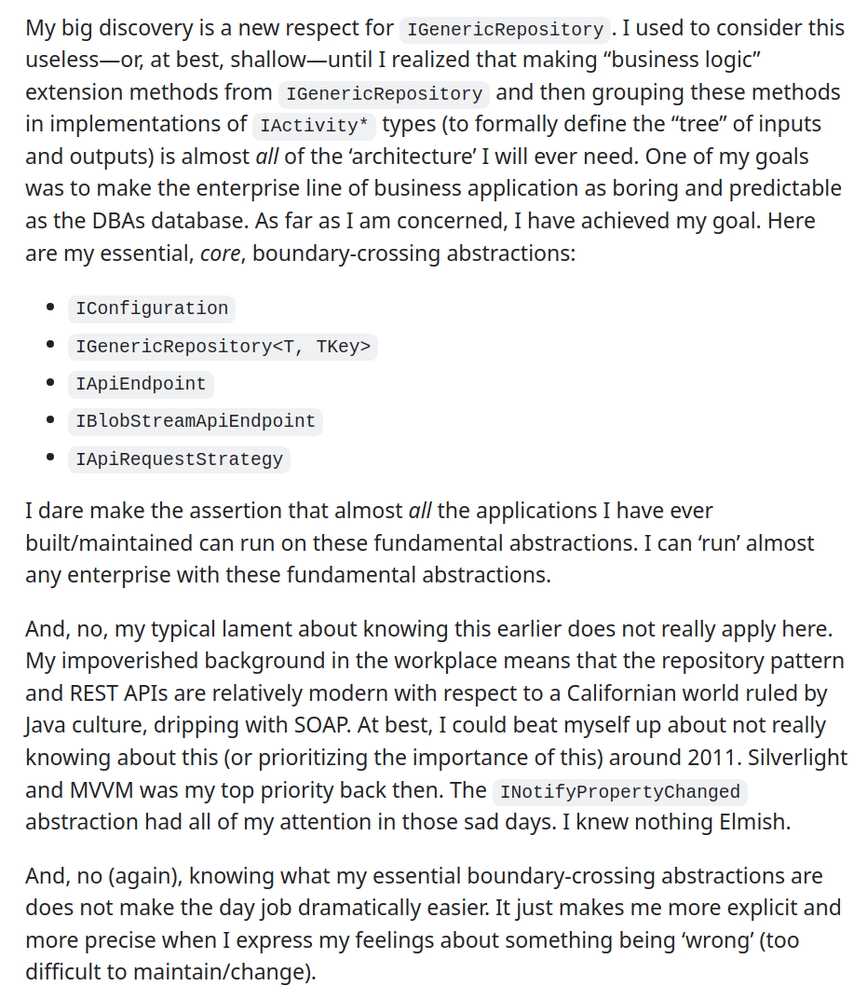
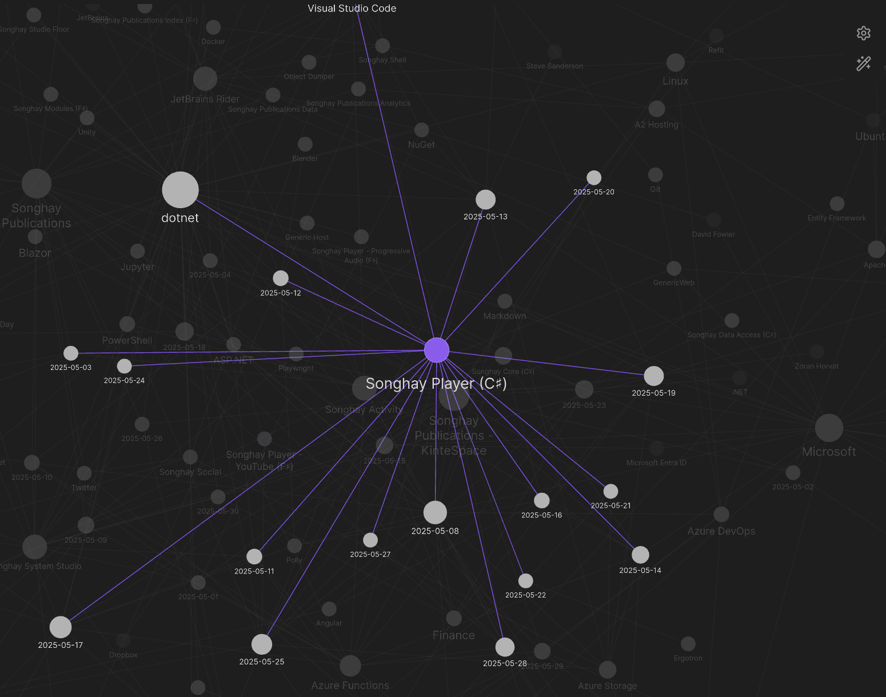
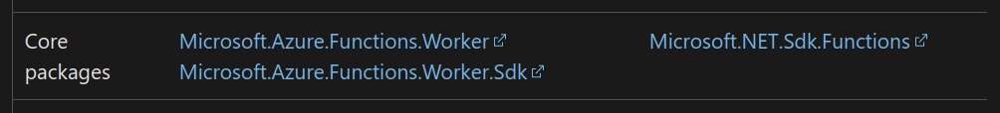
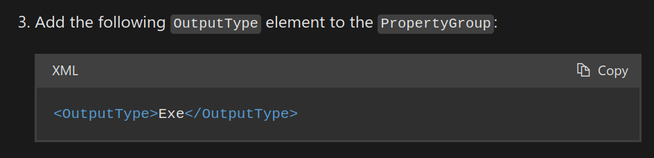
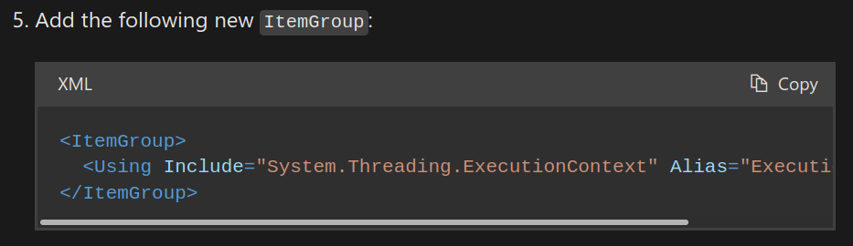
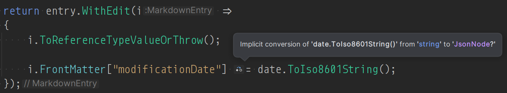
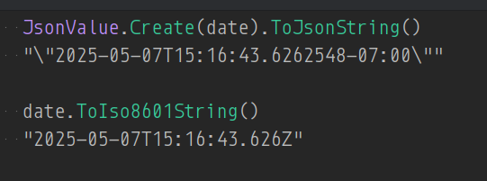
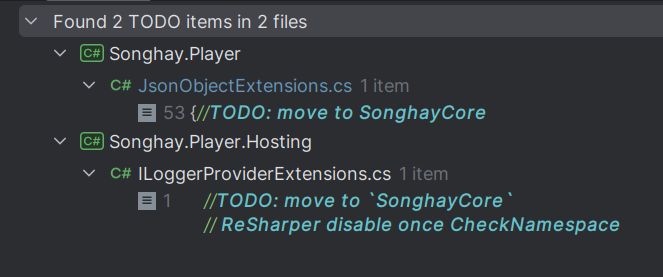

---json
{
  "documentId": 0,
  "title": "studio status report: 2025-05",
  "documentShortName": "2025-05-30-studio-status-report-2025-05",
  "fileName": "index.html",
  "path": "./entry/2025-05-30-studio-status-report-2025-05",
  "date": "2025-05-30T21:20:48.183Z",
  "modificationDate": "2025-05-30T21:20:48.183Z",
  "templateId": 0,
  "segmentId": 0,
  "isRoot": false,
  "isActive": true,
  "sortOrdinal": 0,
  "clientId": "2025-05-30-studio-status-report-2025-05",
  "tag": "{\n  \u0022extract\u0022: \u0022month 05 of 2025 was about discovering the essential \\u2018boundary-crossing abstractions\\u2019 and rewriting Songhay.Player for the last time, really My discovery this month was so important to me that I actually broke the fourth wall and posted my words from my p\\u2026\u0022\n}"
}
---

# studio status report: 2025-05

## month 05 of 2025 was about discovering the essential ‘boundary-crossing abstractions’ and rewriting `Songhay.Player` for the last time, really

My discovery this month was so important to me that I actually broke the fourth wall and [posted](https://www.linkedin.com/posts/wilhite_hey-people-it-is-old-guy-manifesto-activity-7332515716329349121-Gd4t?utm_source=share&utm_medium=member_desktop&rcm=ACoAAADEJ_ABMWbhfBWE7JW6GvOyg5pLa5zVK-Q) _my words_ from my personal journal on LinkedIn:

<div style="text-align:center">



</div>

The five abstractions mentioned above (excluding `IConfiguration` because that abstraction is from Microsoft) will be in the next release of `SonghayCore` [🔗 [GitHub](https://github.com/BryanWilhite/SonghayCore)]. How big is this realization? For the first ime in my life, I can refer to myself as an _architect_ which is a great, sincere feeling because I am not getting any younger 😐🧓

These new abstractions are temporarily lodging in my b-roll server project `Songhay.Player`. I am counting 16 days in the Obsidian graph view that were dedicated to Songhay Player (C♯) (`Songhay.Player`) and these novel abstractions:

<div style="text-align:center">



</div>

16 days of _epic_ re-factoring!

In “sketching out development projects” below there is the following line item:

- replace current b-roll player API with Azure Functions

The 16 days of epic re-factoring will address this line item, royally. In fact, these 16 days will inform how I build enterprise systems for the rest of my life. Having these new abstractions does _not_ mean I know “everything”—it means I know the essentials, the rock-solid fundamentals. Here is [an article from 2003 by Martin Fowler](https://martinfowler.com/eaaCatalog/repository.html) talking about the repository pattern, so I ‘should’ have known this earlier, right? Not really. First of all, there is a difference between the repository pattern and the _generic_ repository pattern. This list of ingredients that inspired me are not hanging low from the proverbial trees:

- the recent release of _keyed_ dependencies from Microsoft [📖 [docs](https://learn.microsoft.com/en-us/dotnet/core/extensions/dependency-injection#keyed-services)] (this lack of keys probably explains why the other, non-Microsoft DI frameworks are still in use)
- being made aware of the _generic_ repository pattern by a kid from the current day job
- my relatively new, healthy lack of respect for integration testing—such massive disrespect is made possible by well-placed, mockable, boundary-crossing abstractions (and new understanding of the role Jupyter Notebooks play)
- the idea of using domain-specific extension methods with a generic (domain-non-specific) repository (this idea came the fastest because of my fondness for extension methods)
- my inexperience, lack of industry role models and lack of critical thinking skills that delayed me seeing why `HttpRequestMessage` needs to be ‘hidden’ behind an abstraction
- the awkward starts and stops of Microsoft’s Entity Framework teams that eventually developed a `DbContext` type that not that far removed from a plain-old CLR object (POCO)
- my time wasted being dragged through at least two very, very different Azure Storage SDKs that finally prompted me to employ a REST-based approach to Azure Storage (which then had to be ‘hidden’ behind an abstraction)
- the innovation of generics themselves which did not appear in Java (deformed) much, much later (and Java culture influences .NET people in useful and not-so-useful ways)
- general cognitive load bearing down on me from a myriad of places that have nothing to do with exploring Domain Driven Design

None of the remarks listed above appeared my notes this month. I may write (or actually _speak_) about such things later. In the meantime, selections, from my Studio notes for this month, follow:

## [[Songhay Core (C♯)]]: why can I not de-serialize `ProgramMetadataExtensions`? 😐

It was because I defined `ProgramMetadata` with read-only properties:

```csharp
public Dictionary<string, DbmsMetadata> DbmsSet { get; } = new();
```

…de-serialization now works because of this:

```csharp
public Dictionary<string, DbmsMetadata> DbmsSet { get; init; } = new();
```

>The `init` keyword defines an _accessor_ method in a property or indexer. An init-only setter assigns a value to the property or the indexer element **only** during object construction. An `init` enforces immutability, so that once the object is initialized, it can't be changed. An `init` accessor enables calling code to use an [object initializer](https://learn.microsoft.com/en-us/dotnet/csharp/programming-guide/classes-and-structs/how-to-initialize-objects-by-using-an-object-initializer) to set the initial value. As a contrast, an [automatically implemented property](https://learn.microsoft.com/en-us/dotnet/csharp/programming-guide/classes-and-structs/auto-implemented-properties) with only a `get` setter must be initialized by calling a constructor.
>
>—“[The init keyword (C# Reference)](https://learn.microsoft.com/en-us/dotnet/csharp/language-reference/keywords/init)”
>

## [[Azure Functions]]: “Migrate C# apps from the in-process model to the isolated worker model” 😐😲 #day-job

I had no idea! I had to be shown this:

>[Support for the in-process model ends on November 10, 2026](https://aka.ms/azure-functions-retirements/in-process-model). We highly recommend that you migrate your apps to the isolated worker model by following the instructions in this article.
>
>—“[Migrate C# apps from the in-process model to the isolated worker model](https://learn.microsoft.com/en-us/azure/azure-functions/migrate-dotnet-to-isolated-model?tabs=net8)”
>

I would be awesome to find that all I have to do is swap my “[core packages](https://learn.microsoft.com/en-us/azure/azure-functions/dotnet-isolated-in-process-differences#execution-model-comparison-table)”:



**Update:** the bulk of the changes were indeed [[NuGet]] packages with some very weird exceptions:

<div style="text-align:center">





</div>

>[!important]
>The docs fail to mention that, in addition to `Microsoft.Azure.Functions.Worker.Extensions.Http.AspNetCore`, the `Microsoft.Azure.Functions.Worker.Extensions.Http` package is required.
>

## [[Songhay Player: YouTube]]: yes, this `etag` thing has been real 😐

The `Get-CloudYtChannelsList` command of the YouTube channel maintenance procedure can be modified to collect upload `etag` information which can be used to skip unchanged uploads #to-do There are about 630 [[YouTube]] channels under curation. A little over 500 of them are changing weekly.

## [[dotnet|.NET 8.0]]: yes, “.NET regular expression source generators” will require your class to become `partial`

>.NET 7 introduced a new `RegexGenerator` source generator. A _source generator_ is a component that plugs into the compiler and augments the compilation unit with additional source code. The .NET SDK (version 7 and later) includes a source generator that recognizes the [GeneratedRegexAttribute](https://learn.microsoft.com/en-us/dotnet/api/system.text.regularexpressions.generatedregexattribute) ==attribute on a partial method== that returns `Regex`. The source generator provides an implementation of that method that contains all the logic for the `Regex`.
>
>—“[.NET regular expression source generators](https://learn.microsoft.com/en-us/dotnet/standard/base-types/regular-expression-source-generators)”
>

Because this brave new world of `RegexGenerator` depends on a partial method, the `class` containing this method must be made partial:

>When a method declaration includes a `partial` modifier, that method is said to be a _**partial method**_. Partial methods may only be declared as members of partial types ([§15.2.7](https://learn.microsoft.com/en-us/dotnet/csharp/language-reference/language-specification/classes#1527-partial-type-declarations)), and are subject to a number of restrictions.
>
>—“[15.6.9 Partial methods](https://learn.microsoft.com/en-us/dotnet/csharp/language-reference/language-specification/classes#1569-partial-methods)”
>

I was thrown into this news when I accepted a re-factoring hint from [[JetBrains Rider]] which gave me the `GeneratedRegex` on line 134:

<div style="text-align:center">


</div>

## [[dotnet|.NET 8.0]]: the importance of `JsonValue.Create` in [[Songhay Publications (C♯)]] 😐🥶

I am unable to explain why the unit test, `MarkdownEntryExtensionsTests.WithNew11tyFrontMatterAndContentHeaderAndTouch_Test`, is now passing. But the change to make things work is this:

```csharp
i.FrontMatter["modificationDate"] = JsonValue.Create(date);
```

…which used to be this:

```csharp
i.FrontMatter["modificationDate"] = date.ToIso8601String();
```

The old statement caused an exception with the message:

```console
A value of type 'System.String' cannot be converted to a 'System.DateTime'.
```

…which made me think that Microsoft’s `GetValue<T>` was fundamentally flawed. Meanwhile, there was hint in [[JetBrains Rider]] that led me to `JsonValue.Create`:

<div style="text-align:center">



</div>

```console
Implicit conversion of 'date.ToIso8601String()' from 'string' to 'JsonNode?' 
```

It is very likely that the “implicit conversion” generates a `JsonNode` of `JsonValueKind.String` with no ‘understanding’ that this string is a ‘date string.’

Superficially, `JsonValue.Create(date)` should be identical to `date.ToIso8601String()`. In both cases the node is of `JsonValueKind.String`—in fact, `JsonValue.Create(date).GetValueKind()` is of `JsonValueKind.String` 😐 Somebody is hiding the secret sauce from me 🥶

Okay, here is one more clue:

<div style="text-align:center">



</div>

>[!important]
>My current `ToIso8601String()` routine needs to be informed by  `JsonValue.Create(date)` #to-do

## [[Songhay Publications|Publications]]: “Elasticsearch Vs OpenSearch | Comparing Elastic and AWS Search Engines”

<div style="text-align:center">

<figure>
    <a href="https://www.youtube.com/watch?v=62u30TO-OsA">
        
    </a>
    <p><small>Elasticsearch Vs OpenSearch | Comparing Elastic and AWS Search Engines</small></p>
</figure>

</div>

>The [OpenSearch Software Foundation](https://hubs.la/Q03ldHNd0), the vendor-neutral home for the OpenSearch Project, today announced the general availability of OpenSearch 3.0. This major release delivers a 9.5x performance improvement over OpenSearch 1.3, building on [benchmarking data](https://hubs.la/Q03ldJkL0) that showed earlier iterations of OpenSearch operating 1.6x faster than its closest industry competitor.
>
>—“[OpenSearch 3.0 Enhances Vector Database Performance, Search Infrastructure and Scalability to Meet AI-driven Demand](https://opensearch.org/blog/opensearch-3-0-enhances-vector-database-performance/)”
>

## [[Selenium WebDriver]]: there may not be a need to run Web-driver tests from conventional test projects 😐🧠💡 #day-job

When I see a line of code like this:

```csharp
chromeDriver.Navigate().GoToUrl("https://localhost:7082");
```

… the `"https://localhost:7082"` jumps out at me—it is effectively saying, “I am an external process that can be run from anywhere”—anywhere like a [[Jupyter|Jupyter Notebook]] 💡

The promise here is a powerful, professional approach to <acronym title="end-to-end">E2E</acronym> testing of Web <acronym title="User Interface">UI</acronym>s 👏

>[!error]
>[[Selenium WebDriver|WebDriver]] appears to not support authenticating with the browser first and then running tests! However, Microsoft’s [[Playwright]] appears to support this \[📖 [docs](https://playwright.dev/docs/auth) \]

<div style="text-align:center">

<figure>
    <a href="https://www.youtube.com/watch?v=JdMkZUePkSE">
        
    </a>
    <p><small>Get started with end-to-end testing: Playwright | Episode 2 - Getting Started</small></p>
</figure>

</div>

## [[Azure Functions]]: when did the `[Blob]` attribute appear on the scene? 👴😐 #make-blog-post

Too many demos and docs highlight `[BlobTrigger]` \[📖 [docs](https://learn.microsoft.com/en-us/azure/azure-functions/functions-bindings-storage-blob-trigger) \] instead of `[Blob]`—likely because of historical reasons as the former appeared well before the latter. This video from four years ago _properly_ introduces the `[Blob]` attribute (to me):

<div style="text-align:center">

<figure>
    <a href="https://www.youtube.com/watch?v=z5AQdk-43ZI">
        
    </a>
    <p><small>Azure Functions University - Blob Lesson (.NET Core)</small></p>
</figure>

</div>

## [[Songhay Player (C♯)]]: the (obvious) need found for `GetPropertyJsonNodeOrNull` 😐🤓

Today, there remains two #to-do items:

<div style="text-align:center">



</div>

The discovery of this need came from seeing (again) the obvious. This will fail:

```csharp
return jObject  
    .GetPropertyJsonObjectOrNull("snippet")  
    .GetPropertyJsonObjectOrNull("publishedAt")?  
    .GetValue<DateTime>();
```

…this will not:

```csharp
return jObject  
    .GetPropertyJsonObjectOrNull("snippet")  
    .GetPropertyJsonNodeOrNull("publishedAt", logger)?  
    .GetValue<DateTime>();
```

The `publishedAt` property does _not_ represent an object 😐

## [[Blender]] has a default (?) color space

[BT.709](https://www.color.org/chardata/rgb/BT709.xalter) is the color space, according to the following video:

<div style="text-align:center">

<figure>
    <a href="https://www.youtube.com/watch?v=Xf5KSLG0XaQ">
        
    </a>
    <p><small>Blender 4.4 Features in LESS THAN FIVE MINUTES!</small></p>
</figure>

</div>

…I seem to recall this clearly defined color space being a first.

## [[dotnet|.NET]]: of course it would be [[Steve Sanderson]] presenting the best lecture on <acronym title="Artificial Intelligence">AI</acronym> I have ever seen 🎊👏

<div style="text-align:center">

<figure>
    <a href="https://www.youtube.com/watch?v=Xyios5mdkIM">
        
    </a>
    <p><small>Keynote: The past, present, and future of AI for application developers - Steve Sanderson</small></p>
</figure>

</div>

## [[Angular]]: “You're misunderstanding DDD in Angular (and Frontend)”

Brutal. Autodidact talking to code camp graduates:

>All in all, there's a growing [semantic diffusion](https://martinfowler.com/bliki/SemanticDiffusion.html?ref=angularspace.com) within frontend communities about DDD and it's bringing more harm than good (in short, _semantic diffusion_ happens when people use a term without understanding it and, within some time, the meaning gets derailed ☹️).
>
>…
>
>DDD is a methodology that's rather easy to cover just the main topics and building blocks (see: _DDD at a glance_ section below). But **it takes many years of hard work** to gather the experience (not just theoretical knowledge) to be able to **use it in practice** for the **benefit of your product**.
>
>—“[You're misunderstanding DDD in Angular (and Frontend)](https://www.angularspace.com/youre-misunderstanding-ddd-in-angular-and-frontend/)”
>

## [[dotnet|.NET]]: when the output from one test can be the input for another test, do _not_ immediately build an ordered test 😐🧠💡 #dotnet-architecture

… Instead chaining one test to another 🔬🔗🔬, we should build _decoupled_ (unit) tests:

>[!important]
>The output of one test can be used as hand-curated input ✋🦋 for another test. This curation process should be considered “part of the job”—actually maintaining an app like a professional (instead of an animal). This curation decouples one test from another—and is my explanation as to why [[JetBrains Rider]] does _not_ support ordered tests.
>

Again, I have to celebrate [[Object Dumper]] which makes this curation process far easier—especially with legacy spaghetti 🍝👴

## [[Songhay Player (C♯)]]: I think the final piece to the puzzle is `IApiRequestStrategy` 😐❓ #dotnet-architecture

My previous concerns about the removal of `Uri`-building parameters from `I*ApiEndpoint` contracts has been addressed with `IApiRequestStrategy.GenerateHttpRequestMessage()`. This will make centralizing all of the <acronym title="Application Programming Interface">API</acronym> requests possible (perhaps with `Dictionary<string, IApiRequestStrategy>`?) via some kind of Provider for <acronym title="Dependency Injection">DI</acronym>.

`IApiRequestStrategy` externalizes the generation of `HttpRequestMessage` which reduces the uniqueness of all implementations of `I*ApiEndpoint` contracts—these implementations would be distinguished by `ResiliencePipeline` going forward which makes them more <acronym title="Dependency Injection">DI</acronym> ‘friendly.’

`IApiRequestStrategy` has the suffix Strategy because I am under the impression that I am using the [Strategy Pattern](https://refactoring.guru/design-patterns/strategy/csharp/example).

## [[Songhay Player (C♯)]]: `IApiEndpoint` and `IApiRequestStrategy` depend on each other 😐

Both of these contracts have one member, respectively:

```csharp
Task<string> DownloadStringAsync(IApiRequestStrategy requestStrategy, string? path);
```

```csharp
HttpRequestMessage GenerateHttpRequestMessage(string? path);
```

>[!important]
>`IApiEndpoint.DownloadStringAsync` passes `string? path` through to `IApiRequestStrategy.GenerateHttpRequestMessage`.

This ‘coupling’ is by design—my design—and it feels like a hack. The problem starts with this first question:

>[!question]
>What happens when I want my “request strategy” to be based on a `Uri`?
>

…which leads to other unpleasant-but-valid questions:

- Are you suggesting that a `Uri` is _not_ the default “request strategy”?
- Why are no generics involved here?
- What do you mean by pass though?

I think generics should be involved here:

```csharp
Task<string> DownloadStringAsync<TItem>(IApiRequestStrategy requestStrategy, TItem? requestItem);
```

```csharp
HttpRequestMessage GenerateHttpRequestMessage<TItem>(TItem? requestItem);
```

Yuck. What kind of name is `requestItem`?

```csharp
Task<string> DownloadStringAsync<TData>(IApiRequestStrategy requestStrategy, TData? requestData);
```

```csharp
HttpRequestMessage GenerateHttpRequestMessage<TData>(TData? requestData);
```

…only slightly better.

>[!warning]
>The use of generic type arguments in an interface forces the implementer to check for types.  

## [[Entity Framework]]: the Generic Async Repository has been around since before 2019…

…and it’s time to catch up! “[Repository Pattern – Generic Async Repositories in C#](https://blog.zhaytam.com/2019/03/14/generic-repository-pattern-csharp/)” is proof that this idea has been around since before 2019. My motivation for (finally) introducing this idea into my Studio includes:

- the desire to define and centralize CRUD operations for [[Entity Framework|Entity Framework Core]]
- providing the generic repository abstraction, `IGenericRepository<T, TKey>`, that can be specialized via extension methods for specific applications

>[!important]
>The default implementation of `IGenericRepository<T, TKey>` needs a `DbContext` in order to construct. `DbContext` is the base class of _all_ [[Entity Framework|Entity Framework Core]] applications.

I have prepared a new, quick-and-dirty release of [[Songhay Data Access (C♯)]] under [issue #14](https://github.com/BryanWilhite/Songhay.DataAccess/issues/14) #to-do to address this ‘discovery’ 😐

## [[FFmpeg]]: `typed-ffmpeg` might help me write [[Jupyter|Jupyter Notebooks]] for video processing 😐🎥 #to-do

>**typed-ffmpeg** offers a modern, Pythonic interface to FFmpeg, providing extensive support for complex filters with detailed typing and documentation. Inspired by `ffmpeg-python`, this package enhances functionality by addressing common limitations, such as lack of IDE integration and comprehensive typing, while also introducing new features like JSON serialization of filter graphs and automatic FFmpeg validation.
>
>—<https://github.com/livingbio/typed-ffmpeg>
>

## [[dotnet|.NET]]: that time I asked about the `>>` operator of F♯ 😐❓

This [StackOverflow answer](https://stackoverflow.com/a/71578086/22944) pretty much answered my question:

…this:

```fsharp
PizzaConfigMsg >> dispatch
```

…is the same as this:

```fsharp
fun pizzaMsg -> pizzaMsg |> PizzaConfigMsg |> dispatch
```

>This tells us that the code is converting a value of type `PizzaConfigMsg` (which I've called `pizzaMsg` above) to a top-level `Message` via the `Message.PizzaConfigMsg` union case, then dispatching the result.
>
>This style of coding (where function arguments become implicit, rather than explicit) is called "point-free programming". You can find more information about it [here](https://blog.jayway.com/2012/05/08/point-free-programming-style-in-f/).

The above link does not work as of this writing 😐 Alternatives:

- “[Programming in the Point-Free Style](https://eiriktsarpalis.wordpress.com/2017/04/02/programming-in-the-point-free-style/)”
- See “[Partial application and point-free programming](https://learn.microsoft.com/en-us/dotnet/fsharp/style-guide/conventions#partial-application-and-point-free-programming)” in “[F# coding conventions](https://learn.microsoft.com/en-us/dotnet/fsharp/style-guide/conventions)”
- “[F# Tip 4: When (not) to use point-free style](https://dev.to/shimmer/f-tip-4-when-not-to-use-point-free-style-57m3)”
- “[Tacit programming](https://en.wikipedia.org/wiki/Tacit_programming)”
- “[Point-free style in F#](https://christianjacobsens.wordpress.com/tag/tacit/)”

I think I need to study the subject of _point-free programming_ in order to get more context 😐 #to-do

<div style="text-align:center">

<figure>
    <a href="https://www.youtube.com/watch?v=eXhFH95zzP0">
        
    </a>
    <p><small>37 Point Free</small></p>
</figure>

<figure>
    <a href="https://www.youtube.com/watch?v=seVSlKazsNk">
        
    </a>
    <p><small>“Point-Free or Die: Tacit Programming in Haskell and Beyond” by Amar Shah</small></p>
</figure>

<figure>
    <a href="https://www.youtube.com/watch?v=HSTweR77nug">
        
    </a>
    <p><small>Pointless or Pointfree - Damjan Vujnovic</small></p>
</figure>

</div>

## open pull requests on GitHub 🐙🐈

- <https://github.com/BryanWilhite/Songhay.HelloWorlds.Activities/pull/14>
- <https://github.com/BryanWilhite/dotnet-core/pull/67>

## sketching out development projects

Eliminating Angular JS in the Studio is the top priority. Replacing the Angular JS app (`http://kintespace.com/player.html`) for the kinté space depends on:

- generating a new `index.html` page with eleventy
- supplementing the index with responsive images

Proposed future items:

- complete upgrade to .NET 8.0
- replace current b-roll player API with Azure Functions
- switch Studio Publications from Material Design to Bulma 💄 ➡️ 💄✨
- start `Songhay.Modules.Bolero.Index` project
- generate responsive and social images with AI

🐙🐈<https://github.com/BryanWilhite/>
