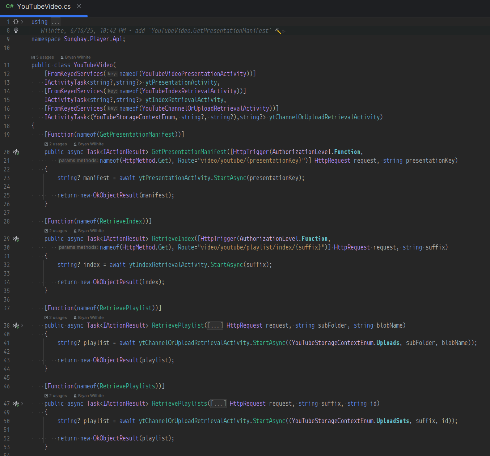
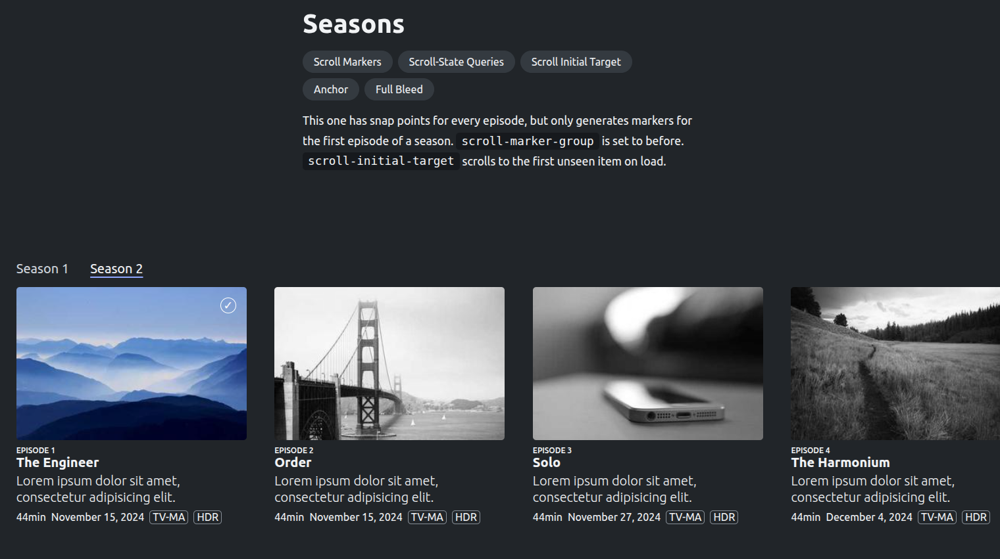

---json
{
  "documentId": 0,
  "title": "studio status report: 2025-06",
  "documentShortName": "2025-06-29-studio-status-report-2025-06",
  "fileName": "index.html",
  "path": "./entry/2025-06-29-studio-status-report-2025-06",
  "date": "2025-06-29T18:43:37.788Z",
  "modificationDate": "2025-06-29T18:43:37.788Z",
  "templateId": 0,
  "segmentId": 0,
  "isRoot": false,
  "isActive": true,
  "sortOrdinal": 0,
  "clientId": "2025-06-29-studio-status-report-2025-06",
  "tag": "{\n  \u0022extract\u0022: \u0022month 06 of 2025 was about releasing the b-roll player API Month 06 of 2025 was about releasing the b-roll player API in Microsoft Azure, solidifying the architectural practice of this Studio as this release features: - the premiere use of Microsoft\\u2019s Htt\\u2026\u0022\n}"
}
---

# studio status report: 2025-06

## month 06 of 2025 was about releasing the b-roll player <acronym title="Application Programming Interface">API</acronym>

Month 06 of 2025 was about releasing the b-roll player <acronym title="Application Programming Interface">API</acronym> in Microsoft Azure, solidifying the architectural practice of this Studio as this release features:

- the premiere use of Microsoft’s `HttpTriggerAttribute.Route` \[🔗 [GitHub](https://github.com/Azure/azure-functions-dotnet-worker/blob/ba0f4dc6e0318af9a493198179dc46a29afb7e57/extensions/Worker.Extensions.Http/src/HttpTriggerAttribute.cs#L59) \] attribute for endpoints which allows me to match routes already set up on the legacy Player <acronym title="Application Programming Interface">API</acronym>
- the premiere use of Microsoft’s keyed <acronym title="Dependency Injection">DI</acronym> which is new to dotnet|.NET 8.0
- the keyed injection of Activities into Functions classes which formally define the ‘tree’ of inputs and outputs of the domain
- the premiere use of the new ‘boundary-crossing’ abstractions of this Studio (e.g. `IApiEndpoint` \[🔗 [GitHub](https://github.com/BryanWilhite/SonghayCore/blob/main/SonghayCore/Abstractions/IApiEndpoint.cs) \]) which still find quite revolutionary-but-not-at-all-glamorous at the moment (more detail is in [last month’s report](https://songhayblog.azurewebsites.net/entry/2025-05-30-studio-status-report-2025-05/))
- the premiere use of `IConfiguration` as a form of input, causing the new Studio convention of `*ShellActivity` Activities which are concerned with reading command-line input

This API release allows me to make the claim I made over two months ago true: this Studio is in a ready state to focus on building for the front end. Two months ago [my notes referenced](https://songhayblog.azurewebsites.net/entry/2025-04-29-studio-status-report-2025-04/) this Pen: <https://codepen.io/rasx/pen/raNbNwx> This Pen represents the push toward replacing the old-ass Angular JS (and, yes, I mean Angular _JS_) home splash for kintespace.com with a splash based on eleventy. Ideally, more to come…

According to the Obsidian Graph View, only five days were spent on the b-roll player API:

This is down from the ‘epic’ 16 days used up [last month](https://songhayblog.azurewebsites.net/entry/2025-05-30-studio-status-report-2025-05/) which is understandable as the front end concerns emerge. Speaking of which, here are the NuGet packages released by this Studio for month 06:

- `Songhay.Publications` 8.0.3 \[🔗 [NuGet](https://www.nuget.org/packages/Songhay.Publications/8.0.3) \]
- `SonghayCore` 8.0.2 \[🔗 [NuGet](https://www.nuget.org/packages/SonghayCore/8.0.2) \]

These releases were needed to support the dependencies of the Player API.

The following selected notes should show a month of front-end awareness and maybe a little day-job concern:

## .NET: “Announcing dotnet run app.cs – A simpler way to start with C# and .NET 10”

>[!question]
>Is this is a replacement for C♯ scripting?

>Until now, executing C# code using the `dotnet` CLI required a project structure that included a `.csproj` file. With this new capability, which we call _file-based apps_, you can run a standalone `.cs` file directly, much like you would with scripting languages such as Python or JavaScript.
>
>This lowers the entry barrier to trying out C# and makes the language a much more attractive choice for learning, prototyping, or automation scenarios.
>
>—“[Announcing dotnet run app.cs – A simpler way to start with C# and .NET 10](https://devblogs.microsoft.com/dotnet/announcing-dotnet-run-app/)”
>

## Microsoft introduces Drasi

Mark Russinovich introduces Drasi under “Project RADIUS” \[📹 [watch](https://youtu.be/lHBo_lDWFcI?list=PLlrxD0HtieHgFYS4DKbJ_xCYNE94ZLJjj&t=2796) \]:

<figure>
    
    
<small>Inside Azure innovations with Mark Russinovich | BRK195</small>

</figure>

>Drasi is a new data processing system that simplifies detecting critical events within complex infrastructures and taking immediate action tuned to business objectives. Developers and software architects can leverage its capabilities across event-driven scenarios, whether working on Internet of Things (IoT) integrations, enhancing security protocols, or managing sophisticated applications. The Microsoft Azure Incubations team is excited to announce that Drasi is now available as an open-source project. To learn more and get started with Drasi, visit [drasi.io](https://drasi.io/) and the project’s [GitHub repositories.](https://github.com/drasi-project)
>
>—“[Drasi: Microsoft’s newest open-source project simplifies change detection and reaction in complex systems](https://azure.microsoft.com/en-us/blog/drasi-microsofts-newest-open-source-project-simplifies-change-detection-and-reaction-in-complex-systems/?msockid=064e6834a94b6283390a6744a8b0634b)”
>

>[Drasi](https://drasi.io/), the open-source Data Change Processing platform, is an exciting new option for building change-driven solutions easily. This article explores how Drasi’s unique capabilities—centered around clearly defined change semantics, the continuous query pattern, and the reaction pattern—provide a more efficient and effective alternative to traditional event-driven implementations. By codifying consistent patterns and reducing complexity, Drasi empowers solution architects and developers to build responsive systems faster with greater precision and less complexity, which makes them less brittle and easier to update as solution requirements change.
>
>—“[Optimizing Change-Driven Architectures with Drasi](https://techcommunity.microsoft.com/blog/linuxandopensourceblog/optimizing-change-driven-architectures-with-drasi/4404675)”
>

## .NET: `json-everything` extension method #to-do

The `IsEquivalentTo` method \[🔗 [link](https://github.com/json-everything/json-everything/blob/43edec29bab368bbd53a4938993318612643aae8/src/Json.More/JsonElementExtensions.cs#L24C21-L24C35) \] is interesting and leads to questions like:

- does it use `ToList` for performance reasons or just out of habit?
- will it work with `ToArray`?
- can it be modified to record/store the location/values of the diff?

## Publications: “Self-hosting your own media considered harmful”

>So along that theme, I've re-uploaded the video to Internet Archive, free for anyone to download and view at their leisure.
>
>…
>
>Some in the fediverse ask why I'm not on Peertube. Here's the problem (and it's not insurmountable): _right now_, there's no easy path towards sustainable content production when the audience for the content is 100x smaller, and the number of patrons/sponsors remains proportionally the same.
>
>—“[Self-hosting your own media considered harmful](https://www.jeffgeerling.com/blog/2025/self-hosting-your-own-media-considered-harmful)”
>

## Microsoft finally has an answer to Amazon Workspaces 😐

>Microsoft Dev Box gives developers self-service access to ready-to-code cloud workstations called _dev boxes_. You can configure dev boxes with tools, source code, and prebuilt binaries that are specific to a project, so developers can immediately start work. You can create cloud development environments for your developer teams by using a customized image, or a preconfigured image from Azure Marketplace, complete with Visual Studio already installed.
>
>If you're a developer, you can use multiple dev boxes in your day-to-day workflows. Access and manage your dev boxes through the developer portal.
>
>Microsoft Dev Box bridges the gap between development teams and IT, by bringing control of project resources closer to the development team.
>
>—“[What is Microsoft Dev Box?](https://learn.microsoft.com/en-us/azure/dev-box/overview-what-is-microsoft-dev-box)”
>

## Microsoft SQL Server: `HierarchyId` has been around since 2008 #day-job

>The [hierarchyid](https://learn.microsoft.com/en-us/sql/t-sql/data-types/hierarchyid-data-type-method-reference?WT.mc_id=DT-MVP-5003978) type was introduced with SQL Server 2008. This type is used to represent and manipulate hierarchical data. Hierarchical data contain the notion of parent/child but also the notion of order between elements having the same parent. Values ​​of this type are stored in a binary form, for example, `0x5AC0` or `0x58`, but in practice, we use character strings of the type `'/'` for the root or `'/1/'` for a child of the root node…
>
>—“[SQL Server - Discovering the HierarchyId data type](https://www.meziantou.net/sql-server-discovering-the-hierarchyid-data-type.htm)”
>

Assuming this `HierarchyId` thing takes off, I’ll need to move into Entity Framework: “[EF Core SQL Server HierarchyID - Use HierarchyId](https://riptutorial.com/efcore-sqlserver-hierarchyid/learn/100002/use-hierarchyid)”

Additional reading: “[Using SQL Server HierarchyId with Entity Framework Core](https://www.meziantou.net/using-hierarchyid-with-entity-framework-core.htm)” 📖

## Finance: tech layoffs from a change in tax law?

>Section 174 of the Internal Revenue Code governs the tax treatment of research and development (R&D) expenditures. For roughly 70 years, American companies could deduct 100% of “qualified research and development spending” in the year they incurred the costs, and this was generally interpreted pretty liberally. Salaries, software, contractor payments… if it contributed to creating or improving a product, it could be deducted “off the top” of a firm’s taxable income. The [deduction was](https://www.thetaxadviser.com/issues/2024/jun/rights-for-the-research-development-credit-and-sec-174/#:~:text=Originally%20enacted%20in%201954%2C%20Sec,product%20development%20expenses%20under%20Sec.) originally codified by Section 174 of the IRS Code of 1954, and under the provision, R&D flourished in the U.S. It gave us the dominance of Bell Labs, Microsoft, Apple, Google, Facebook - pretty much all the US technology booms you’ve lived through unless you’re quire venerable.
>
>—“[The Tech Job Meltdown](https://www.professoraxelrod.com/p/the-tech-job-meltdown)”
>

## Songhay Player (C♯): the thinnest ‘controllers’ ever 😐

The following seems so obvious now that it all comes together:

Here are some initial observations:

- my Activity concept makes a thin ‘controller’ (just two lines of code per endpoint)—and these Activities can also be used in other contexts like the command line (by calling these Activities shown above from a dedicated `*ShellActivity` class which knows how to read `IConfiguration` stuff)—or even something as old-fashioned as a Windows Service
- the ‘art form’ around building an Activity class is to not hide long-running operations in massive `for` loops which would make lowest-cost Azure Functions fall over under the hidden weight
- keyed services via <acronym title="Dependency Injection">DI</acronym> is new to .NET 8.0, making this one of many things we had to wait for from Microsoft
- the fundamental use case for Azure Functions (not particularly celebrated by Microsoft these days) is as a direct (serverless) replacement for ASP.NET Web API
- I am sure David Fowler’s .NET Aspire would have made building this better(?)/faster(?) but, at the moment, I remain ignorant of the benefits (when I somehow have several “micro-services” to deal with instead of _one_ Functions App, I will look forward to .NET Aspire)

## Publications: “CSS Color Functions”

>sRGB has been a standard color space for the web [since 1996](https://www.w3.org/Graphics/Color/sRGB.html). However, it’s closer to how old computers represented color, rather than how humans understand it, so it had some problems like not being able to capture the full gamut of modern screens. Still, many modern applications and websites use sRGB, so even though it is the “old way” of doing things, it is still widely accepted and used today.
>
>…
>
>[Björn Ottosson](https://bottosson.github.io/about/) created this color space as [an “OK” and even better version of the lab color space](https://www.smashingmagazine.com/2024/10/interview-bjorn-ottosson-creator-oklab-color-space/). It was created to solve [the limitations of CIELAB and CIELAB color space](https://www.w3.org/Graphics/Color/Workshop/slides/talk/lilley#limit) like image processing in `lab()`, such as making an image grayscale, and perceptual uniformity. The two color functions in CSS that correspond to this color space are `oklab()` and `oklch()`. #to-do
>
>—“[CSS Color Functions](https://css-tricks.com/css-color-functions/)”
>

## Publications: my first sign of F♯ people daring to question React 😐⏰

>Fastoch is a virtual DOM for Elmish with minimal dependencies.
>
>…
>
>Elmish is a great model to develop robust web applications in F#.
>
>However, having a dependency on React has three main drawbacks:
>
> - React does more than what is needed by Elmish, and is a bit heavy for the job.
> - React must be added using npm as is it not a Fable component.
> - React is developed by Facebook which is an awful company lead by a masculinist billionaire CEO.
>
>—<https://codeberg.org/thinkbeforecoding/Fastoch>
>

## Publications: “AI Photo Upscaling is Getting Worse! Gigapixel vs On1 PhotoRAW vs Luminar Neo”

One interesting point made in this video is that older machine-learning based up-scaling (e.g. in Photoshop) is better than the novel _generative_ products:

<figure>
    
    
<small>AI Photo Upscaling is Getting Worse! Gigapixel vs On1 PhotoRAW vs Luminar Neo</small>

</figure>

## Publications: my extensive work on thumbs is dead on Chromium 😐🧐 #to-do

<https://chrome.dev/carousel/>

>This one has snap points for every episode, but only generates markers for the first episode of a season. `scroll-marker-group` is set to before. `scroll-initial-target` scrolls to the first unseen item on load.

## Publications: did Dan Cătălin Burzo write the responsive-image article of the century? 😐 #to-do

>But what the HTML Standard is concerned with, and what this article talks about, are the so-called “adaptive images” enabled by the [`srcset`](https://developer.mozilla.org/en-US/docs/Web/API/HTMLImageElement/srcset) and [`sizes`](https://developer.mozilla.org/en-US/docs/Web/API/HTMLImageElement/sizes) attributes on ``, and the dedicated [`<picture>`](https://developer.mozilla.org/en-US/docs/Web/HTML/Element/picture) and [`<source>`](https://developer.mozilla.org/en-US/docs/Web/HTML/Element/source) elements. These HTML features help the browser pick the most appropriate image _content_ for the current environment.
>
>—“[How to think about HTML responsive images](https://danburzo.ro/responsive-images-html/)”
>

## Bolero: latest releases seem to all around “Blazor Interactive Render Modes”

>`IServiceCollection.AddBoleroComponents()` to be called instead of `IServiceCollection.AddBoleroHost()` to use interactive render modes. When that is used, `boleroScript` will include `blazor.web.js` instead of `blazor.server.js` or `blazor.webassembly.js`.
>
>—<https://github.com/fsbolero/Bolero/releases>
>

## Publications: Rachel Andrews is working on some columns stuff 😐🍱

>And, now we’re doing it. [I’m working on the specification](https://drafts.csswg.org/css-multicol-2/#ch) (which is in a _very_ draft state right now). There’s also an experimental implementation behind a runtime flag in Chrome Canary, thanks to the work of [Morten Stenshorne](https://github.com/mstensho) at Chrome.
>
>If you want to follow along as we pick through the details, keep an eye on the [css-multicol-2](https://github.com/w3c/csswg-drafts/issues?q=state%3Aopen%20label%3A%22css-multicol-2%22) tag.
>
>—“[CSS multicol block direction wrapping](https://rachelandrew.co.uk/archives/2025/04/04/css-multicol-block-direction-wrapping/)”
>

## open pull requests on GitHub 🐙🐈

- <https://github.com/BryanWilhite/Songhay.HelloWorlds.Activities/pull/14>
- <https://github.com/BryanWilhite/dotnet-core/pull/67>

## sketching out development projects

Eliminating Angular JS in the Studio is the top priority. Replacing the Angular JS app (`http://kintespace.com/player.html`) for the kinté space depends on:

- generating a new `index.html` page with eleventy
- supplementing the index with responsive images

Proposed future items:

- complete upgrade to .NET 8.0
- replace current b-roll player API with Azure Functions
- switch Studio Publications from Material Design to Bulma 💄 ➡️ 💄✨
- start `Songhay.Modules.Bolero.Index` project
- generate responsive and social images with AI

🐙🐈<https://github.com/BryanWilhite/>
