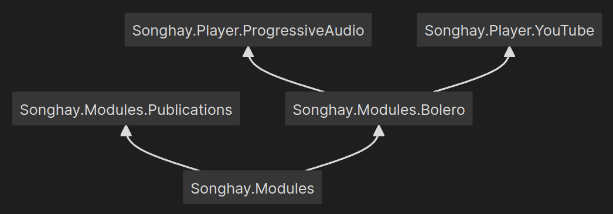
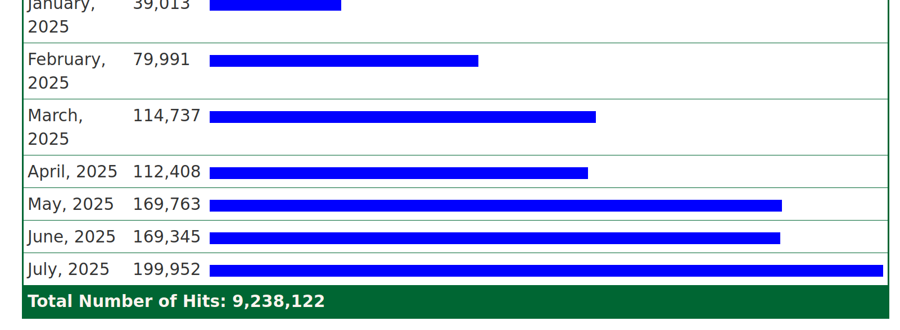
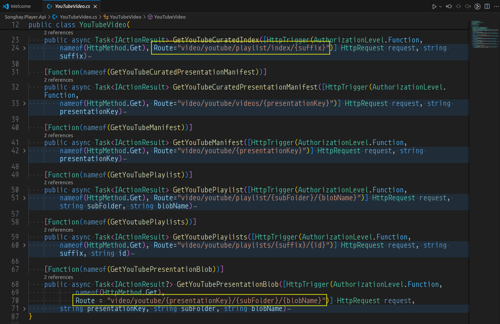
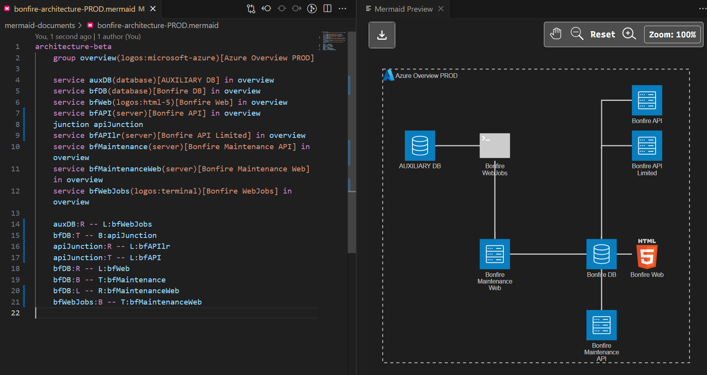
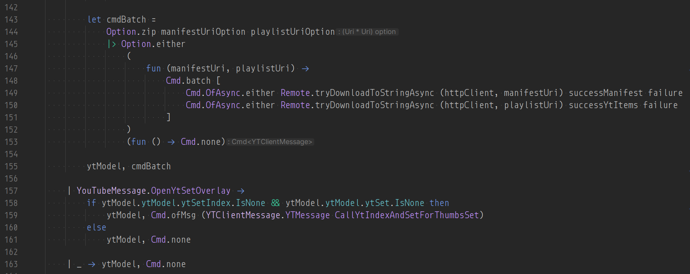

---json
{
  "documentId": 0,
  "title": "studio status report: 2025-08",
  "documentShortName": "2025-08-31-studio-status-report-2025-08",
  "fileName": "index.html",
  "path": "./entry/2025-08-31-studio-status-report-2025-08",
  "date": "2025-08-31T15:38:35.641Z",
  "modificationDate": "2025-08-31T15:38:35.641Z",
  "templateId": 0,
  "segmentId": 0,
  "isRoot": false,
  "isActive": true,
  "sortOrdinal": 0,
  "clientId": "2025-08-31-studio-status-report-2025-08",
  "tag": "{\n  \u0022extract\u0022: \u0022month 08 of 2025 was about readying more Studio WebAssembly assets for the new b-roll player API Just like last month, month 08 of 2025 was about readying the Studio [[WebAssembly]] assets for the new b-roll player API released last month. In so doing, th\\u2026\u0022\n}"
}
---

# studio status report: 2025-08

## month 08 of 2025 was about readying _more_ Studio WebAssembly assets for the new b-roll player API

Just like [last month](https://songhayblog.azurewebsites.net/entry/2025-07-29-studio-status-report-2025-07), month 08 of 2025 was about readying the Studio [[WebAssembly]] assets for the new b-roll player <acronym title="Application Programming Interface">API</acronym> released [last month](https://songhayblog.azurewebsites.net/entry/2025-06-29-studio-status-report-2025-06/). In so doing, the following [[NuGet]] packages were updated:

- `Songhay.Modules.Bolero` [8.1.0](https://www.nuget.org/packages/Songhay.Modules.Bolero/8.1.0) 📦🚀
- `Songhay.Player.ProgressiveAudio` [8.1.0](https://www.nuget.org/packages/Songhay.Player.ProgressiveAudio/8.1.0) 📦🚀
- `Songhay.Player.YouTube` [8.1.0](https://www.nuget.org/packages/Songhay.Player.YouTube/8.1.0) 📦🚀

The list above is saying that, over the last two months, I walked up the F♯ stack 🔨🥞 in this Studio:

<div style="text-align:center">



</div>

The [[Obsidian]] graph view suggests six days spent on `Songhay.Modules.Bolero`:

<div style="text-align:center">


</div>

…coupled with five additional days for `Songhay.Player.ProgressiveAudio`:

<div style="text-align:center">


</div>

…and we see some days overlap for `Songhay.Player.YouTube`:

<div style="text-align:center">


</div>

It looks about half of month 08 was spent on this stack walk 🔨🥞 😐

Selected notes below should provide some color for the work done this month:

## kintespace.com: are all these new hits just <acronym title="Artificial Intelligence">AI</acronym> ‘scrapers’? 😐

<div style="text-align:center">



</div>

<https://kintespace.com/khits.html>

## [[Songhay Modules Publications (F♯)]]: the processing of `Presentation.parts`

The `Presentation.parts` member tells us that a Presentation is made up of _parts_ (of type `PresentationPart`). However, there are no types in this Studio (yet) that tells us how to ‘assemble’ a Presentation.

Now, `Presentation.cssCustomPropertiesAndValues` tells us how to layout something somewhere in a Web app—this is fine for the [[Songhay Player - Progressive Audio (F♯)|b-roll progressive audio player]] because it has _one_ layout ‘surface’ (or ‘page’). What about multi-page presentations? #to-do

>[!important]
>The casing of `Presentation` members do not appear to match conventions (or standards?) #to-do 

## [[Steve Sanderson]]: “Preserving State in Server-Side Blazor applications” #to-do

>Generally, using `sessionStorage` is safer, because it avoids the risk that a user opens multiple tabs and encounters bugs or confusing behavior because the tabs are overwriting each other's state. However if you want the data to be retained if the user closes the entire browser, you'll need to use `localStorage`.
>
>—“[Preserving State in Server-Side Blazor applications](https://gist.github.com/SteveSandersonMS/ba16f6bb6934842d78c89ab5314f4b56)”
>

## [[ASP.NET]]: the `KestrelServerLimits.MaxRequestBodySize` property #day-job #to-do

I see that, by default, the size of a request can up to 30MB:

>When set to null, the maximum request body size is unlimited. This limit has no effect on upgraded connections which are always unlimited. This can be overridden per-request via [IHttpMaxRequestBodySizeFeature](https://learn.microsoft.com/en-us/dotnet/api/microsoft.aspnetcore.http.features.ihttpmaxrequestbodysizefeature?view=aspnetcore-9.0). Defaults to 30,000,000 bytes, which is approximately 28.6MB.
>
>—“[KestrelServerLimits.MaxRequestBodySize Property](https://learn.microsoft.com/en-us/dotnet/api/microsoft.aspnetcore.server.kestrel.core.kestrelserverlimits.maxrequestbodysize?view=aspnetcore-9.0)”
>

## [[Windows]]: “Are they trying to kill Windows 10 intentionally?”

>Well, yes, kind of, but that’s not news. Windows 10 is EOL on October 14, 2025. Consumers can get another year of updates either with cold hard cash or the [insane bing battle pass](https://rewards.bing.com/), but I don’t have much confidence in the quality of those updates.
>
>At the end of the day, I understand the struggles of working on near-EOL software. You want to do right by your users, but when resources are constrained, tradeoffs must be made. And in this case, focusing on stability is the correct choice.
>
>—“[The Windows 10 emoji picker has been broken for a month](https://rozab.dev/blog/emoji-search/)”
>

## [[Microsoft SQL Server]]: `JSON_CONTAINS` is a new <acronym title="JavaScript Object Notation">JSON</acronym> function currently in preview

>Using the `JSON_CONTAINS` function has the following limitations:
>
> - The **json** type isn't supported as search value.
> - The JSON object or array returned from `JSON_QUERY` isn't supported as search value.
> - The path parameter is currently required.
> - If the SQL/JSON path points to an array then wildcard is required in the SQL/JSON path expression. Automatic array unwrapping is currently only at the first level.
>
>—[JSON_CONTAINS (Transact-SQL)](https://learn.microsoft.com/en-us/sql/t-sql/functions/json-contains-transact-sql?view=sql-server-ver17)
>

I need to explore the differences between `JSON_QUERY` and `JSON_CONTAINS` #to-do

## [[Songhay Player (C♯)]]: the document order of [[Azure Functions]] method routes matters 😐

The route on line 24 and the route on line 70 both have five segments:

<div style="text-align:center">



</div>

However, the route on line 70 has three placeholders while the one on line 24 has only one. Because both of these routes have five segments, the route with fewer placeholders should come first because [[ASP.NET]] should select that route first as expected when the first four segments of the request are `video/youtube/playlist/index/`; otherwise, when the route on line 70 comes before the one on line 24, the last two segments of our request will be treated as the placeholders `{presentationKey}/{subFolder}/`. I am confident that this document-order convention is mentioned in official documentation #to-do

## [[Blazor]]: “Running .NET in the browser without Blazor” #to-do

This could be the big one that could eliminate [[Bolero]] entirely:

>The templates for building a .NET application that can be run from JavaScript don't ship with the default SDK. They're experimental, so you need to explicitly install them. Which NuGet package to install depends on which version of the templates you want:
>
> - .NET 8: `Microsoft.NET.Runtime.WebAssembly.Templates`
> - .NET 9: `Microsoft.NET.Runtime.WebAssembly.Templates.net9`
> - .NET 10: `Microsoft.NET.Runtime.WebAssembly.Templates.net10`
>
>…
>
>Alternatively you can install the `wasm-experimental` workload, which includes the templates and also…a bunch of _stuff_ 😅 I'm not really sure what that extra stuff is actually _used_ for though, because as far as I can tell, none of it is required for this 🤷‍♂️
>
>—“[Running .NET in the browser without Blazor](https://andrewlock.net/running-dotnet-in-the-browser-without-blazor/)”
>

## [[Songhay System Studio]]: “You’re Wrong About Dates — And Your Code is Lying to You”

>But that’s not how humans think. When you say _“2023”_, you mean the whole year. _“March 2024”_? The entire month. Even _“March 15th”_ means the full day, not some arbitrary nanosecond.
>
>We’ve been forced into fake precision that doesn’t match reality. And it’s not harmless — it leads to broken logic, messy hacks, and subtle bugs that only show up in production.
>
>—“[You’re Wrong About Dates — And Your Code is Lying to You](https://metaduck.com/youre-wrong-about-dates/)”
>

## [[Songhay Modules Bolero (F♯)]]: developing new Studio patterns around `Result<_,_>` and `Option<_>` 😐✨

The [[Elmish]] `model` of [[Bolero]] is expected to have types hydrated by boundary-crossing be `Option<_>` which is clear expression of the uncertainty of data-driven presentation. Yesterday, this fact made me erroneously write expressions like this:

```fsharp
model.restApiMetadataOption |> RestApiMetadata.toApiBase |> Option.isSome
```

…where `RestApiMetadata.toApiBase` is:

```fsharp
static member toApiBase (restApiMetadataOption: RestApiMetadata option) =  
    restApiMetadataOption  
    |> Option.map(_.GetApiBase())
```

I erroneously assumed that I would have write members like this over and over again because I failed to see the power in `FsToolkit.ErrorHandling`:

```fsharp
model.restApiMetadataOption |> Option.map _.GetApiBase() |> Option.isSome
```

The expression above eliminates the curiosity in seeing whether _augmenting_ `Option<RestApiMetadata>`  is possible \[📖 [docs](https://learn.microsoft.com/en-us/dotnet/fsharp/language-reference/type-extensions#optional-type-extensions) \] This augmentation would be the equivalent of trying to write a C♯ extension method for, say, `IEnumerable<T>` with `T` constrained to a specific type which has always felt wrong.

## [[Obsidian]] is not trying to be [[Notion]]

>We’re not trying to be Notion. Notion has raised hundreds of millions of dollars. I think it’s amazing, especially on the collaboration side. It has a lot of advantages that make the app better for certain things. We’re just a small team. Our focus is to keep making the tool better and stay small, as long as we’re making enough money to stay afloat.
>
>—“[How the head of Obsidian went from superfan to CEO](https://www.theverge.com/decoder-podcast-with-nilay-patel/760522/obsidian-ceo-steph-ango-kepano-productivity-software-notes-app)”
>

## kintespace.com: “AI crawlers and fetchers are blowing up websites, with Meta and OpenAI the worst offenders”

>That growing traffic comes from just a select few companies. Meta accounted for more than half of all AI crawler traffic on its own, at 52 percent, followed by Google and OpenAI at 23 percent and 20 percent respectively. This trio then has its hands on a combined 95 percent of all AI crawler traffic. Anthropic, by contrast, accounted for just 3.76 percent of crawler traffic. The Common Crawl Project, which slurps websites to include in a free public dataset designed to prevent duplication of effort and traffic multiplication at the heart of the crawler problem, was a surprisingly-low 0.21 percent.
>
>—“[AI crawlers and fetchers are blowing up websites, with Meta and OpenAI the worst offenders](https://www.theregister.com/2025/08/21/ai_crawler_traffic/)”
>

## [[dotnet|.NET 10]]: and`Microsoft.Testing.Platform` #to-do

>Microsoft.Testing.Platform (MTP) is a lightweight and portable alternative to VSTest for running tests in all contexts, including continuous integration (CI) pipelines, CLI, Visual Studio Test Explorer, and VS Code Text Explorer. The Microsoft.Testing.Platform is embedded directly in your test projects, and there’s no other app dependencies.
>
>…
>
>.NET 10 introduces native integration with Microsoft.Testing.Platform. To enable it, create a `dotnet.config` file at your solution or repository root.
>
>—“[Enhance your CLI testing workflow with the new dotnet test](https://devblogs.microsoft.com/dotnet/dotnet-test-with-mtp/)”
>

## [[Mermaid]]: my first Architecture Diagrams #day-job 😐🌐

Do not forget about the importance of the `junction`:

<div style="text-align:center">



</div>

- the `title` in the Architecture Diagram is not like that of the [Flowchart](https://mermaid.js.org/syntax/flowchart.html); it does not support surrounding “special” characters in quotes—even a hyphen in a title causes a parsing error (years-old, related issues like [#6056](https://github.com/mermaid-js/mermaid/issues/6056) remain open 😐)
- icon support from <https://icon-sets.iconify.design/logos/> is quite nice; however I fail to understand how to change to a different set \[📖 [docs](https://mermaid.js.org/config/icons.html) \] in [[Visual Studio Code]] with [the Mermaid Chart extension](https://marketplace.visualstudio.com/items?itemName=MermaidChart.vscode-mermaid-chart).

## Songhay Publications: kinté space with a brand new understanding of `Option.zip` and `Option.either`

This use of [[FsToolkit.ErrorHandling]] is very novel ✨

<div style="text-align:center">



</div>

`Option.zip` returns `Some` tuple when both options to be zipped are not `None`. Once that check is out of the way, `Option.either` does its magic 🪄 The works perfectly with the `Cmd.batch` pattern from [[Elmish]].

Lines 158 through 161 could also be translated to an `Option.either` pattern out of its `if` expression. I now see that `Option.either`, at bottom, hides the `match` syntax and makes binding a value ‘fluent.’

## [[Songhay System Studio]]: “Why German Strings are Everywhere”

>Strings are conceptually very simple: It’s essentially just a sequence of characters, right? Why, then, does every programming language have [their own](https://en.wikipedia.org/wiki/String_(computer_science)#String_datatypes) slightly different string implementation? It turns out that there is a lot more to a string than “just a sequence of characters”…
>
>We’re no different and built [our own custom string type](https://xkcd.com/927/) that is highly optimized for data processing. Even though we didn’t expect it when we first wrote about it in our inaugural [Umbra research paper](https://db.in.tum.de/~freitag/papers/p29-neumann-cidr20.pdf), a lot of new systems adopted our format. They are now implemented in [DuckDB](https://github.com/duckdb/duckdb/blob/main/src/include/duckdb/common/types/string_type.hpp), [Apache Arrow](https://arrow.apache.org/docs/format/Columnar.html#variable-size-binary-view-layout), [Polars](https://pola.rs/posts/polars-string-type/), and [Facebook Velox](https://15721.courses.cs.cmu.edu/spring2023/slides/23-velox.pdf).
>
>—“[Why German Strings are Everywhere](https://cedardb.com/blog/german_strings/)”
>

## [[Songhay System Studio]]: “Open Source is one person”

>So let’s start with the data. A project exists called [ecosyste.ms](https://ecosyste.ms/) that catalogs a lot of open source. Most of it I would guess, but not all. They currently have 11.8 million open source projects in their data. You would be right to think that is a big number. I’m told anything over 15 is a big number, but it probably depends how smart you are, or think you are.
>
>So what do we mean by one person is open source. What I mean is if we look at all the projects that ecosyste.ms is tracking, how many have a single person maintaining that project? It’s about 7 million. This is also a big number. 7 million open source projects are one person. It’s actually bigger than that, because of the 11.8 million projects ecosyste.ms is tracking, we don’t know how many maintainers 4 million of the projects have.
>
>—“[Open Source is one person](https://opensourcesecurity.io/2025/08-oss-one-person/)”
>

## open pull requests on GitHub 🐙🐈

- <https://github.com/BryanWilhite/Songhay.HelloWorlds.Activities/pull/14>
- <https://github.com/BryanWilhite/dotnet-core/pull/67>

## sketching out development projects

Eliminating Angular JS in the Studio is the top priority. Replacing the Angular JS app (`http://kintespace.com/player.html`) for the kinté space depends on:

- generating a new `index.html` page with eleventy
- supplementing the index with responsive images

Proposed future items:

- complete upgrade to .NET 8.0
- ~~replace current b-roll player API with Azure Functions~~
- switch Studio Publications from Material Design to Bulma 💄 ➡️ 💄✨
- start `Songhay.Modules.Bolero.Index` project
- generate responsive and social images with AI

🐙🐈<https://github.com/BryanWilhite/>
