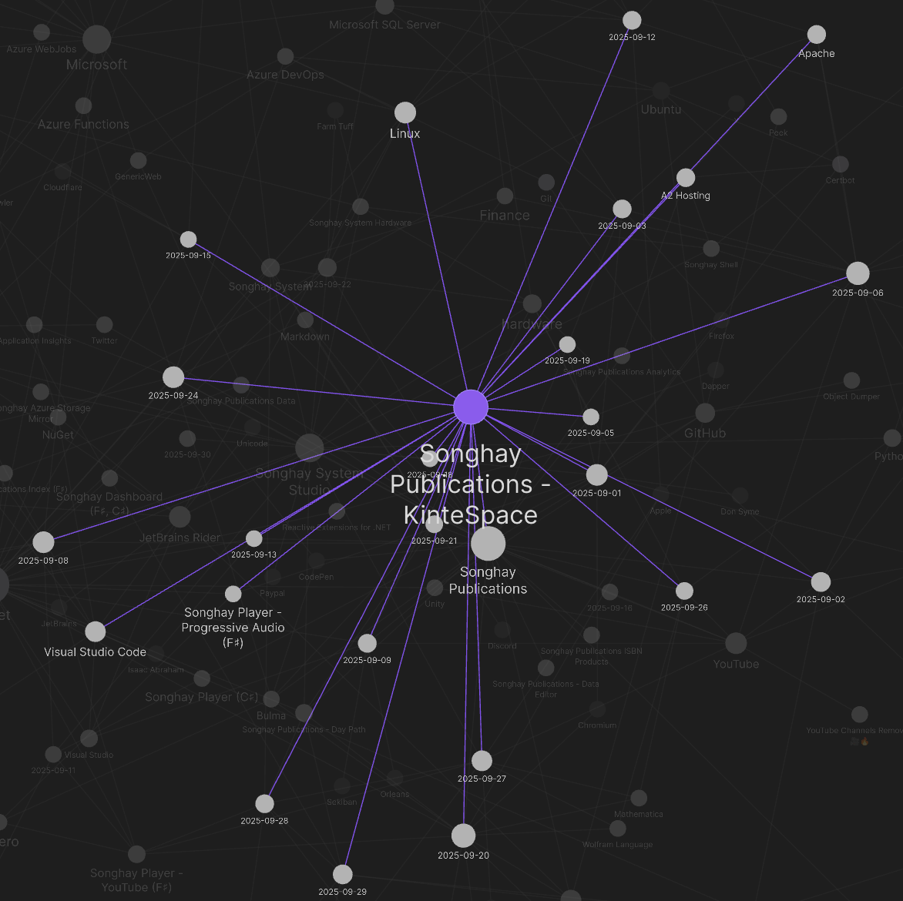

---json
{
  "documentId": 0,
  "title": "studio status report: 2025-09",
  "documentShortName": "2025-09-30-studio-status-report-2025-09",
  "fileName": "index.html",
  "path": "./entry/2025-09-30-studio-status-report-2025-09",
  "date": "2025-09-30T19:50:55.805Z",
  "modificationDate": "2025-09-30T19:50:55.805Z",
  "templateId": 0,
  "segmentId": 0,
  "isRoot": false,
  "isActive": true,
  "sortOrdinal": 0,
  "clientId": "2025-09-30-studio-status-report-2025-09",
  "tag": "{\n  \u0022extract\u0022: \u0022Month 09 of 2025 was about actually working inside of this sketch: kintespace.com Publications stack This is a very rough rendering of the brand new Publications stack for kintespace.com. The layers of this stack starts with: 1. Markdown with Obsidian\\n2. \\u2026\u0022\n}"
}
---

# studio status report: 2025-09

Month 09 of 2025 was about actually working inside of this sketch:


This is a very rough rendering of the brand new Publications stack for kintespace.com. The layers of this stack starts with:

1. Markdown with Obsidian
2. `Songhay.Publications.KinteSpace.DataAccess` (over SQLite) to index/tag the Markdown files and provide other meta-data (e.g. responsive-image data) as static JSON
3. eleventy, to transform Markdown and static JSON into HTML in the conventional staging directory, `/app-staging`
4. webpack for the Typescript pipeline in the conventional `/src` directory
5. Sass for Bulma CSS in the conventional `/src` directory
6. Blazor WebAssembly, the progressive enhancement vector, providing the b-roll player and Index experiences, rooted under `/app-staging/b-roll`
7. b-roll player cloud APIs (`Songhay.Player`), supporting the b-roll player (Blazor WebAssembly) assets

The Obsidian graph for this month shows about 19 days of work but this number might be a bit inflated due to poor use of categories:

<div style="text-align:center">



</div>

Selected notes of the month:

## Songhay System Studio: some “triggered” words from Don Syme 😐

>The belief system I’m referring to is what I’ll call “The Symbolic Supremacy”. This is a common and widespread belief system about programming, closely associated with logic, formalism, functional programming and other fields I’ve been involved with in my career, but to be honest most computer scientists in most faculties are adherents to some extent. To a first approximation, the tenets of this belief system are:
>
> 1. Programs should be expressed in symbolic notation following logical mathematical rules.
>
> 2. Programs must have a precise interpretation. The more precise, the better. Precision is the essence of programming.
>
> 3. Anything claiming to implement “natural language programming” is fundamentally invalid, wrong, foolish and/or deceptive.
>
>—“[On Natural Language Programming](https://dsyme.net/2025/08/27/on-natural-language-programming/)”
>

## Publications: Anna’s Archive 😐🐈

Congrats to my daughter for finding this one:

>We preserve books, papers, comics, magazines, and more, by bringing these materials from various [shadow libraries](https://en.wikipedia.org/wiki/Shadow_library), official libraries, and other collections together in one place. All this data is preserved forever by making it easy to duplicate it in bulk — using torrents — resulting in many copies around the world. Some shadow libraries already do this themselves (e.g. Sci-Hub, Library Genesis), while Anna’s Archive “liberates” other libraries that don’t offer bulk distribution (e.g. Z-Library) or aren’t shadow libraries at all (e.g. Internet Archive, DuXiu).
>
>This wide distribution, combined with open-source code, makes our website resilient to takedowns, and ensures the long-term preservation of humanity’s knowledge and culture. Learn more about [our datasets](https://annas-archive.org/datasets).
>
>—<https://annas-archive.org/faq>
>

## Dapper: the parameter system does not (or no longer) works with `LIKE` 😐 #day-job 

Given an anonymous-object set of parameters:

```csharp
new { myParam, myOtherParam }
```

(…or even the “[Dynamic Parameters](https://www.learndapper.com/parameters#dapper-dynamic-parameters)” equivalent), Dapper will ignore a `LIKE` pattern in this form:

```plaintext
    MY_COLUMN LIKE @myParam
AND
    MY_OTHER_COLUMN LIKE @myOtherParam
```

And, of course everything will work as expected when `LIKE` is replaced by `=`:

```plaintext
    MY_COLUMN = @myParam
AND
    MY_OTHER_COLUMN = @myOtherParam
```

There is a [StackOverflow answer](https://stackoverflow.com/a/36030073/22944) that suggests we have to hard-code the wildcards into the string instead of passing them in the parameter(s) 😐⏳

## Songhay Player - YouTube (F♯): finally able to record the <acronym title="Cascading Style Sheets">CSS</acronym> issue 😐🔎

After a lengthy correction of Mockoon configuration (including the improving of Songhay Player (C♯) automated tests), I can look at the CSS issue like a professional:

<div style="text-align:center">


</div>

>[!important]
>There is no explicit setting for `img.height` under `video.thumbs.thumbs-container` and defaults to `auto`.

Additionally, `video.thumbs.thumbs-container > div` needs to have its height set explicitly to `100%`:

<div style="text-align:center">


</div>

## .NET 10 is supposed to eliminate the `ReadOnlyCollection<T>` performance issues 😐

>So what’s going on here? It’s super subtle. First, it’s necessary to know that `ReadOnlyCollection<T>` just wraps an arbitrary `IList<T>`, the `ReadOnlyCollection<T>`‘s `GetEnumerator()` returns `_list.GetEnumerator()` (I’m ignoring for this discussion the special-case where the list is empty), and `ReadOnlyCollection<T>`‘s indexer just indexes into the `IList<T>`‘s indexer. So far presumably this all sounds like what you’d expect. But where things gets interesting is around what the JIT is able to devirtualize. In .NET 9, it struggles to devirtualize calls to the interface implementations specifically on `T[]`, so it won’t devirtualize either the `_list.GetEnumerator()` call nor the `_list[index]` call. However, the enumerator that’s returned is just a normal type that implements `IEnumerator<T>`, and the JIT has no problem devirtualizing its `MoveNext` and `Current` members. Which means that we’re actually paying a lot more going through the indexer, because for `N` elements, we’re having to make `N` interface calls, whereas with the enumerator, we only need the one with `GetEnumerator` interface call and then no more after that.
>
>Thankfully, this is now addressed in .NET 10. [dotnet/runtime#108153](https://github.com/dotnet/runtime/pull/108153), [dotnet/runtime#109209](https://github.com/dotnet/runtime/pull/109209), [dotnet/runtime#109237](https://github.com/dotnet/runtime/pull/109237), and [dotnet/runtime#116771](https://github.com/dotnet/runtime/pull/116771) all make it possible for the JIT to devirtualize array’s interface method implementations. Now when we run the same benchmark (reverted back to using `ToArray`), we get results much more in line with our expectations, with both benchmarks improving from .NET 9 to .NET 10, and with `SumForLoop` on .NET 10 being the fastest.
>
>—“[Performance Improvements in .NET 10](https://devblogs.microsoft.com/dotnet/performance-improvements-in-net-10/)”
>

## Publications: “CSS Custom Functions with @function”

>If you thought the [if() function](https://www.youtube.com/watch?v=Apn8ucs7AL0) was cool, hold on to your hats because CSS functions just landed in **Chrome 139**! This capability is an absolute game-changer for writing more organized and dynamic CSS.
>
>—“[5 Useful CSS functions using the new @function rule](https://una.im/5-css-functions/)”
>

<div style="text-align:center">

<figure>
    <a href="https://www.youtube.com/watch?v=K5k_bTdP_6I">
        
    </a>
    <p><small>CSS Custom Functions with @function</small></p>
</figure>

</div>

## Songhay Publications: kinté space forces new Studio convention for webpack 😐

Time was lost yesterday in an attempt to use webpack with <acronym title="Cascading Style Sheets">CSS</acronym> as well as with JavaScript. Going forward, the Studio will respect this statement:

>Webpack is a module bundler. ==Its main purpose is to bundle JavaScript files for usage in a browser==, yet it is also capable of transforming, bundling, or packaging just about any resource or asset.
>
>—<https://github.com/webpack/webpack>
>

As of right now, I do not know what a <acronym title="Cascading Style Sheets">CSS</acronym> “module” is 😐🧠

This Obsidian journal (and the previous Joplin journal) has no detailed history on the use of :

1. the `OptimizeCSSAssetsPlugin`
2. the `CssMinimizerPlugin`
3. the `MiniCssExtractPlugin`

Because of the nature of the “community” and “plug-in” beasts, I replaced `OptimizeCSSAssetsPlugin` with `CssMinimizerPlugin` \[📖 [docs](https://webpack.js.org/plugins/css-minimizer-webpack-plugin/) \] to (probably) stop peer-dependency failures with `npm`. I made no notes about this change. However, the only reason why `CssMinimizerPlugin` is needed is because of the desire to have `MiniCssExtractPlugin` \[📖 [docs](https://webpack.js.org/plugins/mini-css-extract-plugin/) \] for <acronym title="Cascading Style Sheets">CSS</acronym> “module”-bundling.

## open pull requests on GitHub 🐙🐈

- <https://github.com/BryanWilhite/Songhay.HelloWorlds.Activities/pull/14>
- <https://github.com/BryanWilhite/dotnet-core/pull/67>

## sketching out development projects

Eliminating Angular JS in the Studio is the top priority. Replacing the Angular JS app (`http://kintespace.com/player.html`) for the kinté space depends on:

- generating a new `index.html` page with eleventy
- supplementing the index with responsive images

Proposed future items:

- complete upgrade to .NET 8.0
- switch Studio Publications from Material Design to Bulma 💄 ➡️ 💄✨
- start `Songhay.Modules.Bolero.Index` project
- generate responsive and social images with AI

🐙🐈<https://github.com/BryanWilhite/>
