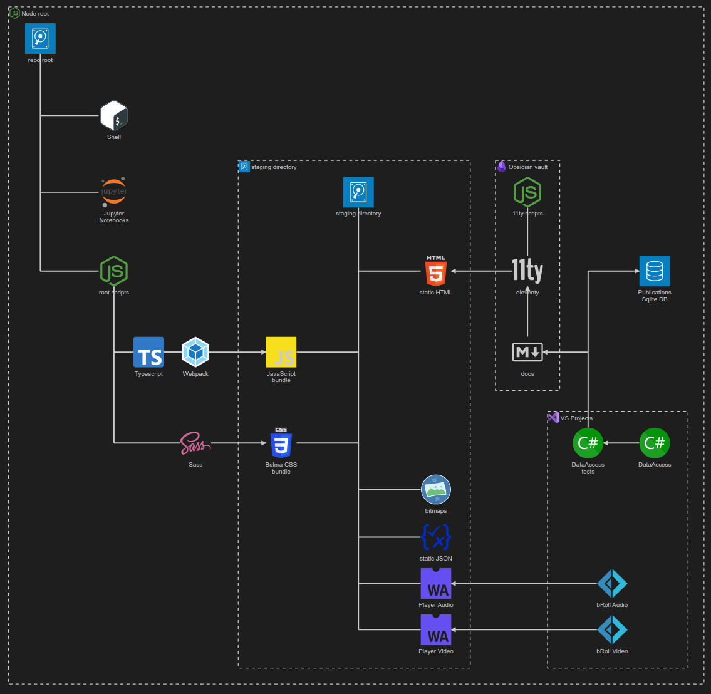
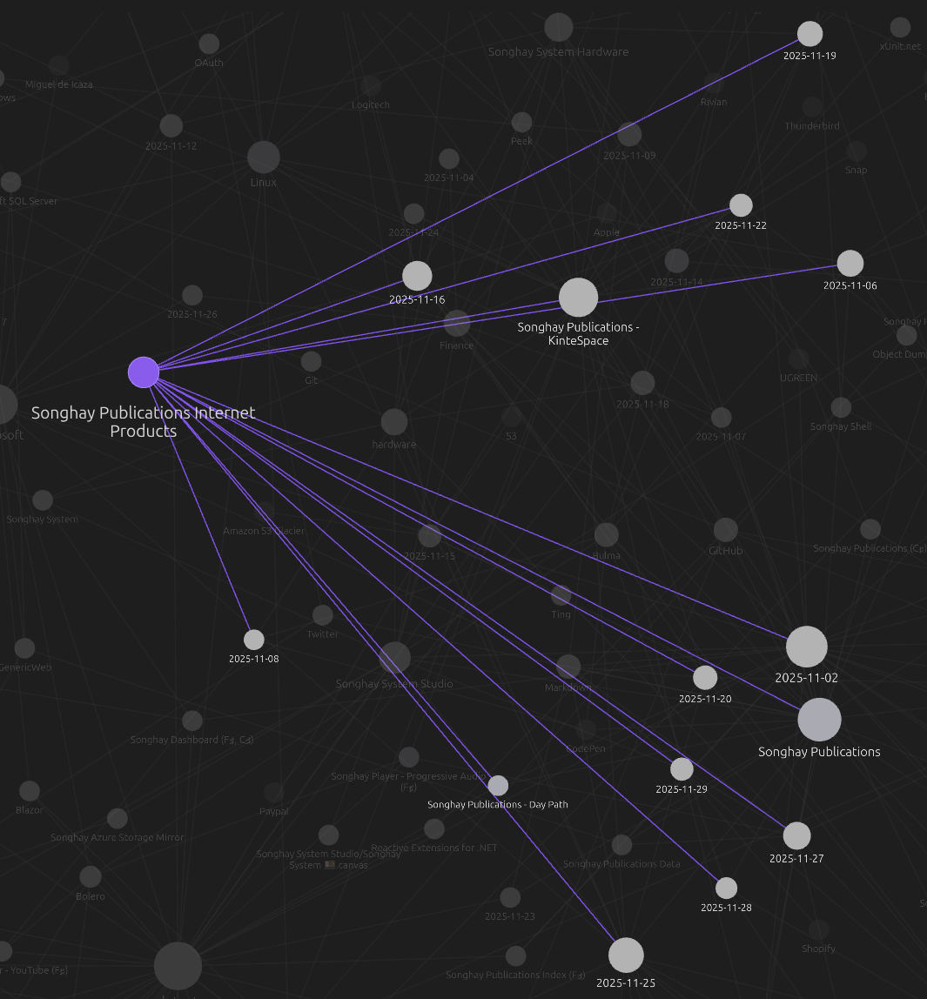
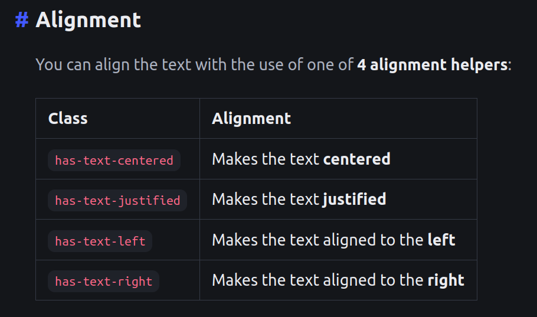
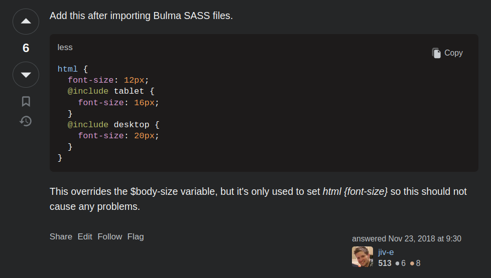
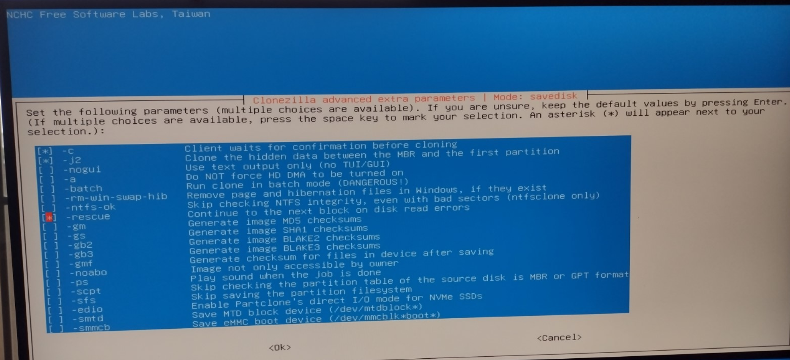
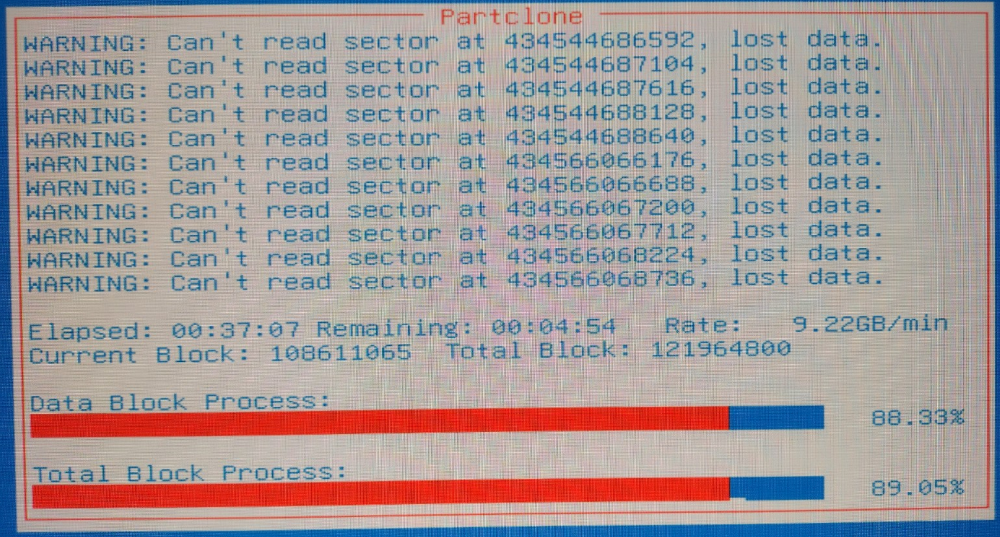
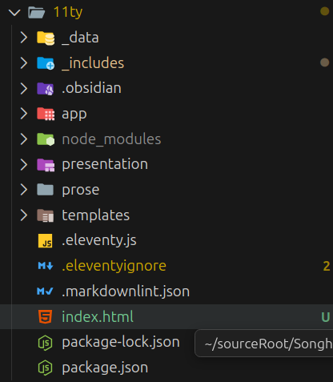
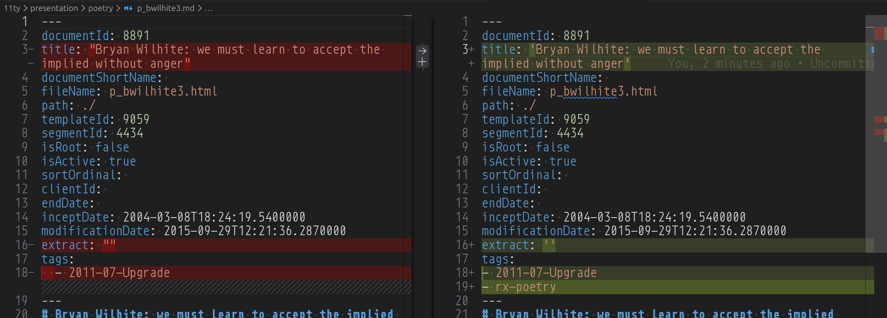

---json
{
  "documentId": 0,
  "title": "studio status report: 2025-11",
  "documentShortName": "2025-11-29-studio-status-report-2025-11",
  "fileName": "index.html",
  "path": "./entry/2025-11-29-studio-status-report-2025-11",
  "date": "2025-11-29T17:08:18.330Z",
  "modificationDate": "2025-11-29T17:08:18.330Z",
  "templateId": 0,
  "segmentId": 0,
  "isRoot": false,
  "isActive": true,
  "sortOrdinal": 0,
  "clientId": "2025-11-29-studio-status-report-2025-11",
  "tag": "{\n  \u0022extract\u0022: \u0022Month 11 of the imperial year 2025 was, first, about producing this Mermaid visualization based on the chalk scribbles from earlier: Mermaid diagram of the kintespace.com pipeline The second thing done was to start living inside of this visualization: I b\\u2026\u0022\n}"
}
---

# studio status report: 2025-11

Month 11 of the imperial year 2025 was, first, about producing this Mermaid visualization based on the chalk scribbles [from earlier](https://songhayblog.azurewebsites.net/entry/2025-09-30-studio-status-report-2025-09/):

<div style="text-align:center">



</div>

The second thing done was to start living inside of this visualization: I basically set up camp at the Obsidian vault and made several trips to eleventy <acronym title="Application Programming Interface">API</acronym>s, the root scripts and Sass.

According to the Obsidian Graph View of my Studio Journal, my ‘camping trip’ took about eleven days—which is very much in the spirit of eleventy 😐🃏:

<div style="text-align:center">



</div>

It is a bit easier to measure these days in Obsidian because I have a new Studio topic, Songhay Publications Internet Products, that is devoted to this kind of work.

Selected notes of the month should provide details below:

## Songhay Publications Internet Products: finally, the Mermaid diagram of the modern Publications pipelines 😐👓

Here is the polished visualization based on the chalk scribbles from earlier:

<div style="text-align:center">


</div>

The left-hand side of this “[Architecture Diagram](https://mermaid.js.org/syntax/architecture.html)” is very 2014-ish (2014 was when webpack was released). But the right-hand side ‘progresses’ into the weirdness of my Studio preferences:

- the ‘repo root’ 📁 bash shell 🐚 has rsync scripts for deploying to the staging site
- the Jupyter Notebooks 📓📓📓 will serve as a ‘work diary’ for the Publications Data
- Markdown is my replacement for the entire word processing concept previously owned by Microsoft 👏
- eleventy takes my word processing documents and treats them like data for generating Web 1.0 <acronym title="HyperText Markup Language">HTML</acronym> ⚙📖
- both the live site and eleventy depend on static <acronym title="JavaScript Object Notation">JSON</acronym> generated by the `DataAccess` logic (currently in a test harness) on top of the SQLite database of the Publications Data schema 🗃
- responsive image <acronym title="HyperText Markup Language">HTML</acronym> declarations also depend on this `DataAccess` logic 🖼↕
- WebAssembly-based experiences (e.g. the b-roll player) depend on F♯ projects 🍱🍱🍱

## Studio Internet Products: yes, Bulma handles text alignment

Bulma “[alignment helpers](https://bulma.io/documentation/helpers/typography-helpers/#alignment)” should completely eliminate the `poemBlock` mixin referenced below:

<div style="text-align:center">



</div>

## SQLite: “SQLite 3.51 Brings New JSONB Functions and Better Performance”

>The team behind SQLite, a free and open-source self-contained relational database engine widely used in embedded systems and applications, released SQLite 3.51, with the headline change being the addition of `jsonb_each()` and `jsonb_tree()`, new functions that mirror existing JSON utilities but return data in the binary JSONB format for array and object types.
>
>—“[SQLite 3.51 Brings New JSONB Functions and Better Performance](https://linuxiac.com/sqlite-3-51-brings-new-jsonb-functions-and-better-performance/)”

## Bulma: over seven years ago there was support for responsive font sizing

<div style="text-align:center">



</div>
<https://stackoverflow.com/a/53443912/22944>

## hardware: the real reason why most nerds need a <acronym title="Virtual Private Network">VPN</acronym> 🤓

There are two ways to hide your IP address while torrenting—one is via a <acronym title="Virtual Private Network">VPN</acronym> and the other is covered here:

<div style="text-align:center">

<figure>
    <a href="https://www.youtube.com/watch?v=SMLyV09cxvA">
        
    </a>
    <p><small>New User Torrenting Guide 2024 - 100% SAFE!</small></p>
</figure>

</div>

## Songhay System Hardware: okay, okay I get it—I have to run Clonezilla in “rescue” mode 😐💾🚑

We have to run Clonezilla in “expert” mode in order to see this screen:

<div style="text-align:center">



</div>

This screen allows us to select the `-rescue` parameter which allows the ‘cloning’ process to continue with notifications like this:

<div style="text-align:center">



</div>

## Internet Products: added _conventional_ eleventy `index.html` 😐

<div style="text-align:center">



</div>

Today, `11ty/index.html` is simply this placeholder stuff:

```html
---
layout: layouts/base.html
---
<p>[index line one]</p>

<p>[index line two]</p>
```

…which depends on `11ty/_includes/layouts/base.html`:

```html
<!DOCTYPE html>
<html lang="en">

    <body>


        <main class="section">
{{ content }}
        </main>

    </body>

</html>
```

Almost every static <acronym title="HyperText Markup Language">HTML</acronym> publication in this Studio will have an Index file arrangement like the above.

- [x] add conventional Index file arrangement 🚜✨

Achievement unlocked 🔓

## Bulma: “you can customize Bulma with CSS only (without using Sass)”

The big news with the latest version of Bulma is about moving from color “literals” to CSS custom properties:

>[**CSS Variables**](https://bulma.io/documentation/features/css-variables/) are used instead of literals: `color: var(--bulma-primary);` instead of `color: hsl(171deg, 100%, 41%);`, which means you can customize Bulma with CSS only (without using Sass)
>
>—”[What changes](https://bulma.io/documentation/start/migrating-to-v1/#what-changes)”
>

This news means my plan to update `src/scss/_bulma-colors.scss` with latest Bulma docs has to be revisited.

## Internet Products:  `MarkdownEntryTests.ShouldAddTagsToPoetryFiles` was tested on one file 😐🎊

There are some concerns here:

<div style="text-align:center">



</div>

- the .NET code (`YamlDotNet`) prefers single quotes
- `YamlDotNet` does not insert spaces before array items

Apparently, I did not build any convenient utility into Songhay Publications (C♯) that writes the data that is returned from `FileInfo.ToJsonObjectAndAnyContent`.  Instead, I had to do this:

```csharp
string newContent =
    $"""
    ---
    {frontMatter.ToYaml(logger)?.Trim()}
    ---
    {content}

    """;

File.WriteAllText(fileInfo.FullName, newContent);
```

I have added [issue #61](https://github.com/BryanWilhite/Songhay.Publications/issues/61) ✅

## Markdown: “Markdown is Holding You Back”

>**Markdown is implicit typing**. It lets you write quickly, but without constraints or guarantees. There's no schema. No way to enforce consistency. A heading in one file might be a **concept**, in another it might be a **step**, and there's no machine-readable distinction between the two.
>
>…
>
>Semantic markup describes **what content is**, not just **how it should look**. It's the difference between saying "here's a bullet with some text" and "here's a step in a procedure." To a human, those may look the same on a page. To a machine or to a publishing pipeline, they are entirely different.
>
>Web developers already went through all this with HTML. Prior to HTML5, you had `<div>` as a logical container. But HTML5 introduced `<section>`, `<article>`, `<aside>`, and many other elements that described the content.
>
>—“[Markdown is Holding You Back](https://newsletter.bphogan.com/archive/issue-45-markdown-is-holding-you-back/)”
>

## hardware: “The unpowered SSDs in your drawer are slowly losing your data”

Ah! We _cannot_ replace magnetic, spinning disks with <acronym title="Solid State Drive">SSD</acronym>s for archival purposes:

>The problem is that most consumer SSDs use only TLC or QLC NAND, so users who leave their SSDs unpowered for over a year are risking the integrity of their data. The reliability of QLC NAND has improved over the years, so you should probably consider 2–3 years of unpowered usage as the guardrails. [Without power, the voltage stored in the NAND cells can be lost](https://www.xda-developers.com/will-ssd-lose-data-without-power/), either resulting in missing data or completely useless drives.
>
>—“[The unpowered SSDs in your drawer are slowly losing your data](https://www.xda-developers.com/your-unpowered-ssd-is-slowly-losing-your-data/)”
>

## Daz 3D: yes, it can run on Linux but under Wine 😐

This looks brutal and fragile:

<div style="text-align:center">

<figure>
    <a href="https://www.youtube.com/watch?v=Um4WUwXBNAc">
        
    </a>
    <p><small>DAZ Studio + Linux + Nvidia GPU</small></p>
</figure>

</div>

The video helps me view Daz 3D in the a new context: it is just another Windows ‘game’ that may or may not run on Linux 😐

## hardware: the highest level of private-citizen security involves the YubiKey or an equivalent 😐🔓

According to Shannon Morse, anything above the YubiKey level involves <acronym title="Trusted Platform Module">TPM</acronym>-like things:

<div style="text-align:center">

<figure>
    <a href="https://www.youtube.com/watch?v=gIKdZ1YrR2k">
        
    </a>
    <p><small>How to Make Your Passwords Bulletproof with MFA & Passkeys 🔑</small></p>
</figure>

</div>

## Microsoft: “Fara-7B: An Efficient Agentic Model for Computer Use”

>**Fara-7B** is Microsoft's first **agentic small language model (SLM)** designed specifically for computer use. With only 7 billion parameters, Fara-7B is an ultra-compact Computer Use Agent (CUA) that achieves state-of-the-art performance within its size class and is competitive with larger, more resource-intensive agentic systems.
>
>—<https://github.com/microsoft/fara>
>

## Internet Products: what eleventy collections mean to this Studio 😐

In terms of Publications Data, the Document \[🔗 [GitHub](https://github.com/BryanWilhite/Songhay.Publications/blob/main/Songhay.Publications/Models/Document.cs) \] does not refer to another Document. The Document depends on the Segment (and, perhaps, the `IndexKeyword`) to indirectly refer to other documents.

However, in terms of eleventy, Markdown documents refer to other documents indirectly using tags and collections. I have not been aware of this lately:

>Take care to note that `tags` have a singular purpose in Eleventy: to construct collections of content. Some blogging platforms use Tags to refer to a hierarchy of labels for the content (e.g. a [tag cloud](https://en.wikipedia.org/wiki/Tag_cloud)).
>
>—”[Collections (Using Tags)](https://www.11ty.dev/docs/collections/)”
>

The statement above has the following unintended-but-perhaps-very-useful consequence:

>[!important]
>Every tag defined in an Obsidian context becomes an eleventy collection.

Historically, I have been familiar with imperatively defining collections with the eleventy [Collections API](https://www.11ty.dev/docs/collections-api/):

```javascript
config.addCollection('entries', collection => {
    return collection.getFilteredByGlob('entry/**/*.md');
});
```

Today, I assume that, through Obsidian conventions and the Collections API, I can do something like this:

```liquid
 
```

…where `collections.rx-presentation` (a property with dashes) is syntax supported by the Liquid template \[📖 [docs](https://www.11ty.dev/docs/collections/#a-note-about-using-in-tags) \]. ~~Currently, I assume that~~ `rx_get_presentation_uri` can have this signature:

```javascript
config.addFilter('rx_get_presentation_uri', (collection, page) => {
//…
});

```

…where `page` is defined as “[Eleventy Supplied Data](https://www.11ty.dev/docs/data-eleventy-supplied/)” which is wonderful but leads to a critical question:

>[!question]
>In the context of a template, can the front matter of another page be read?

The short answer is _yes_ 😐🧠💡 because an eleventy collection item contains a `data` property (added in version 2.x) appears to represent front matter (see “[Collection Item Data Structure](https://www.11ty.dev/docs/collections/#collection-item-data-structure)”). Without this relatively recent and awesome addition, one would have to resort to using `page.inputPath` and installing some `npm` package that can read <acronym title="YAML Ain’t Markup Language">YAML</acronym> from a text file—and, when this is not working, a ‘last’ resort would be calling out to custom code from this Studio, likely Songhay Publications (C♯) code 😐💦

## open pull requests on GitHub 🐙🐈

- <https://github.com/BryanWilhite/Songhay.HelloWorlds.Activities/pull/14>
- <https://github.com/BryanWilhite/dotnet-core/pull/67>

## sketching out development projects

Eliminating Angular JS in the Studio is the top priority. Replacing the Angular JS app (`http://kintespace.com/player.html`) for the kinté space depends on:

- generating a new `index.html` page with eleventy
- supplementing the index with responsive images

Proposed future items:

- complete upgrade to .NET 8.0
- switch Studio Publications from Material Design to Bulma 💄 ➡️ 💄✨
- start `Songhay.Modules.Bolero.Index` project
- generate responsive and social images with AI

🐙🐈<https://github.com/BryanWilhite/>
