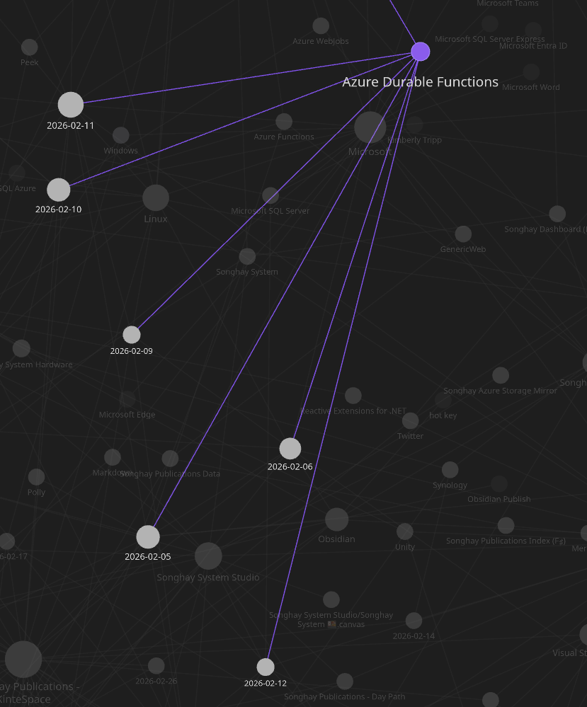
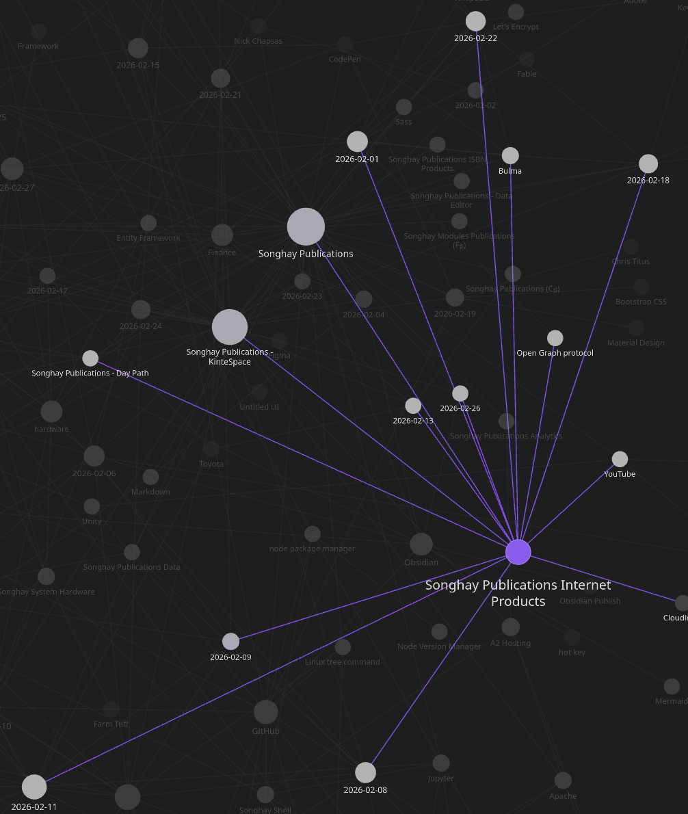

---json
{
  "documentId": 0,
  "title": "studio status report: 2026-02",
  "documentShortName": "2026-02-27-studio-status-report-2026-02",
  "fileName": "index.html",
  "path": "./entry/2026-02-27-studio-status-report-2026-02",
  "date": "2026-02-27T22:09:01.751Z",
  "modificationDate": "2026-02-27T22:09:01.751Z",
  "templateId": 0,
  "segmentId": 0,
  "isRoot": false,
  "isActive": true,
  "sortOrdinal": 0,
  "clientId": "2026-02-27-studio-status-report-2026-02",
  "tag": "{\n  \u0022extract\u0022: \u0022Month 02 of 2026 was still about not getting the re-release of kintespace.com almost out the \\u2018door\\u2019\\u2014just like last month! But the main reason for this extravagant delay (apart from more #day-job tech drama) was my major discovery of the \\u2018magazine cover\\u2019 l\\u2026\u0022\n}"
}
---

# studio status report: 2026-02

Month 02 of 2026 was _still_ about _not_ getting the re-release of kintespace.com almost out the ‘door’—just like [last month](https://songhayblog.azurewebsites.net/entry/2026-01-31-studio-status-report-2026-01)! But the main reason for this _extravagant_ delay (apart from _more_ #day-job tech drama) was my major discovery of the ‘magazine cover’ [layout](https://codepen.io/rasx/pen/PwGwbOv?editors=1100) 👏 Without this discovery, kintespace.com should not be re-released.

The other major kintespace.com blocker was the need for new responsive-image conventions. Month 02 sees [my new Jupyter Notebook presentation](https://github.com/BryanWilhite/jupyter-central/tree/main/wand-responsive-images) establishing these conventions 👏  I am 99% certain that there are no in-Studio blockers in the way of the release of kintespace.com! However, the #day-job _did_ get in the way—in a _wonderful_ way—after _six years_ of failing to truly understand [[Azure Durable Functions]], this month brings understanding:

<div style="text-align:center">



</div>

The Obsidian Graph view shows _six days_ touching upon [[Azure Durable Functions]]. This cloud work rivals the re-release of kintespace.com (eight days):

<div style="text-align:center">



</div>

Selected notes of the month follow:

## [[Fable]]: Fable Lit Fullstack Template #to-do

>A modern, ergonomic starter template for building full‑stack F# applications with **[Fable.Lit](https://fable.io/Fable.Lit/)**, and **Web Components** — powered by a brand‑new, strongly‑typed UI DSL that removes the biggest pain points of traditional Lit development.
>
>This template is designed to give you a smooth, productive experience from day one, whether you're building a small prototype or a full production app.
>
>—<https://github.com/JordanMarr/fable-lit-fullstack-template>
>

## [[Wikipedia]] as a social media app

>Xikipedia is a pseudo social media feed that algorithmically shows you content from Simple Wikipedia. It is made as a demonstration of how even a basic non-ML algorithm with no data from other users can quickly learn what you engage with to suggest you more similar content. No data is collected or shared here, the algorithm runs locally and the data disappears once you refresh or close the tab.
>
>—<https://xikipedia.org/>
>

## [[SQLite]]: “Meet Bunny Database: the SQL service that just works” #to-do

>Today, we’re launching Bunny Database as a public preview: a SQLite-compatible managed service that spins down when idle, keeps latency low wherever your users are, and doesn’t cost a fortune.
>
>—“[Meet Bunny Database: the SQL service that just works](https://bunny.net/blog/meet-bunny-database-the-sql-service-that-just-works/)”
>

## [[Entity Framework]]: yes, `IsRequired(false)` might be needed for nullable properties 😐 #day-job

According to a [StackOverflow answer](https://stackoverflow.com/a/63918587/22944), something like the following is needed when mapping a nullable property to a `NULL` database column:

```csharp
builder.Property(x => x.MyProperty).IsRequired(false);
```

This explicit call to make a property _not_ required should prevent <acronym title="Entity Framework">EF</acronym> error messages starting with:

```console
SqlNullValueException: Data is Null. This method or property cannot be called on Null values.
```

## [[ASP.NET]]: I am embarrassed about failing to see the obvious: of course [[Microsoft]] would make sure there is a rich [[Typescript]] experience in [[Visual Studio]] #day-job 😐

This two-year-old video from a member of the [[Visual Studio]] Typescript experience team is a decent introduction:

<div style="text-align:center">

<figure>
    <a href="https://www.youtube.com/watch?v=1-U75WdCEbE">
        
    </a>
    <p><small>Exploring [[JavaScript]] and TypeScript Development in Visual Studio for ASP.NET Core Developers</small></p>
</figure>

</div>

## [[Obsidian]]: someone wrote a plugin that uses [[eleventy]] to publish to the Web 😐🕸 #to-do

That ‘someone’ is the guy behind [Obsidian Digital Garden](https://dg-docs.ole.dev/):

<div style="text-align:center">

<figure>
    <a href="https://www.youtube.com/watch?v=7f8e5IiUkeo">
        
    </a>
    <p><small>How I Published My Obsidian Notes Website For Free 🏡 Digital Garden</small></p>
</figure>

</div>

>Publish your notes directly from [Obsidian](https://obsidian.md/) to the internet. While [feature packed](https://dg-docs.ole.dev/features/), it is [highly configurable](https://dg-docs.ole.dev/getting-started/03-note-settings/) and [hackable](https://dg-docs.ole.dev/advanced/adding-custom-components/). Enable and disable features on a per-note basis. Use it as a full fledged digital garden or as a [simple note sharing solution](https://dg-docs.ole.dev/example-pages/simple-page/).
>
>—<https://dg-docs.ole.dev/>
>

## [[hardware]]: no computer parts until 2027?

>At most, Micron can only meet two-thirds of the medium-term memory requirements for some customers, Sadana said. But the company is currently building two big factories called fabs in Boise, Idaho, that will start producing memory in 2027 and 2028, he said. Micron is also going to break ground on a fab in the town of Clay, New York, that he said is expect to come online in 2030.
>
>But for now, “we’re sold out for 2026,” Sadana said.
>
>—“[AI memory is sold out, causing an unprecedented surge in prices](https://www.cnbc.com/2026/01/10/micron-ai-memory-shortage-hbm-nvidia-samsung.html?msockid=064e6834a94b6283390a6744a8b0634b)”
>

## [[Azure Durable Functions]]: the modular monolithic response to a long-running “normal” function #day-job 😐

In the world of [[Azure Durable Functions]], a “normal” function is an _activity_ function. When this kind of function runs too long for the expected duration of a typical <acronym title="Hypertext Transfer Protocol Secure">HTTPS</acronym> response, the classic thing to do is to write a status message to a database table—a table known to all relevant concerns of the monolith. This classical thinking would prevent the ‘discovery’ of why [[Azure Durable Functions]] is needed. This kind of thinking would therefore make [[2026-02-06#I think I have discovered the ‘real’ introduction to Azure Durable Functions make-blog-post day-job 😐|my previous notes]] about this kind of discovery moot 😐

To obscure the matter further, this messaging database table can be checked via a dedicated Web <acronym title="Application Programming Interface">API</acronym>!

## [[Obsidian]]: okay, this video introduces me to Bases 😐🧠✨

<div style="text-align:center">

<figure>
    <a href="https://www.youtube.com/watch?v=nWUQbK8KlOo">
        
    </a>
    <p><small>NEW Obsidian Bases Core Plugin 📝 Full Overview + Practical Use Cases - Wanderloots</small></p>
</figure>

</div>

### related reading

- “Functions are used in [Bases](https://help.obsidian.md/bases) to manipulate data from [properties](https://help.obsidian.md/properties) in [filters](https://help.obsidian.md/bases/views#Filters) and [formulas](https://help.obsidian.md/formulas).” \[📖 [docs](https://help.obsidian.md/bases/functions) \]

## [[Azure Durable Functions]]: for years, I failed to recognize that [[Microsoft]]’s use of the word _orchestration_ was in line with its use in the context of Service Oriented Architecture 😐👂

>Orchestration is often discussed in the context of [service-oriented architecture](https://en.wikipedia.org/wiki/Service-oriented_architecture "Service-oriented architecture"), [virtualization](https://en.wikipedia.org/wiki/Platform_virtualization "Platform virtualization"), [provisioning](https://en.wikipedia.org/wiki/Provisioning_\(technology\) "Provisioning (technology)"), [converged infrastructure](https://en.wikipedia.org/wiki/Converged_Infrastructure "Converged Infrastructure") and dynamic [data center](https://en.wikipedia.org/wiki/Datacenter "Datacenter") topics. Orchestration in this sense is about aligning the business request with the applications, data, and infrastructure.[[3]](https://en.wikipedia.org/wiki/Orchestration_\(computing\)#cite_note-3)
>
>In the context of [cloud computing](https://en.wikipedia.org/wiki/Cloud_computing "Cloud computing"), the main difference between [workflow automation](https://en.wikipedia.org/wiki/Workflow_automation "Workflow automation") and orchestration is that workflows are processed and completed as processes within a single domain for automation purposes, whereas orchestration includes a workflow and provides a directed action towards larger goals and objectives.
>
>—<https://en.wikipedia.org/wiki/Orchestration_(computing)>
>

>[!important]
>When we use <acronym title="Dependency Injection">DI</acronym> to inject services into the constructor of a class, this class _must_ be concerned with _orchestrating_ these services.

The challenge that [[Azure Durable Functions]] takes on is performing these orchestrations in the `async` world of <acronym title="Hypertext Transfer Protocol Secure">HTTPS</acronym> service.

## [[dotnet|.NET]]: NCrontab Expression Tester

>NCrontab is a .NET library providing crontab parsing, crontab formatting and the DateTime calculation of occurrences based on a crontab expression. The library supports a six-part format that allows for seconds. Learn more about NCrontab and how to write NCrontab expressions at [the NCrontab GitHub repository](https://github.com/atifaziz/NCrontab). Learn more about [how and why this tool was created at my blog](https://swimburger.net/blog/dotnet/introducing-ncrontab-tester-blazor-webassembly).
>
>Use the tool below to test out your NCrontab/CRON expression and see the DateTimes of your occurrences.
>
>—<https://ncrontab.swimburger.net/>
>

## [[Netflix]]: “Retired Netflix Engineering Director On Regrets, Video Engineering, Hiring Stories”

This retired guy prefers _engineering mentality_ over computer science (coding skills):

<div style="text-align:center">

<figure>
    <a href="https://www.youtube.com/watch?v=ApG9vjbHDCk">
        
    </a>
    <p><small>Retired Netflix Engineering Director On Regrets, Video Engineering, Hiring Stories</small></p>
</figure>

</div>

## [[Songhay Publications Internet Products|Internet Products]]: the [[Bulma]] “hero” is not friendly to the “hero” `img` 😐

I think [this layout](https://github.com/BryanWilhite/nodejs/tree/main/bulma-responsive-images) I am working on needs to get rid of the `.hero` layout and switch to <acronym title="Cascading Style Sheets">CSS</acronym> grid. It is clear to me that <acronym title="Cascading Style Sheets">CSS</acronym> grid is designed to stack elements on top of each other:

<div style="text-align:center">

<figure>
    <a href="https://www.youtube.com/watch?v=Q-kprWFU8mU">
        
    </a>
    <p><small>Overlapping Elements on Top of Each Other using the CSS Grid</small></p>
</figure>

</div>

## [[Obsidian]]: “How I use Obsidian”

This guy uses Jekyll to publish 🙄

>Rules I follow in my personal vault:
>
> - Avoid splitting content into multiple vaults.
> - Avoid folders for organization.
> - Avoid non-standard Markdown.
> - Always pluralize categories and tags.
> - Use internal links profusely.
> - Use `YYYY-MM-DD` dates everywhere.
> - Use the 7-point scale for ratings.
> - Keep [a single to-do list](https://stephango.com/todos) per week.
>
>Having a [consistent style](https://stephango.com/style) collapses hundreds of future decisions into one, and gives me focus. For example, I always pluralize tags so I never have to wonder what to name new tags. Choose rules that feel comfortable to you and write them down. Make your own style guide. You can always change your rules later.
>
>—“[How I use Obsidian](https://stephango.com/vault)”
>

## open pull requests on GitHub 🐙🐈

- <https://github.com/BryanWilhite/SonghayCore/pull/187>
- <https://github.com/BryanWilhite/Songhay.HelloWorlds.Activities/pull/14>
- <https://github.com/BryanWilhite/dotnet-core/pull/67>

## sketching out development projects

- upgrade `SonghayCore`, `Songhay.Publications`, `Songhay.DataAccess`, etc. to .NET 10 📦🔝
- consider using Lerna to coordinate the two levels of `npm` scripts 🧠👟
- use a Jupyter Notebook to track finding and changing Amazon links to open source links 📓⚙
- use a Jupyter Notebook to convert flickr links to Publications (responsive image) links 📓⚙
- establish `DataAccess` logic for Obsidian markdown metadata 🔨✨
- establish `DataAccess` logic for Index data, including adding and removing Obsidian documents (and Segments) 🔨✨
- package `DataAccess` logic in `*Shell` project for `npm` scripting 🚜✨
- convert rasx() context repo to the relevant conventions shown in the diagram above 🔨🚜
- retire the old `kinte-space` repo for kintespace.com 🚜🧊
- convert Songhay Day Path Blog repo to the relevant conventions shown in the diagram above 🔨🚜
- re-release Songhay Dashboard by updating its repo to the relevant conventions shown in the diagram above 🔨🚜
- start development of Songhay Publications Index (F♯) experience for WebAssembly 🍱✨
- start development of Songhay Publications - Data Editor to establish a <acronym title="Graphical User Interface">GUI</acronym> for `*Shell` and provide visualizations and interactions for Publications data 🍱✨

🐙🐈<https://github.com/BryanWilhite/>
