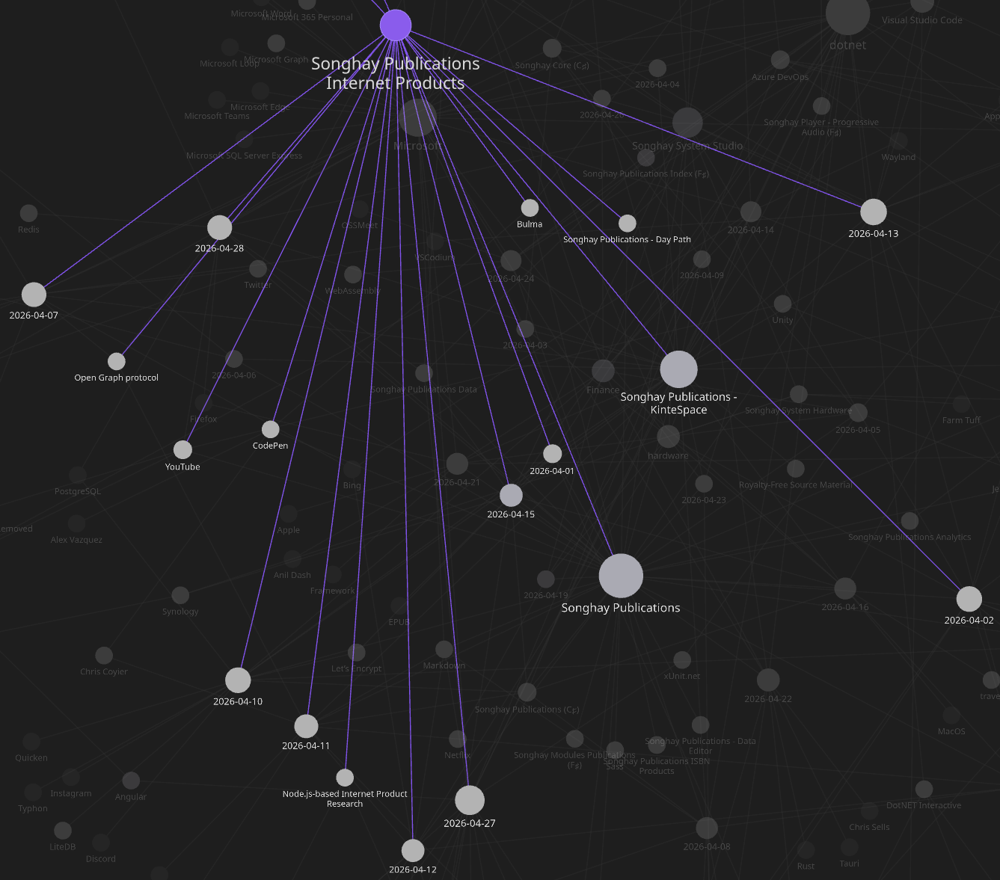
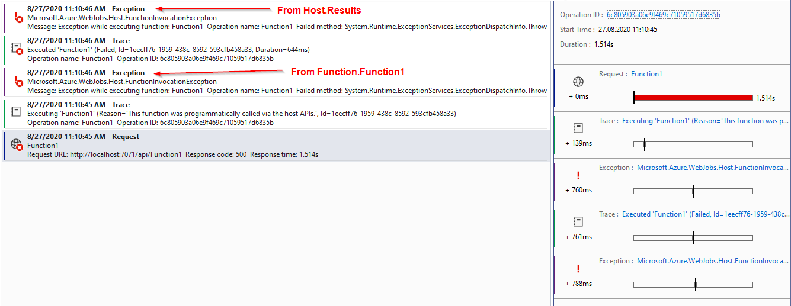
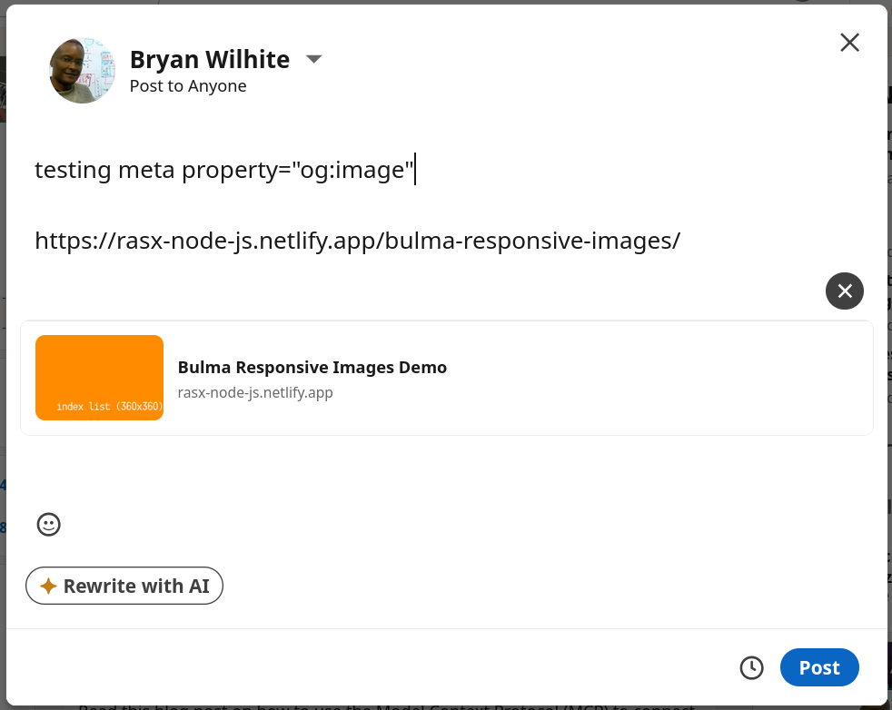

---json
{
  "documentId": 0,
  "title": "studio status report: 2026-04",
  "documentShortName": "2026-04-28-studio-status-report-2026-04",
  "fileName": "index.html",
  "path": "./entry/2026-04-28-studio-status-report-2026-04",
  "date": "2026-04-28T22:05:05.868Z",
  "modificationDate": "2026-04-28T22:05:05.868Z",
  "templateId": 0,
  "segmentId": 0,
  "isRoot": false,
  "isActive": true,
  "sortOrdinal": 0,
  "clientId": "2026-04-28-studio-status-report-2026-04",
  "tag": "{\n  \u0022extract\u0022: \u0022Month 04 of 2026 witnessed the continued lack of the re-release of kintespace.com\\u2014still almost out the \\u2018door.\\u2019 This month was dominated by two blockers: 1. an illness that lasted over a seven days\\n2. errands and meetings required in response to losing my \\u2026\u0022\n}"
}
---

# studio status report: 2026-04

Month 04 of 2026 witnessed the continued lack of the re-release of kintespace.com—_still_ almost out the ‘door.’ This month was dominated by two blockers:

1. an illness that lasted over a seven days
2. errands and meetings required in response to losing my #day-job of over four years

One, bound by logic, would assume that the loss of my #day-job would provide _more_ time to get things done in my Studio. Instead, I spent more time staring to into space, recovering from illness 😐 10 days were spent in month 04 on Internet Publications:



I also managed to release the following NuGet packages for this Studio:

- `SonghayCore 10.0.0` [📦 [NuGet](https://www.nuget.org/packages/SonghayCore/10.0.0) ]
- `SonghayCore.xUnit 10.0.0` [📦 [NuGet](https://www.nuget.org/packages/SonghayCore.xUnit/10.0.0) ]
- `Songhay.DataAccess 10.0.0` and `10.0.1` [📦 [NuGet](https://www.nuget.org/packages/Songhay.DataAccess/10.0.1) ]
- `Songhay.Publications 10.0.0` and `10.0.1` [📦 [NuGet](https://www.nuget.org/packages/Songhay.Publications/10.0.1) ]
- `Songhay.Publications.DataAccess 10.0.0` and `10.0.1` [📦 [NuGet](https://www.nuget.org/packages/Songhay.Publications.DataAccess/10.0.1) ]

This Studio-wide upgrade to .NET 10 was overdue and could no longer be delayed. Moreover, .NET 10 has new feature, “[file-based apps](https://learn.microsoft.com/en-us/dotnet/core/sdk/file-based-apps),” that allows eleventy to call out to .NET Publications code via the `child_process` module [📖 [docs](https://nodejs.org/api/child_process.html#child-process) ]. This discovery maximizes the flexibility of eleventy pipelines removing a great number of conceptual and psychological boundaries in this Studio.

Selected notes of the month follow:

## Obsidian: another sweep through plugins 🧹😐

### plugins that try to replace Jupyter Notebooks

- [Obsidian Code Emitter](https://github.com/mokeyish/obsidian-code-emitter) (explicitly references Jupyter; depends on third-party <acronym title="Application Programming Interface">API</acronym>s to execute code)
- [Obsidian Execute Code Plugin](https://github.com/twibiral/obsidian-execute-code) (mentioned on 2022-11-26#Obsidian Obsidian Execute Code Plugin warns me about Linux snap packages)
- [obsidian-functionplot](https://github.com/leonhma/obsidian-functionplot)
- [Embed Code File](https://github.com/almariah/embed-code-file)
- [Mermaid Tools for Obsidian.md](https://github.com/dartungar/obsidian-mermaid) (“adds a toolbar with common Mermaid.js elements”)
- [Numerals Obsidian Plugin](https://github.com/gtg922r/obsidian-numerals) (“an advanced calculator inside a math code block”)
- [ACE CODE EDITOR](https://github.com/Raven-Pensieve/obsidian-ace-code-editor) (based on [the Ace code editor](https://ace.c9.io/))
- [Obsidian VSCode Editor](https://github.com/sunxvming/obsidian-vscode-editor) (“based on [Monaco Editor](https://microsoft.github.io/monaco-editor/) (VSCode Editor kernel)”)
- [Terminal for Obsidian](https://github.com/polyipseity/obsidian-terminal) (mentioned on 2024-07-09#yes, Obsidian can be used as a commanding platform)
- [Obsidian RubyWasm Plugin](https://github.com/geeknees/obsidian-ruby-wasm-plugin)

### other awesome picks

- [Local REST API for Obsidian](https://coddingtonbear.github.io/obsidian-local-rest-api/)
- [Notes Explorer](https://github.com/tu2-atmanand/obsidian-notes-explorer)
- [Obsidian Unicode Search](https://github.com/BambusControl/obsidian-unicode-search)
- [Markdown Tree plugin](https://github.com/carvah/markdown-tree-plugin) (emulates the Linux tree command)

## Publications: “Why the heck are we still using Markdown??”

>We don’t know what we want.
>
>Do we want UI? Do we want a programming language? We don’t know. The only reason feature creep exists is because of unclear specifications.
>
>You want a **MINIMAL** easily legible **markup** language, you have markdown. Simple as that right?
>
>…
>
>In markdown you can write a bold in different ways. `**bold**`, `__bold__`, `<b>bold</b>` are _some_ of the ways a valid bold can be written. And these are for commonmark. If you’re using something which isn’t marketing itself as “CommonMark™ Compliant®©” You can very well encounter _valid_ stuff that produce the same input. Like:
>
> - `_*bold*_`
> - `*_bold*_`
> - `_*bold_*`
> - `*_bold_*`
>
>Truly magnificent.
>
>—“[Why the heck are we still using Markdown??](https://bgslabs.org/blog/why-are-we-using-markdown/)”
>

## Songhay Core (C♯): extensive breaking changes in `JsonElementExtensions` 🔨🔥

The following renaming is happening in `JsonElementExtensions`:

- every member that returns a nullable will be suffixed with `*OrNull` which is a functional but personal reminder that C# lacks an in-built `Result<_,_>` type
- the `ToScalarValue` overloads will be renamed to `ToValueTypeOrNull` to reduce the use of the word `*Scalar*`
- the `ToObject` overloads will be renamed to `ToInstanceOrNull` to use the word `*Instance*` to allude to reference types

<https://github.com/BryanWilhite/SonghayCore/issues/191>

## Songhay Core (C♯): consider removing `object`-boxing from the signatures of `XmlUtility` methods #to-do 😐🔨

`object` should be removed from the signatures of:

- `GetNodeValue` (consider marking obsolete because it is a shallow wrapper for `GetNavigableNode`)
- `GetNodeValueAndParse<T>`

<https://github.com/BryanWilhite/SonghayCore/issues/192>

## Jeffrey Snover: “Microsoft Hasn’t Had a Coherent GUI Strategy Since Petzold”

>In 1988, Charles Petzold published _Programming Windows_. 852 pages. Win16 API in C. And for all its bulk, it represented something remarkable: a single, coherent, authoritative answer to how you write a Windows application. In the business, we call that a ‘strategy’.
>
>…
>
>What happened next is a masterclass in how a company with brilliant people and enormous resources can produce a thirty-year boof-a-rama by optimizing for the wrong things.  AKA _Brillant people doing stupid things._
>
>…
>
>Silverlight wasn’t killed by technical failure. The technology was fine. It was killed by a business strategy decision, and developers were the last to know.
>
>Remember that pattern. We’ll see it again.
>
>—“[Microsoft Hasn’t Had a Coherent GUI Strategy Since Petzold](https://www.jsnover.com/blog/2026/03/13/microsoft-hasnt-had-a-coherent-gui-strategy-since-petzold/)”
>

<div style="text-align:center">


</div>

## Application Insights: “Exceptions sent to AppInsights twice” #day-job 😐

It’s official—and still not fixed:

>When a function throws an exception, that exception is shown once in the console but is logged twice to AppInsights (testing that locally in Visual Studio) with different categories: Host.Results and Function.Function1.
>
>—“[Exceptions sent to AppInsights twice](https://github.com/Azure/azure-functions-host/issues/6564)”
>

<div style="text-align:center">



</div>

## Internet Products: testing `meta property="og:image"` (Open Graph protocol metadata)

It’s working without any Twitter stuff:

<div style="text-align:center">



</div>

## eleventy: the need to run `dotnet` file-based apps from Node.js might be real 😐

According to Bing <acronym title="Artificial Intelligence">AI</acronym> responding to the prompt, `run command line from nodejs`:

>You can run command-line commands from Node.js using the built-in **`child_process`** module.
>
>There are two main approaches:
>
> - **`exec`** — runs a command and buffers the entire output (good for short outputs).
> - **`spawn`** — streams output as it’s produced (better for large outputs or long-running processes).

`exec` code sample from Bing:

```javascript
// Import the child_process module
const { exec } = require('child_process');

// Command to run (example: list files)
exec('ls -la', (error, stdout, stderr) => {
    if (error) {
        console.error(`Error executing command: ${error.message}`);
        return;
    }
    if (stderr) {
        console.error(`Command error output: ${stderr}`);
        return;
    }
    console.log(`Command output:\n${stdout}`);
});
```

`spawn` example:

```javascript
const { spawn } = require('child_process');

// Spawn a process (example: ping google.com)
const child = spawn('ping', ['-c', '4', 'google.com']);

// Handle standard output
child.stdout.on('data', (data) => {
    console.log(`Output: ${data}`);
});

// Handle standard error
child.stderr.on('data', (data) => {
    console.error(`Error: ${data}`);
});

// Handle process exit
child.on('close', (code) => {
    console.log(`Process exited with code ${code}`);
});
```

I look forward (finally) to seeing that something like [this](https://learn.microsoft.com/en-us/dotnet/core/sdk/file-based-apps#pass-arguments):

```bash
dotnet run file.cs -- arg1 arg2
```

…called with ease from the eleventy context in Node.js.

## eleventy: “The End of Eleventy”

>Who uses 11ty? NASA, CERN, the TC39 committee, W3C, Google, Microsoft, Mozilla, Apache, freeCodeCamp, to name a few. The [A11y Project](https://www.a11yproject.com/) launched with Eleventy 1.0 and its [lead developer Eric Bailey](https://social.ericwbailey.website/@eric/109914908787346813) noted that nearly three years later, the site could _still install and run from a cold start with no complications_.
>
>Leatherman was initially hired by [Netlify](https://www.netlify.com/) to work on Eleventy full-time, but in September 2024, 11ty moved to [Font Awesome](https://fontawesome.com/), with Leatherman joining their team. Now, in 2026, Eleventy is "Build Awesome", angled as the all-in-one site builder for Font Awesome and Web Awesome. But why?
>
>…
>
>My point of writing this is that the companies looking to monetize are far too focused on creating high-quality tools instead of focusing on doing the work and research into the _"why"_. Into communicating the philosophy of SSGs in a way that would make them sincerely enticing long-term to non-technical people.
>
>—“[The End of Eleventy](https://brennan.day/the-end-of-eleventy/)”
>

## Songhay System Studio: “Clean Architecture vs Hexagonal Architecture”

>Both patterns enforce the same fundamental rule: business logic must not depend on infrastructure.
>
>In both:
>
> - The domain (entities, business rules, use cases) sits at the centre
> - Infrastructure (databases, HTTP, messaging) sits at the edge
> - The domain communicates with infrastructure through interfaces, never directly
> - Swapping infrastructure — changing your database, your messaging platform, your delivery mechanism — should not require touching business logic
>
>If you understand one deeply, the other will feel familiar.
>
>—“[Clean Architecture vs Hexagonal Architecture](https://github.com/sami12rom/architecture-knowledge-base/blob/main/comparisons/clean-architecture-vs-hexagonal.md)”
>

## Node.js-based Internet Product Research: I have verified that `child_process` works with `dotnet run --file` 😐✅

Following up the speculation from earlier this month:

<div style="text-align:center">


</div>

See “[How To Handle Command-line Arguments in Node.js Scripts](https://www.digitalocean.com/community/tutorials/nodejs-command-line-arguments-node-scripts)” 📖

## open pull requests on GitHub 🐙🐈

- ~~<https://github.com/BryanWilhite/SonghayCore/pull/187>~~
- <https://github.com/BryanWilhite/Songhay.HelloWorlds.Activities/pull/14>
- <https://github.com/BryanWilhite/dotnet-core/pull/67>

## sketching out development projects

- ~~upgrade `SonghayCore`, `Songhay.Publications`, `Songhay.DataAccess`, etc. to .NET 10 📦🔝~~
- consider using Lerna to coordinate the two levels of `npm` scripts 🧠👟
- use a Jupyter Notebook to track finding and changing Amazon links to open source links 📓⚙
- use a Jupyter Notebook to convert flickr links to Publications (responsive image) links 📓⚙
- establish `DataAccess` logic for Obsidian markdown metadata 🔨✨
- establish `DataAccess` logic for Index data, including adding and removing Obsidian documents (and Segments) 🔨✨
- package `DataAccess` logic in `*Shell` project for `npm` scripting 🚜✨
- convert rasx() context repo to the relevant conventions shown in the diagram above 🔨🚜
- retire the old `kinte-space` repo for kintespace.com 🚜🧊
- convert Songhay Day Path Blog repo to the relevant conventions shown in the diagram above 🔨🚜
- re-release Songhay Dashboard by updating its repo to the relevant conventions shown in the diagram above 🔨🚜
- start development of Songhay Publications Index (F♯) experience for WebAssembly 🍱✨
- start development of Songhay Publications - Data Editor to establish a <acronym title="Graphical User Interface">GUI</acronym> for `*Shell` and provide visualizations and interactions for Publications data 🍱✨

🐙🐈<https://github.com/BryanWilhite/>
