---json
{
  "documentId": 0,
  "title": "studio status report: 2026-06",
  "documentShortName": "2026-06-28-studio-status-report-2026-06",
  "fileName": "index.html",
  "path": "./entry/2026-06-28-studio-status-report-2026-06",
  "date": "2026-06-28T14:32:36.600Z",
  "modificationDate": "2026-06-28T14:32:36.600Z",
  "templateId": 0,
  "segmentId": 0,
  "isRoot": false,
  "isActive": true,
  "sortOrdinal": 0,
  "clientId": "2026-06-28-studio-status-report-2026-06",
  "tag": "{\n  \u0022extract\u0022: \u0022I have not yet released kintespace.com\\u2014but shortly after I am done writing this report, it should be released to staging for testing. This was the most lengthy, self-imposed task of my entire adult life. \\u2026and, sorry capitalism (and sorry me), this \\u201Cgreat \\u2026\u0022\n}"
}
---

# studio status report: 2026-06

I have not yet released kintespace.com—but shortly after I am done writing this report, it should be released to staging for testing. This was the most lengthy, self-imposed task of my entire adult life. …and, sorry capitalism (and sorry me), this “great work” will _not_ help me “escape democracy” as a multi-billionaire (which, according to a young [50 Cent](https://en.wikipedia.org/wiki/50_Cent), means I have wasted my time) ⌛🐇🕳

Now, without spending at least an hour looking through _years_ of notes, I will attempt to list _some_ of the challenges that brought me to this place:

1. I had to build a new media player ⌛🐇🕳 before even starting the “normal” Web stuff.
2. I had to re-develop my Index concept which was a “distraction” ⌛🐇🕳 away from the “normal” Web stuff.

## my Web-based Publications must include a Flash-like media player

I am laboring (alone and pathetically) under the assumption that I can have a “player” based on a single technology that can host interactive experiences, stream audio and stream video. I have decided (even after years of making wrong decisions about this) that this technology is based on WebAssembly. Just for giggles, here were my previous disastrous commitments:

- [Windows Help files](https://en.wikipedia.org/wiki/Microsoft_Compiled_HTML_Help) on a credit-card sized CD-ROM (yes, I am serious about this)
- [Macromedia Director](https://en.wikipedia.org/wiki/Adobe_Director) on a credit-card sized  CD-ROM
- Adobe Flash
- Microsoft Silverlight

Now, in spite of overwhelming evidence that large entertainment companies have already succeeded in placing “creators” like me in an artisinal weirdo micro ghetto getting tinier by the minute, my new WebAssembly initiative is driven by the following (public) projects:

- `Songhay.Player.ProgressiveAudio` \[🔗 [GitHub](https://github.com/BryanWilhite/Songhay.Player.ProgressiveAudio) \]
- `Songhay.Player.YouTube` \[🔗 [GitHub](https://github.com/BryanWilhite/Songhay.Player.YouTube) \]

These projects are a fraction of what’s planned. Respectively, we can see that this particular form of torture has been going on since 2022:

<div style="text-align:center">

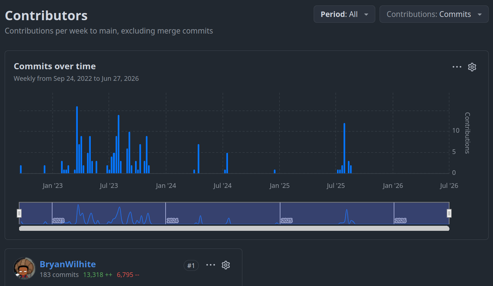
<https://github.com/BryanWilhite/Songhay.Player.ProgressiveAudio/graphs/contributors?all=1>

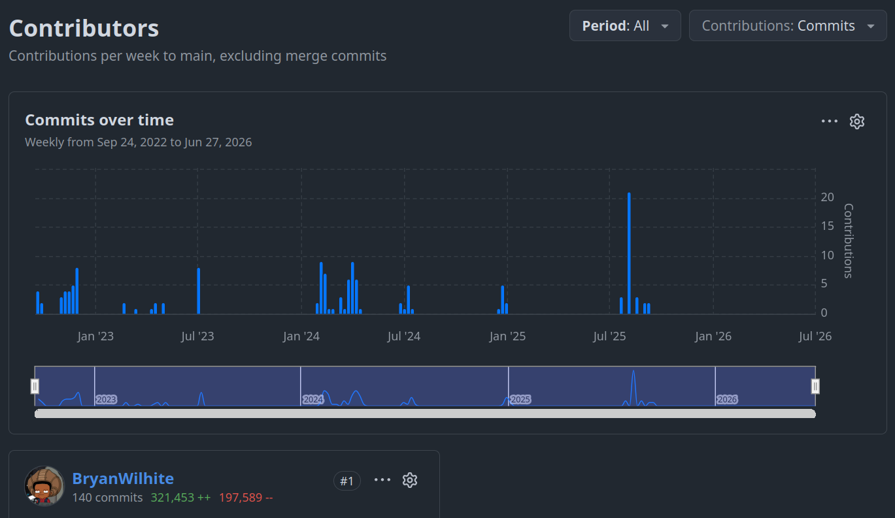
<https://github.com/BryanWilhite/Songhay.Player.YouTube/graphs/contributors?all=1>

</div>

The rabbit-hole bottom line is that this media player experience had to be developed before any recognizable Web development could be started—so this massive “diversion” began in 2022. For depressing-but-necessary perspective, we can glance at what the hell I was thinking [at the start of 2022](https://songhayblog.azurewebsites.net/entry/2022-01-30-studio-status-report-2022-01/).

## my Web-based Publications must have a custom Index system

I look forward to using my new Publication system to explain again and again (until I actually _like_ the delivery of the explanation) why an Index system is such big deal for a publication.

From the world of classical print publication, we know that the paper-based index helps us find specific things on a specific page. The classical, [Matt Mullenweg](https://en.wikipedia.org/wiki/Matt_Mullenweg), Web 1.0 answer to the paper-based index was a “keyword”-driven (or “tag”-driven) taxonomy. The word _taxonomy_ means building something like an index but not using the exact words found on the page—instead, we have the freedom to use classifying words outside the body of the text.

I have been laboring for years under the assumption that the Mullenwegian “word cloud” of Web 1.0 taxonomy has not been improved upon. Not because people are stupid but because of the dominance of Web 2.0 where the “dark patterns” for publication tools were not there to help individual writers organize and search their written material but to collect data for centralized, corporate world domination. One may want to argue that the search and summarizing abilities of <acronym title="Artificial Intelligence">AI</acronym> tools represent the ultimate improvement to all of this—but I would argue that, to avoid <acronym title="Artificial Intelligence">AI</acronym>-based amnesia, you will have to feed the AI some kind of structured data (that the AI probably built) in order to be productive. That structured data will effectively be “your” Index.

### my custom Index has be integrated with traffic stats

Here is a question we can ask a centralized AI product (for “entertainment purposes only”): Do WordPress, Joomla, Drupal, Squarespace, Contentful or any other similar product have analytic features that track the traffic for a single Web page?

Today, AI is telling me that the answer is _yes_ and the leading third-party, plug-in products that provide this are:

- Jetpack Stats
- MonsterInsights
- ExactMetrics
- Google Analytics

And there is even a suggestion that Joomla and Drupal had this built in quite early on 😲 I am actually surprised by this real-world inquiry. However, my inquiry did not include my “peculiar” contraints:

- these products must not be based on PHP
- these products must not require data stored at a third-party location
- these products must be integrated with some kind of _information design_ concept for the entire Web site

### my custom Index has to be integrated with information design functionality

My use of the term ‘information design functionality’ functions as an umbrella term that includes the ability to organize your Web Publication into an outline form. I am also talking about generating a table of contents, a site map and/or a global navigation concept.

I started the `Songhay.Publications` [project on GitHub](https://github.com/BryanWilhite/Songhay.Publications) to work through these desires. We can literally [see the rabbit holes](https://github.com/BryanWilhite/Songhay.Publications/graphs/commit-activity) for this desire spring up right about where I was laid off from my day job of four years:

<div style="text-align:center">


</div>

We can look at [my entire miserable life](https://github.com/BryanWilhite/Songhay.Publications/graphs/contributors?all=1) with `Songhay.Publications`, breaking it up into two ‘eras’:

<div style="text-align:center">

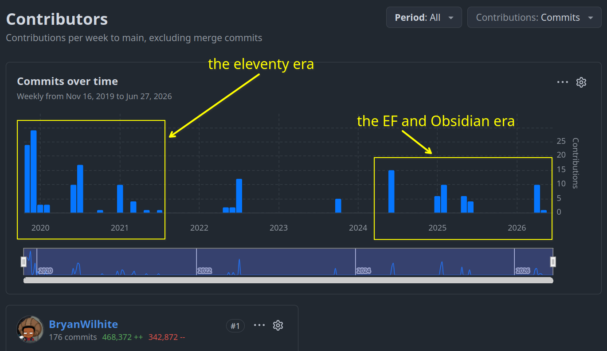

</div>

First there was the eleventy honeymoon period where I set up the Blogging system that I am using today (see <https://github.com/BryanWilhite/Blog>). However, this system paid little attention to my precious Index concept(s). My honeymoon period with Obsidian and my day-job inspired update of my <acronym title="Entity Framework">EF</acronym> skills (with a renewed respect for SQLite) drove me to revisit `Songhay.Publications`, inaugurating a second ‘era’ of development 🐇🕳

## my selected notes of the month

Almost the entire month was dedicated to Internet Products (kintespace.com):

<div style="text-align:center">

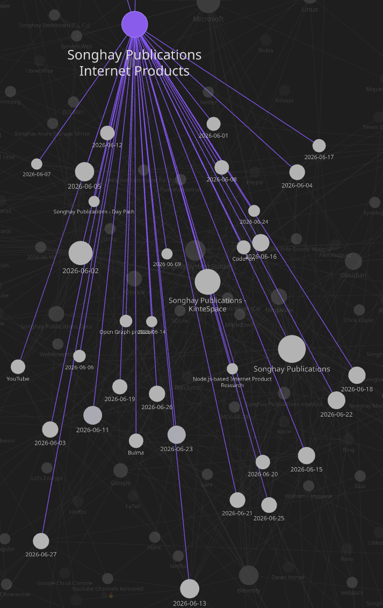

</div>

This means there should be fewer notes to show publicly this month:

## FluentValidation is preferred over MiniValidation by Damian Edwards…

…because MiniValidation (<https://github.com/DamianEdwards/MiniValidation>) depends on hard-coded attribute adornment via `System.ComponentModel.DataAnnotations`:

<div style="text-align:center">

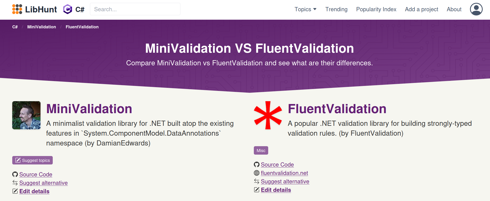
<https://www.libhunt.com/compare-MiniValidation-vs-FluentValidation>

</div>

## xUnit.net: my first time testing with reflection 😐🧠🧹

The `ToIDocument_Test`, currently in the the kinté space repo (but will be moved to Songhay Publications (C♯)), has _expected_ `JsonObject` property values against _actual_ plain-old .NET object values:

<div style="text-align:center">

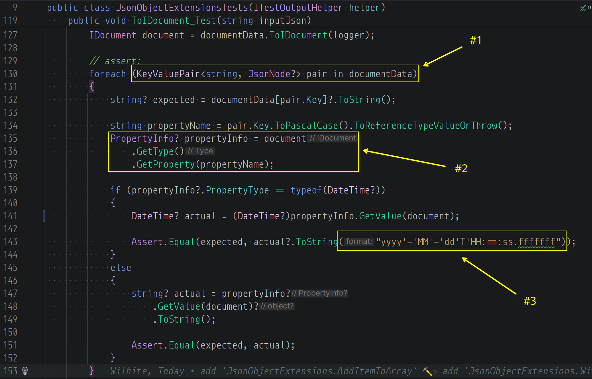

</div>

1. `JsonObject` supports enumeration through its properties by default; when an instance has a `GetEumerator` method that means it can be used in `foreach`—another ancient fundamental fact about .NET that the dudes with the big bucks probably never forget
2. remember the `GetType`-`GetProperty` combo? …what about the `GetType`-`GetProperty`-`GetValue` combo? Because `GetValue` returns `object?` we need to stringify with `Object.ToString` for equality testing
3. testing equality for dates as strings is probably me opening another can of worms 🥫🪱 as I currently do not know _exactly_ what is the date format of <acronym title="JavaScript Object Notation">JSON</acronym> dates—and `"yyyy'-'MM'-'dd'T'HH:mm:ss.fffffff"` is probably not _exactly_ correct

I used to know this `GetType`-`GetProperty` combo by heart over 15 years ago back when it was a novelty:

```csharp
PropertyInfo? propertyInfo = document
    .GetType()
    .GetProperty(propertyName);
```

## Internet Products: should `IDocument` date-time properties always be `DateTimeKind.Utc` ? 😐🗺

The short answer is _yes_. Just get on an international flight with your publishing pipeline and think about it 🛫 This [person](https://forum.obsidian.md/t/properties-support-retain-save-iso-8601-time-zone-information/67142/2) has:

<div style="text-align:center">

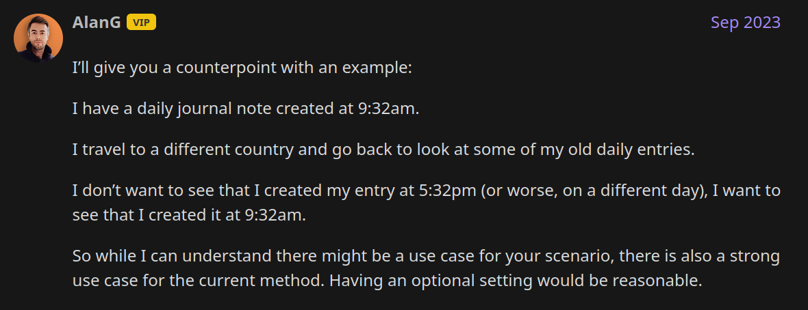

</div>

…and, by the way, two important facts:

1. SQLite does _not_ support date or time types and stores `DateTime` as a string
2. Obsidian “[just doesn’t seem to know how to correctly process timezone offsets correctly](https://forum.obsidian.md/t/obsidian-still-appears-to-not-fully-support-iso-8601-datetime-standard/114211/7)” and the “[date picker follows your operating system's default date and time format](https://obsidian.md/help/properties#Date)”

This _yes_ answer means stuff like this:

```csharp
DateTime actual = DateTime.Parse(input);
```

…should change to this \[📖 [docs](https://learn.microsoft.com/en-us/dotnet/api/system.datetime.parse?view=net-10.0#system-datetime-parse(system-string-system-iformatprovider-system-globalization-datetimestyles)) \]:

```csharp
DateTime actual = DateTime.Parse(input, CultureInfo.InvariantCulture, DateTimeStyles.AdjustToUniversal);
```

…actually this `DateTime.TryParse` angle is more useful:

```csharp
Assert.True(DateTime.TryParse(expected,  
    CultureInfo.InvariantCulture,  
    DateTimeStyles.AdjustToUniversal, out DateTime actual));
```

## FFmpeg: ffmpeg webCLI (WebAssembly) #to-do

>A browser-based video editor powered by [ffmpeg.wasm](https://github.com/ffmpegwasm/ffmpeg.wasm). **No uploads, no servers -- all processing happens locally** in your browser using WebAssembly.
>
>🚀 **Live app:** [https://tejaswigowda.com/ffmpeg-webCLI/](https://tejaswigowda.com/ffmpeg-webCLI/)
>
>—<https://github.com/tejaswigowda/ffmpeg-webCLI>
>

## WinUI: `Microsoft.UI.Reactor`

This appears to be Microsoft’s gigantic answer to what that other guy was doing:

<div style="text-align:center">


</div>

>Reactor is **not** a new UI platform. It is a new way to _describe_ WinUI content. Every control you render is a real WinUI control — `Button`, `TextBox`, `NavigationView`, `TreeView` — just authored differently. Apps built with Reactor interop freely with XAML, MVVM, existing controls, and the rest of the WinUI ecosystem.
>
>What Reactor adds on top of WinUI:
>
> - A virtual element tree and reconciler that diff old vs. new descriptions and patch only what changed on real WinUI controls
> - Hooks-based state (`UseState`, `UseEffect`, `UseReducer`, …) co-located with render logic
> - A C# DSL that replaces XAML markup with typed factory methods and fluent modifiers
> - Higher-level building blocks — flex layout, charting, commanding, navigation, data grid, theming, localization — many of which are candidates to migrate back into WinUI itself
>
>—<https://github.com/microsoft/microsoft-ui-reactor/tree/main>
>

## Internet Products: I see where custom messages are needed for FluentValidation 😐✨

A custom message \[📖 [docs](https://docs.fluentvalidation.net/en/latest/configuring.html?highlight=withmessage) \] must be specified when FluentValidation begins with:

```console
The specified condition was not met
```

…as seen here:

<div style="text-align:center">

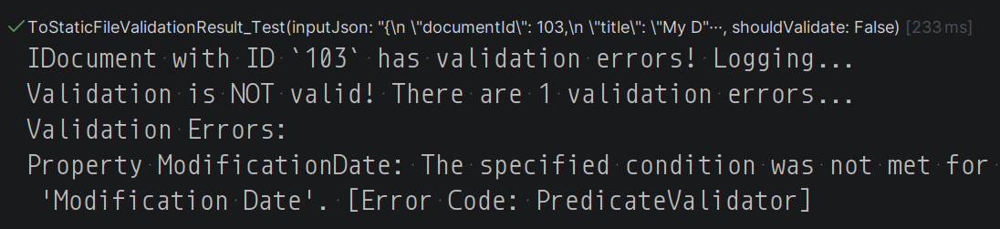

</div>

## Finance: “This time it’s coming for tech first.”

>It’s hard not to enjoy the bitter irony, here. The tech industry once revelled in disruption. Whether it was Uber wiping out the taxi industry, Amazon destroying traditional bookstores, or Spotify wiping out artist revenues, time and time again we’ve seen the Silicon Valley enrich themselves by disrupting an established market and then transforming into rent seekers.
>
>AI now threatens to do the same to countless professions. Everyone from writers to graphic designers to financial analysts can feel the wolf at the door.
>
>But this time things are a little different.
>
>This time it’s coming for tech first.
>
>—“[Cannibalism](https://b-ark.ca/2026/06/07/cannibalism.html)”
>

## Internet Products: the thumb `img` elements should load lazily 😐 📞🐌🖼

>Lazy loading avoids the network and storage bandwidth required to handle the image until it's reasonably certain that it will be needed. This improves the performance in most typical use cases.
>
>While explicit [`width`](https://developer.mozilla.org/en-US/docs/Web/HTML/Reference/Elements/img#width) and [`height`](https://developer.mozilla.org/en-US/docs/Web/HTML/Reference/Elements/img#height) attributes are recommended for all images to avoid layout shift, ==they are especially important for lazy-loaded ones==. Lazy-loaded images will never be loaded if they do not intersect a visible part of an element, even if loading them would change that, because unloaded images have a `width` and `height` of `0`. It creates an even more disruptive user experience when the content visible in the viewport reflows in the middle of reading it.
>
>Lazy-loaded images located in the visual viewport may not yet be visible when the Window [`load`](https://developer.mozilla.org/en-US/docs/Web/API/Window/load_event "load") event is fired. This is because the event is fired based on eager-loaded images — lazy-loaded images are not considered even if they are located within the visual viewport upon initial page load.
>
>—<https://developer.mozilla.org/en-US/docs/Web/HTML/Reference/Elements/img#lazy>
>

## Internet Products: the splash image credits message experience is in place 👏😐

<div style="text-align:center">

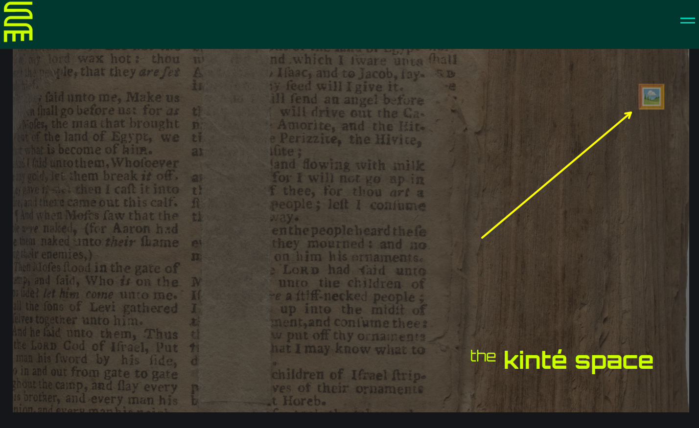

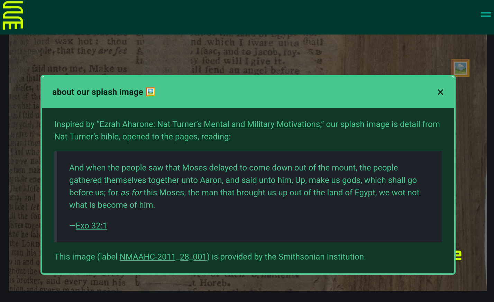

</div>

## Bing <acronym title="Artificial Intelligence">AI</acronym>: What Is the Best Local LLM for Coding in 2026?

>Qwen3-Coder-Next is currently the top local LLM for coding in 2026, offering best-in-class performance on real-world software engineering tasks.

<div style="text-align:center">

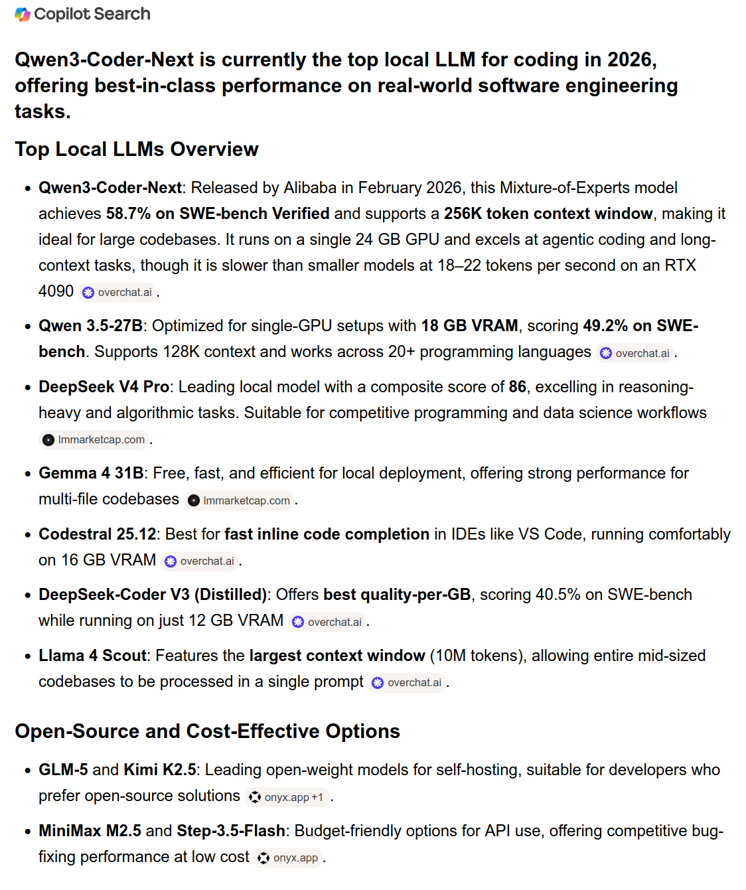

</div>

## kintespace.com analytics: monthly hits section is complete 👏😐✅

<div style="text-align:center">

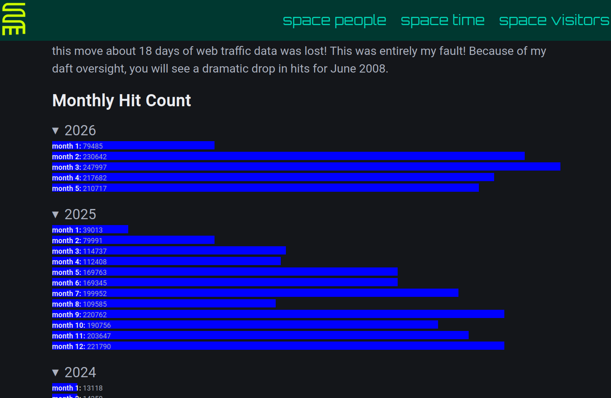

</div>

## open pull requests on GitHub 🐙🐈

- <https://github.com/BryanWilhite/Songhay.HelloWorlds.Activities/pull/14>
- <https://github.com/BryanWilhite/dotnet-core/pull/67>

## sketching out development projects

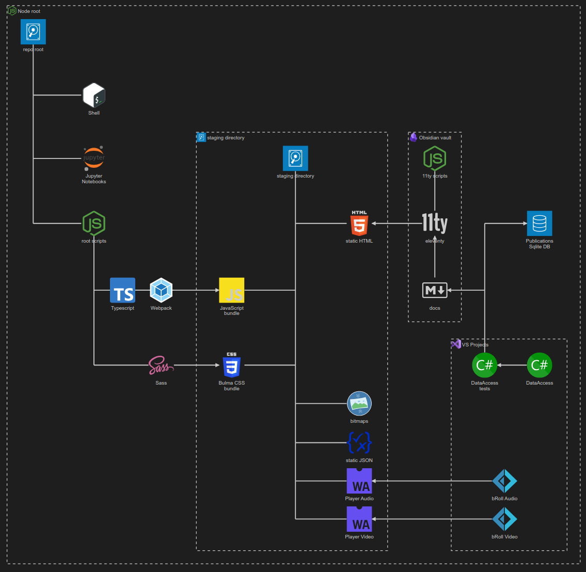

- retire the old `kinte-space` repo for kintespace.com 🚜🧊
- ~~establish `DataAccess` logic for Obsidian markdown metadata 🔨✨~~
- ~~establish `DataAccess` logic for Index data, including adding and removing Obsidian documents (and Segments) 🔨✨~~
- package `DataAccess` logic in `*Shell` project for `npm` scripting 🚜✨
- ~~consider using Lerna to coordinate the two levels of `npm` scripts in the kinté space repo 🧠👟~~
- use a Jupyter Notebook to track finding and changing Amazon links to open source links in the kinté space repo 📓⚙
- use a Jupyter Notebook to convert flickr links to Publications (responsive image) links in the kinté space repo 📓⚙
- ~~convert rasx() context repo to the relevant conventions shown in the diagram above 🔨🚜~~
- convert Songhay Day Path Blog repo to the relevant conventions shown in the diagram above 🔨🚜
- re-release Songhay Dashboard by updating its repo to the relevant conventions shown in the diagram above 🔨🚜
- start development of Songhay Publications Index (F♯) experience for WebAssembly 🍱✨
- start development of Songhay Publications - Data Editor to establish a <acronym title="Graphical User Interface">GUI</acronym> for `*Shell` and provide visualizations and interactions for Publications data 🍱✨

🐙🐈<https://github.com/BryanWilhite/>
