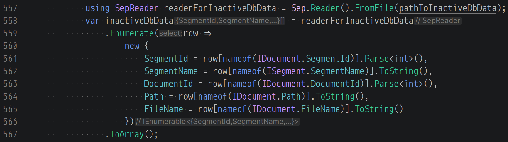
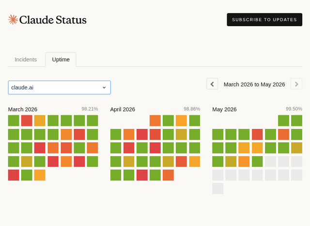
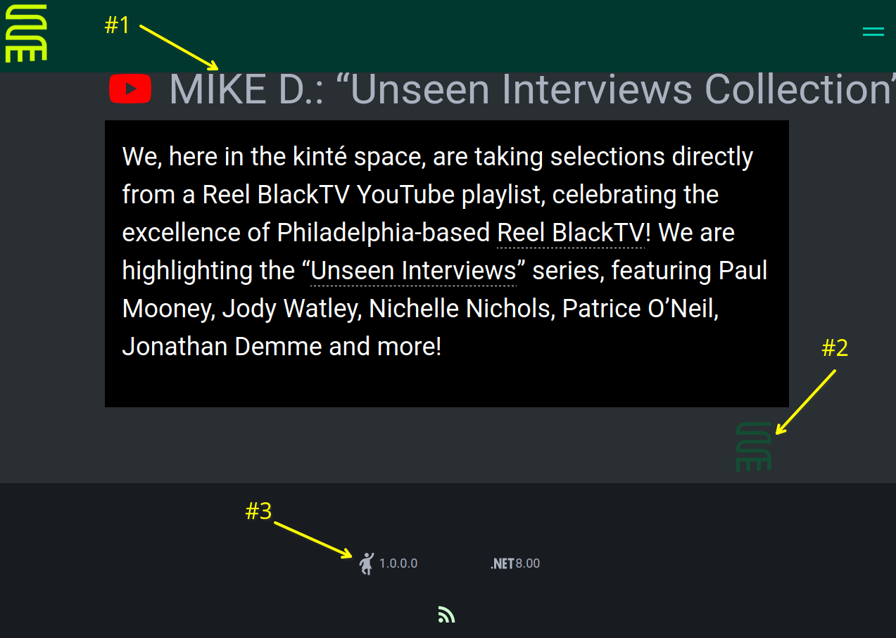
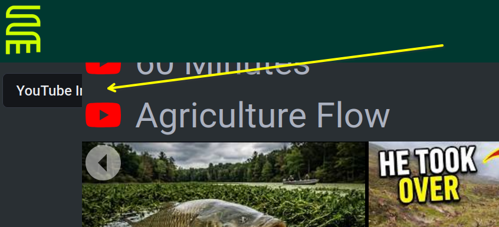
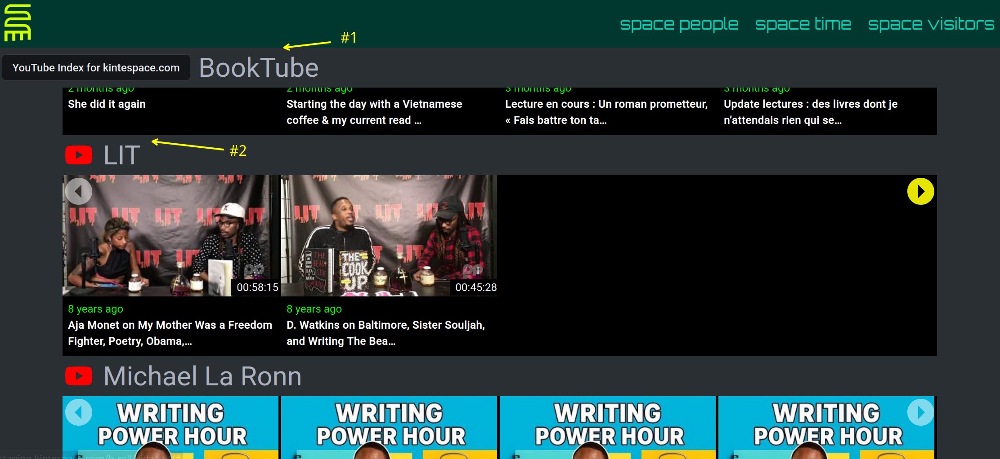
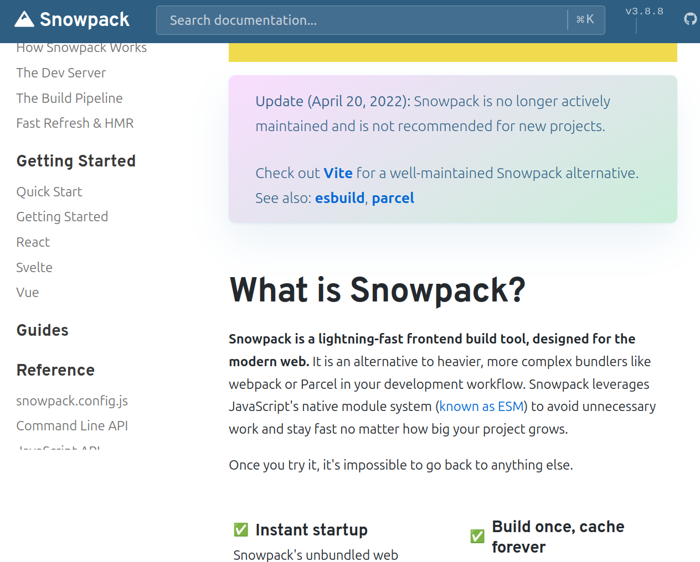
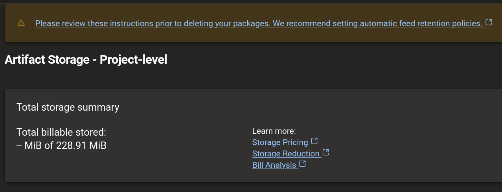
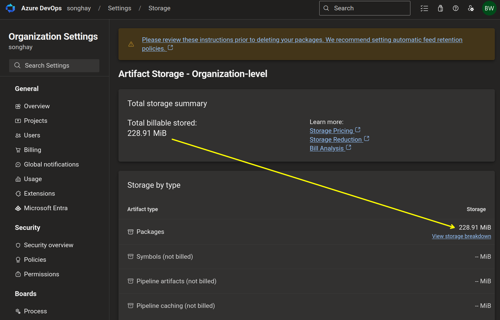
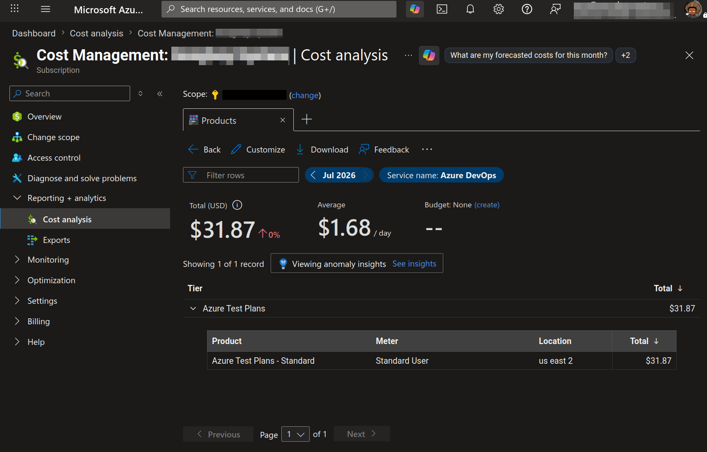
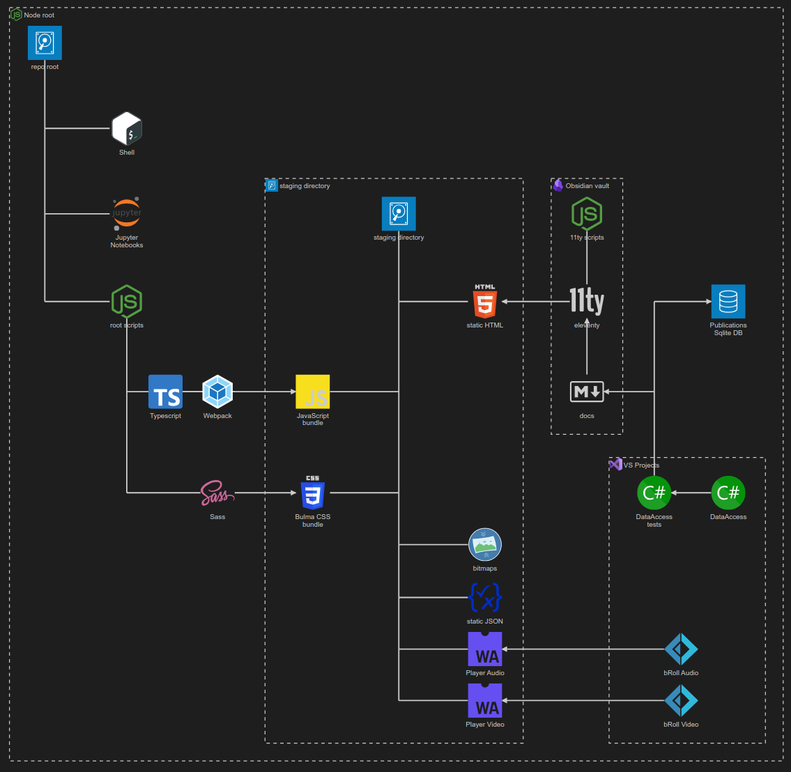

---json
{
  "documentId": 0,
  "title": "studio status report: 2026-07",
  "documentShortName": "2026-07-30-studio-status-report-2026-07",
  "fileName": "index.html",
  "path": "./entry/2026-07-30-studio-status-report-2026-07",
  "date": "2026-07-30T22:24:03.659Z",
  "modificationDate": "2026-07-30T22:24:03.659Z",
  "templateId": 0,
  "segmentId": 0,
  "isRoot": false,
  "isActive": true,
  "sortOrdinal": 0,
  "clientId": "2026-07-30-studio-status-report-2026-07",
  "tag": "{\n  \u0022extract\u0022: \u0022Month 07 of 2026 was about releasing kintespace.com, really digging into details of Microsoft\\u2019s inflation of cloud rental costs and formally experimenting with Astro. Yes, kintespace.com was finally released on the 10th day of the month\\u2013but let\\u2019s see whet\\u2026\u0022\n}"
}
---

# studio status report: 2026-07

Month 07 of 2026 was about releasing kintespace.com, really digging into details of Microsoft’s inflation of cloud rental costs and formally experimenting with [Astro](https://astro.build/). Yes, kintespace.com was _finally_ released on the 10th day of the month–but let’s see whether my work on Internet products exceeds 10 journaled days:

I am seeing 15 days of work which makes sense because, after using the eleventy-based pipeline for kintespace.com, I approached two other tasks:

1. trying to get eleventy to work with Vite
2. trying to get Astro to work with Obsidian

Also, for my job searching misery I built <https://bryanwilhite.github.io/> which I regard as something I should have built _years_ ago. It should have been obvious to me to build something that _shows_ my skills instead of waiting around for a chance to _talk_ about them 😐🤦 The “artistic beauty” is in building tangible things that “nobody” looks at instead of talking shit about being “undiscovered.” The true “artist” will work with or without you, the “audience”…

In keeping with this poignant obscurity, I have also used this month to update <https://rasx-node-js.netlify.app/> which is a manifestation of the following breakthroughs:

1. the standardization of [Bulma](https://bulma.io/) in this Studio
2. the rediscovery of the [D3](https://d3js.org/)
3. the discovery of [Observable](https://observablehq.com/) notebooks
4. the uncovering and explicit use of [DOMPurify](https://github.com/cure53/DOMPurify)
5. the opportunity to declare that contemporary “vanilla” JavaScript can do things that only frameworks and libraries did in the past

It is unfair and too easy to blame having a #day-job as the sole reason why I am suddenly celebrating all of this personal growth 😐🐰 Perhaps the selected notes below will clarify:

## Sep  is now the official <acronym title="Comma-Separated Values">CSV</acronym>-file processor of this Studio

Following up my note the beginning of this year, on my eldest son’s birthday, I can confirm that Sep exceeds expectations. I did mention that there is a `Regex` out there for CSV data handling but I don’t have the time or the Polyglot Notebooks technology to play with that these days 😐

### the importance of the `SepReader.Enumerate` method

When we are first introduced to Sep, we immediately can see that it is designed to load large files with little pressure on memory. However, it may be difficult to see how we can load _everything_ in memory and perform  <acronym title="Language Integrated Query">LINQ</acronym> operations. We can do this with the `SepReader.Enumerate` method:

## Songhay System Studio: “Most rewrites serve the engineer, not the business”

>The strongest case against a rewrite is not the effort. It is memory. Code that has run in production for years is a written record of every bug someone hit and quietly fixed. The odd conditional, the retry with the suspicious timeout: most of it is scar tissue, and each scar marks an incident you never saw. Joel Spolsky made this point in 2000, calling the full rewrite [the single worst strategic mistake](https://www.joelonsoftware.com/2000/04/06/things-you-should-never-do-part-i/) a software company can make.
>
>Throw the code away and you throw away the fixes. Then you meet the same bugs again, in production, in front of the same users.
>
>—“[Most rewrites serve the engineer, not the business](https://anatoliybabushka.com/blog/when-to-rewrite-working-code.html)”
>

## Obsidian plugin: External File Embed and Link

Obsidian is not designed to support _relative_ linking to any file external to the vault (it will fall back to an absolute `file:` reference \[📖 [docs](https://obsidian.md/help/drag-and-drop#Dragging+from+outside+Obsidian) \])—but there’s a plugin for that:

>Embed and link local files outside your obsidian vault with relative paths for cross-device and multi-platform compatibility.
>
>…
>
>- Embed external files (Markdown, PDF, Images, Audio, Video) outside your obsidian vault.
> - Create links to files outside your obsidian vault that open with system default applications.
> - Reference files using virtual directories for cross-device and cross-platform compatibility.
> - Provide commands to add embeds or links via file picker.
>
>—<https://github.com/oylbin/obsidian-external-file-embed-and-link>
>

## Songhay Modules Bolero (F♯): potentially devastating news 😐📰

It is possible that the Bolero project is dying out. It is stuck in the .NET 8.0 time-frame:

>Bolero 0.24.39 only ships `net6.0` and `net8.0` TFM targets (verified by inspecting the NuGet package under `lib/`). When the project targets `net10.0`, NuGet silently falls back to the `net8.0` build. The net8.0 compiled assemblies use WASM JS interop conventions that are incompatible with the .NET 10 WASM runtime host — specifically, the `getI32` marshalling function is no longer available in the same way on the `dotnet.runtime.js` interop surface, causing the `TypeError` at render time.
>
>The misleading part is that `dotnet build` and `dotnet publish` both complete successfully — the mismatch only manifests at runtime in the browser.
>
>**Workaround:** Revert to `net8.0` until Bolero publishes packages with a `net10.0` target.
>
>—<https://github.com/fsbolero/Bolero/issues/375#issuecomment-4061336805>
>

## Fun.Blazor is the higher-performance alternative to Bolero

When “[.NET 8 and .NET 9 will reach End of Support on November 10, 2026](https://devblogs.microsoft.com/dotnet/dotnet-8-9-end-of-support/)” and Bolero is still not updated for .NET 10 then this Studio should have the lavish option of switching the b-roll player over to something like Fun.Blazor. Here are the known alternatives to Bolero in decreasing order of preference:

1. Fun.Blazor (assuming it has all the features of Bolero 🐰)
2. plain Blazor (requiring a complete rewrite in C♯ 🐰🐰🐰)
3. Following up 2025-08-12#Blazor “Running .NET in the browser without Blazor” to-do ❓
4. Feliz (implying that the b-roll player will be a React app 🐰🤮)

>[!warning]
>Fun.Blazor is currently _not_ upgraded to .NET 10 😐

- Fun.Blazor is _not_ based on Elmish by default (this alone could explain the performance advantage Fun.Blazor has); Elmish is optional
- Fun.Blazor also uses <acronym title="Computation Expression">CE</acronym>s

## Publications: “Claude’s API is notoriously unstable”

>Claude’s API is notoriously unstable, yet it’s the only API provider that is compatible with a Claude subscription.
>
>…
>
>Claude Code is Anthropic’s primary consumer-facing engineering interface, and once you’re in, you’re locked in. Your Claude subscription—which is a cheaper version of the Anthropic API—is restricted to use with the Claude Code CLI/Desktop, Claude CoWork, or @Claude in Slack.
>
>…
>
>I would take OpenCode’s interface any day over Anthropic’s, but I am prohibited from applying my Claude subscription to OpenCode.
>
>There are FOSS projects to circumvent Anthropic’s policies, which allow you to use your Claude subscription instead of an expensive Anthropic API Key
>
>—“[Anthropic's Method to Losing Goodwill in a Few Easy Steps](https://raheeljunaid.com/blog/anthropics-method-to-losing-goodwill-in-a-few-easy-steps/)”
>

## Internet Products: finalizing kintespace.com 👏

I have finished addressing, supposedly, all of the bits and bobs listed yesterday:

- [x] deploy to staging and inspect 🚀👓

1. clicking on the Presentation does nothing #to-do—this is _not_ a regression 😐
2. the credits button needs to stand out from backgrounds—this _is_ a regression
3. the version-numbering of Bolero is no longer detectable? #to-do

The `z-order` of the “sticky” dropdown needs to be sorted:

### issues above addressed 👏

I have waited _years_ to see this experience:

1. this “sticky” experience is my finest
2. more space is needed between thumbs #to-do

## Songhay System Studio: it should be the most important tech documentary 😐

Most of the other tech documentaries in my collection are about JavaScript frameworks:

<figure>
    
    
<small>The Story of C++: The World's Most Consequential Programming Language</small>

</figure>

## webpack was to be replaced by Snowpack but Vite took the world by storm 😐✨

The honorable folks of Snowpack leave this quite openly on their home page:

>**Update (April 20, 2022):** Snowpack is no longer actively maintained and is not recommended for new projects.
>
>Check out [Vite](https://vitejs.dev/) for a well-maintained Snowpack alternative.  
>See also: [esbuild](https://esbuild.github.io/), [parcel](https://parceljs.org/)
>

<https://www.snowpack.dev/>

This is mentioned quite openly in:

<figure>
    
    
<small>VITE: The Documentary</small>

</figure>

- the effort here was to formally recognize <acronym title="ECMAScript modules">ESM</acronym> as a standard in wide release
- the initial release of Vite was tied to Vue
- Vite 2.0 was a complete rewrite (c. 2020?)
- Vite uses rollup.js which I regarded as a loser to webpack—I guess I am wrong 👴

>[!important]
>First developed by the developer of Vue, [Evan You](https://github.com/yyx990803), Vite is designed to replace webpack because it does not scale.
>

Because this Studio invested in WebAssembly (and my day jobs have been Microsoft biased), I have avoided building big-ass JavaScript monstrosities on top of webpack that would have led me to—at least to the desire for–something like Snowpack or Vite.

## Apache: it took an IBM guy to compare with nginx 😐

<figure>
    
    
<small>Apache vs NGINX</small>

</figure>

- nginx was built with the intention of being faster than Apache—and it succeeded
- nginx is more popular for containers

## Publications: “Why 55% of Americans Stopped Posting On Social Media”

>A [new Incogni survey](https://blog.incogni.com/digital-fatigue-and-burnout/) suggests Americans are pulling back from social media, with more than half saying "maintaining an online presence feels like work" and [55% reporting they post less than they did five years ago](https://www.pcmag.com/news/death-of-the-status-update-why-55-americans-stopped-posting-social-media). "The full study concludes that there's been a significant shift in public attitudes toward social media," reports PCMag. "Where it was once fun and relaxing, it's now growing dark and angsty..." From the report: _As the [chart](https://i.pcmag.com/imagery/articles/05jtX24y12N42HIDJ8fPcnG-2.fit_lim.size_1536x.png) shows, there's also a clear correlation with age. A full 60% of Gen Z respondents feel the pain of maintaining a social presence. Perhaps they have a niggling hope that they might still be discovered as an influencer? Those of us in the Boomer category are clearly more relaxed about it, with just 38% saying that maintaining a social presence feels like work. The survey quizzed respondents about how they feel when they don't keep up with checking their socials and, by extension, how they'd feel if they just plain quit. They were given choices, both positive (peace, relaxation, and relief) and negative (anxiety, fear of missing out, and discomfort)._
>
>—“[Why 55% of Americans Stopped Posting On Social Media](https://tech.slashdot.org/story/26/07/13/0548235/why-55-of-americans-stopped-posting-on-social-media)”
>

## Vite and ASP.NET: I am confident that Microsoft will release project templates based on Vite… #to-do

…meanwhile, we have Shawn Wildermuth:

<figure>
    
    
<small>Coding Shorts: Using Vite in ASP.NET Core Projects</small>

</figure>

## AzDO: what the hell is all this artifact storage 😧❓

>Azure Artifacts provides developers with a streamlined way to manage all their dependencies from a single feed. These feeds serve as repositories for storing, managing, and sharing packages, whether within your team, across organizations, or publicly online. Azure Artifacts supports multiple package types, including NuGet, npm, Python, Maven, Cargo, and Universal Packages.
>
>…
>
>Azure Artifacts provides 2 GiB of free storage for each organization. This free tier is designed to help you evaluate if Azure Artifacts fits your workflow. As your organization begins handling more critical tasks, [increase artifacts storage limit](https://learn.microsoft.com/en-us/azure/devops/artifacts/artifact-storage?view=azure-devops#increase-artifacts-storage-limit) to ensure you have the appropriate resources.
>
>—”[What is Azure Artifacts?](https://learn.microsoft.com/en-us/azure/devops/artifacts/start-using-azure-artifacts?view=azure-devops)”
>

I am being charged almost $2 a day for this:

## Netlify “On-demand Builders” deprecated? 😐

>On-demand Builders are serverless functions used to generate web content as needed that’s automatically cached on Netlify’s Edge CDN. They enable you to build pages for your site when a user visits them for the first time and then cache them at the edge for subsequent visits.
>
>—“[On-demand Builders](https://docs.netlify.com/build/configure-builds/on-demand-builders/)”
>

It appears that on-demand Builders are considered deprecated:

>For better performance and fewer function invocations, consider using [serverless functions with the `durable` directive](https://docs.netlify.com/build/caching/caching-overview#durable-directive) instead of On-demand Builders.

## Internet Products: in this Studio it’s official: eleventy does _not_ work with Vite correctly 😐😠

In addition to over two days of time wasted, the digitized public provides me with two clues:

### 1. a developer of a Vite plugin for eleventy warns us that both Vite and eleventy process `*.html` files

This is a message from a developer from over five years ago (because he has not updated the entire repo in over five years):

>Because Vite has built-in handling for HTML files, it's recommended to _not_ use `.html` files with Eleventy. If you're writing Nunjucks, for instance, use `.njk` instead of `.html`. Don't rely on Eleventy's default template handling for HTML files is what I'm saying.
>
>—<https://github.com/Snugug/vite-plugin-eleventy#important-integration-caveats>
>

This conflict over HTML-file processing _should_ mean that Vite and eleventy _cannot_ work together properly. Perhaps I am misunderstanding the meaning? I do notice that the “[starter template](https://github.com/matthiasott/eleventy-plus-vite/tree/main/src)” for the `eleventy-plugin-vite` plugin does _not_ use `*.html` files as eleventy templates. Dropping HTML templates would be seriously disruptive to my Studio pipeline.

### 2. the guy who used to work on Slinkity has moved on to work on Astro 😲

Here is a message from the [Slinkity](https://slinkity.dev/) guy:

>**⚠️ Slinkity is no longer maintained.** The project owner [(@bholmesdev)](https://github.com/bholmesdev) now works on [Astro](https://astro.build) full-time. If you want to build component-driven content sites, give Astro a try! If you're committed to 11ty and want to use client components, consider [11ty's WebC project.](https://www.11ty.dev/docs/languages/webc/)

I have walked through the friendly `npm init slinkity` experience and I notice that, by default, Slinkity is _also_ not using `*.html` files as eleventy templates. It is using a Markdown file, `index.md` 😐

### signs point toward none of these issues being “fixed” 🛑

- The conflict over HTML-file processing between Vite and eleventy does not feel trivial to me; it feels _fundamental_ to Vite.
- Vite likely has no way to easily “turn off” its handling of HTML files in order to not interfere with eleventy.
- Zach Leatherman has “Build Awesome” newness on his plate surely making this HTML template “fix” a non-priority.

### what needs to be “fixed”?

I think the short term “fix” to my issues here is to warn others _not_ to use HTML templates.

Steps to reproduce:

1. build a simple eleventy publication, depending on `@11ty/eleventy-plugin-vite` and using  an HTML file as the Index template (`index.html`) and HTML files for the layouts.
2. add the conventional `_data/settings.json` file and use the HTML templates to render data from this file
3. run `npm start` and or `npm build` and the settings data will not be rendered in any output base on HTML templates (also, Vite my try to add its `_site` directory to your build output 😐)

## Astro even talks publicly about a relationship with WebAssembly 😲

>Astro supports loading WASM files directly into your application using the browser’s [`WebAssembly`](https://developer.mozilla.org/en-US/docs/Web/JavaScript/Reference/Global_Objects/WebAssembly) API.
>
>—“[WASM](https://docs.astro.build/en/guides/imports/#wasm)”
>

## open pull requests on GitHub 🐙🐈

- <https://github.com/BryanWilhite/Songhay.HelloWorlds.Activities/pull/14>
- <https://github.com/BryanWilhite/dotnet-core/pull/67>

## sketching out development projects

- ~~retire the old `kinte-space` repo for kintespace.com~~ 🚜🧊
- use a Jupyter Notebook to track finding and changing Amazon links to open source links in the kinté space repo 📓⚙
- use a Jupyter Notebook to convert flickr links to Publications (responsive image) links in the kinté space repo 📓⚙
- convert Songhay Day Path Blog repo to the relevant conventions shown in the diagram above 🔨🚜
- re-release SonghaySystem.com in Astro on Netlify 🚀
- start development of Songhay Publications Index (F♯) experience for WebAssembly 🍱✨
- start development of Songhay Publications - Data Editor to establish a <acronym title="Graphical User Interface">GUI</acronym> for `*Shell` and provide visualizations and interactions for Publications data 🍱✨

🐙🐈<https://github.com/BryanWilhite/>
